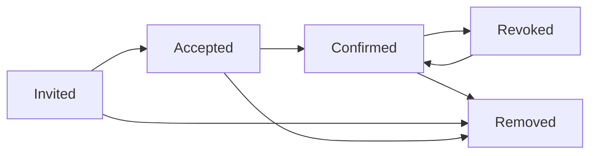

## Overview

Manage organization membership, including inviting users, updating roles, and controlling access.

## Get Organization User

Retrieve details of a specific organization user.

```bash
GET /organizations/{orgId}/users/{id}
```

<ParamField path="orgId" type="string" required>
  Organization ID
</ParamField>

<ParamField path="id" type="string" required>
  Organization user ID
</ParamField>

<ParamField query="includeGroups" type="boolean" default="false">
  Include group memberships
</ParamField>

### Response

<ResponseField name="id" type="string" required>
  Organization user ID
</ResponseField>

<ResponseField name="userId" type="string">
  User account ID (null if invited but not accepted)
</ResponseField>

<ResponseField name="type" type="number" required>
  User type/role (0=Owner, 1=Admin, 2=User, 3=Manager, 4=Custom)
</ResponseField>

<ResponseField name="status" type="number" required>
  Status (0=Invited, 1=Accepted, 2=Confirmed, -1=Revoked)
</ResponseField>

<ResponseField name="email" type="string" required>
  User's email address
</ResponseField>

<ResponseField name="accessAll" type="boolean">
  Whether user has access to all collections
</ResponseField>

<ResponseField name="collections" type="array">
  Collections assigned to user
</ResponseField>

<ResponseField name="groups" type="array">
  Group IDs (if includeGroups=true)
</ResponseField>

---

## List Organization Users

Retrieve all users in an organization.

```bash
GET /organizations/{orgId}/users?includeGroups={includeGroups}&includeCollections={includeCollections}
```

<ParamField path="orgId" type="string" required>
  Organization ID
</ParamField>

<ParamField query="includeGroups" type="boolean" default="false">
  Include group memberships for each user
</ParamField>

<ParamField query="includeCollections" type="boolean" default="false">
  Include collection assignments for each user
</ParamField>

---

## Get Mini Details

Retrieve basic user information for all organization members.

```bash
GET /organizations/{orgId}/users/mini-details
```

<ParamField path="orgId" type="string" required>
  Organization ID
</ParamField>

<Info>
This endpoint returns minimal information and is available to all organization members for managing collection access.
</Info>

---

## Invite User

Invite a new user to the organization.

<CodeGroup>
```bash cURL
curl -X POST "https://api.bitwarden.com/organizations/{orgId}/users/invite" \
  -H "Authorization: Bearer {access_token}" \
  -H "Content-Type: application/json" \
  -d '{
    "emails": ["user@example.com"],
    "type": 2,
    "accessAll": false,
    "collections": [
      {
        "id": "collection-guid",
        "readOnly": false,
        "hidePasswords": false
      }
    ],
    "groups": ["group-guid"]
  }'
```

```javascript JavaScript
await fetch(`https://api.bitwarden.com/organizations/${orgId}/users/invite`, {
  method: 'POST',
  headers: {
    'Authorization': `Bearer ${accessToken}`,
    'Content-Type': 'application/json'
  },
  body: JSON.stringify({
    emails: ['user@example.com'],
    type: 2,
    collections: [{id: collectionId, readOnly: false}]
  })
});
```
</CodeGroup>

### Request Body

<ParamField body="emails" type="array" required>
  Email addresses to invite
</ParamField>

<ParamField body="type" type="number" required>
  User role (0=Owner, 1=Admin, 2=User, 3=Manager, 4=Custom)
</ParamField>

<ParamField body="accessAll" type="boolean" default="false">
  Grant access to all collections
</ParamField>

<ParamField body="collections" type="array">
  Collection assignments (required if accessAll=false)
</ParamField>

<ParamField body="groups" type="array">
  Group IDs to add user to
</ParamField>

<ParamField body="permissions" type="object">
  Custom permissions (required if type=4)
</ParamField>

<ParamField body="accessSecretsManager" type="boolean" default="false">
  Grant Secrets Manager access
</ParamField>

---

## Reinvite User

Resend invitation email to a user.

```bash
POST /organizations/{orgId}/users/{id}/reinvite
```

<ParamField path="orgId" type="string" required>
  Organization ID
</ParamField>

<ParamField path="id" type="string" required>
  Organization user ID
</ParamField>

---

## Bulk Reinvite Users

Resend invitations to multiple users.

```bash
POST /organizations/{orgId}/users/reinvite
```

<ParamField path="orgId" type="string" required>
  Organization ID
</ParamField>

<ParamField body="ids" type="array" required>
  Array of organization user IDs
</ParamField>

---

## Accept Invitation

Accept an organization invitation.

```bash
POST /organizations/{orgId}/users/{id}/accept
```

<ParamField path="orgId" type="string" required>
  Organization ID
</ParamField>

<ParamField path="id" type="string" required>
  Organization user ID
</ParamField>

<ParamField body="token" type="string" required>
  Invitation token from email
</ParamField>

---

## Confirm User

Confirm a user after they accept the invitation.

```bash
POST /organizations/{orgId}/users/{id}/confirm
```

<ParamField path="orgId" type="string" required>
  Organization ID
</ParamField>

<ParamField path="id" type="string" required>
  Organization user ID
</ParamField>

<ParamField body="key" type="string" required>
  User's encrypted organization key
</ParamField>

---

## Update User

Update user's role, permissions, or collection access.

```bash
PUT /organizations/{orgId}/users/{id}
```

<ParamField path="orgId" type="string" required>
  Organization ID
</ParamField>

<ParamField path="id" type="string" required>
  Organization user ID
</ParamField>

### Request Body

<ParamField body="type" type="number" required>
  User role
</ParamField>

<ParamField body="accessAll" type="boolean" required>
  Access all collections
</ParamField>

<ParamField body="collections" type="array">
  Collection assignments
</ParamField>

<ParamField body="groups" type="array">
  Group IDs
</ParamField>

<ParamField body="permissions" type="object">
  Custom permissions (if type=4)
</ParamField>

---

## Revoke User Access

Revoke a user's access to the organization.

```bash
PUT /organizations/{orgId}/users/{id}/revoke
```

<ParamField path="orgId" type="string" required>
  Organization ID
</ParamField>

<ParamField path="id" type="string" required>
  Organization user ID
</ParamField>

<Info>
Revoked users cannot access the organization but remain in the user list. They can be restored later.
</Info>

---

## Restore User

Restore a revoked user's access.

```bash
PUT /organizations/{orgId}/users/{id}/restore
```

<ParamField path="orgId" type="string" required>
  Organization ID
</ParamField>

<ParamField path="id" type="string" required>
  Organization user ID
</ParamField>

---

## Remove User

Permanently remove a user from the organization.

```bash
DELETE /organizations/{orgId}/users/{id}
```

<ParamField path="orgId" type="string" required>
  Organization ID
</ParamField>

<ParamField path="id" type="string" required>
  Organization user ID
</ParamField>

<Warning>
Removing a user deletes their organization membership. They will lose access to all shared items.
</Warning>

---

## Bulk Remove Users

Remove multiple users at once.

```bash
DELETE /organizations/{orgId}/users
```

<ParamField path="orgId" type="string" required>
  Organization ID
</ParamField>

<ParamField body="ids" type="array" required>
  Array of organization user IDs to remove
</ParamField>

---

## Account Recovery

### Get Reset Password Details

Retrieve information needed to reset a user's password.

```bash
GET /organizations/{orgId}/users/{id}/reset-password-details
```

<ParamField path="orgId" type="string" required>
  Organization ID
</ParamField>

<ParamField path="id" type="string" required>
  Organization user ID
</ParamField>

### Get Bulk Recovery Details

Get recovery details for multiple users.

```bash
POST /organizations/{orgId}/users/account-recovery-details
```

<ParamField path="orgId" type="string" required>
  Organization ID
</ParamField>

<ParamField body="ids" type="array" required>
  Array of organization user IDs
</ParamField>

---

## User Status Flow



1. **Invited (0)**: User has been invited but hasn't accepted
2. **Accepted (1)**: User accepted invitation but not confirmed by admin
3. **Confirmed (2)**: User fully active in organization
4. **Revoked (-1)**: User access temporarily suspended

---

## Permissions Model

### Standard Roles

| Role | Type | Description |
|------|------|-------------|
| Owner | 0 | Full access to everything |
| Admin | 1 | Administrative access |
| User | 2 | Standard member access |
| Manager | 3 | Manage assigned collections |
| Custom | 4 | Custom permission set |

### Custom Permissions

When `type=4`, specify granular permissions:

```json
{
  "accessEventLogs": true,
  "accessImportExport": false,
  "accessReports": true,
  "createNewCollections": true,
  "editAnyCollection": false,
  "deleteAnyCollection": false,
  "editAssignedCollections": true,
  "deleteAssignedCollections": false,
  "manageGroups": false,
  "managePolicies": false,
  "manageSso": false,
  "manageUsers": false,
  "manageResetPassword": false
}
```