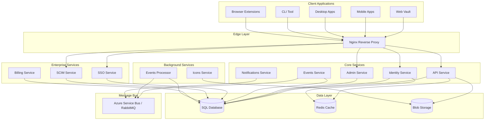
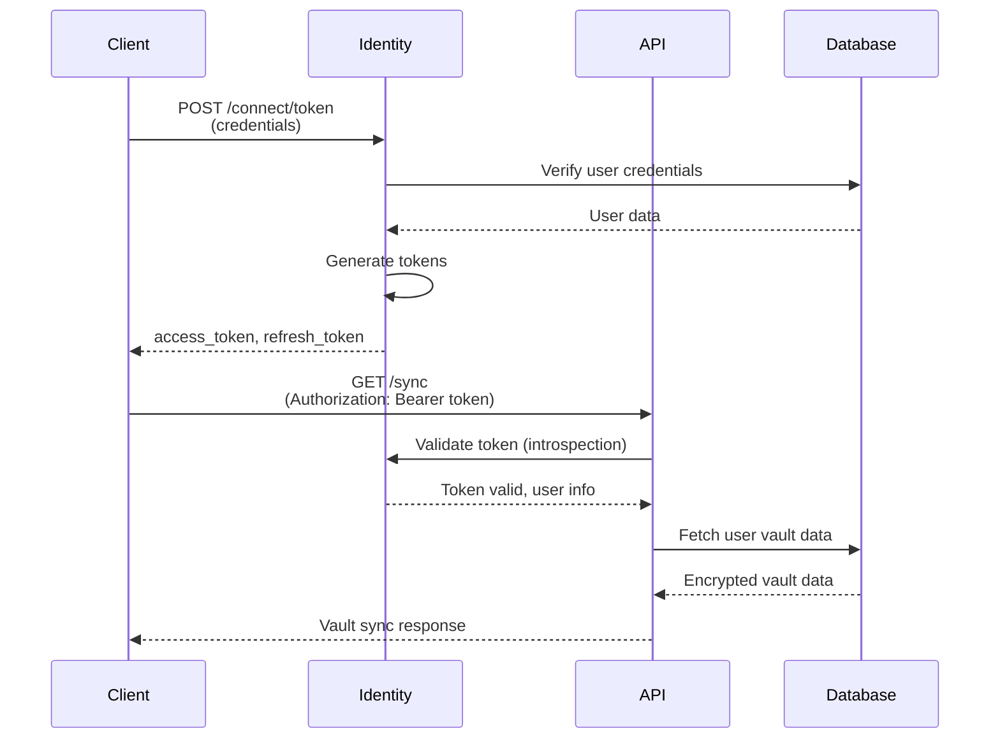
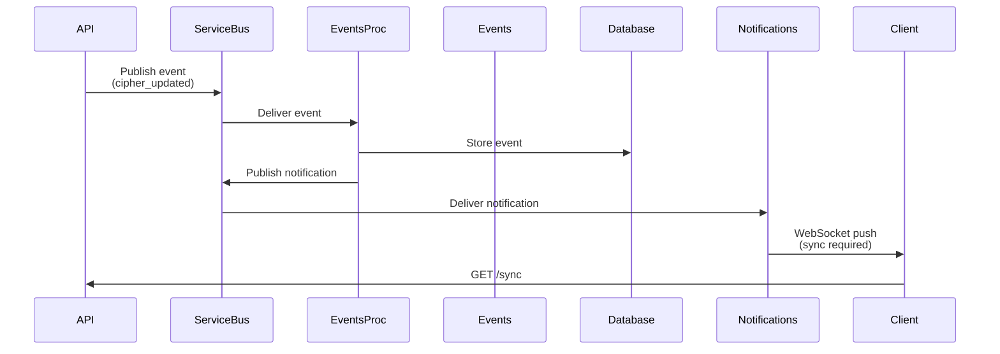

## Overview

Bitwarden Server follows a microservices architecture pattern, with each service responsible for specific functionality. Services communicate through HTTP APIs and message queues, with a shared database layer.

## High-Level Architecture

## Service Architecture

### Core Services

<AccordionGroup>
  <Accordion title="API Service" icon="server">
    **Port**: 4000 (default)
    
    The main REST API service that handles:
    - Vault operations (ciphers, folders, collections)
    - Organization management
    - User account operations
    - Attachment uploads/downloads
    - Sync endpoints
    - Two-factor authentication
    
    **Key Components**:
    - `Controllers/` - REST API endpoints
    - `Validators/` - Request validation
    - `Services/` - Business logic
    - `Models/` - Request/response models
    
    **Dependencies**:
    - SQL Database (primary data store)
    - Redis (caching and distributed locking)
    - Blob Storage (attachments)
    - Service Bus (event publishing)
  </Accordion>
  
  <Accordion title="Identity Service" icon="key">
    **Port**: 33656 (default)
    
    OAuth 2.0 / OpenID Connect authentication server:
    - User login and registration
    - Token issuance and validation
    - OAuth 2.0 flows (authorization code, client credentials)
    - Two-factor authentication enforcement
    - Device authorization
    
    **Based on**: IdentityServer4 framework
    
    **Key Endpoints**:
    - `/connect/token` - Token endpoint
    - `/connect/authorize` - Authorization endpoint
    - `/.well-known/openid-configuration` - Discovery
    
    **Dependencies**:
    - SQL Database
    - Redis (rate limiting)
    - Certificate store (signing keys)
  </Accordion>
  
  <Accordion title="Admin Service" icon="user-gear">
    **Port**: 5000 (default)
    
    Administrative portal and API:
    - User management
    - Organization administration
    - System configuration
    - License management
    - Event log viewing
    
    **Authentication**: Requires admin user credentials
    
    **Dependencies**:
    - SQL Database
    - Identity Service (authentication)
  </Accordion>
  
  <Accordion title="Notifications Service" icon="bell">
    **Port**: 5002 (default)
    
    Real-time notification delivery:
    - WebSocket connections for live updates
    - Push notifications to connected clients
    - Vault sync notifications
    - Anonymous client connections
    
    **Protocol**: SignalR over WebSockets
    
    **Dependencies**:
    - Service Bus (receives notifications)
    - Redis (connection management)
  </Accordion>
  
  <Accordion title="Events Service" icon="list">
    **Port**: 5003 (default)
    
    Event collection and audit logging:
    - Receives events from all services
    - Batches events for storage
    - Provides event query API
    - Audit trail compliance
    
    **Event Types**:
    - User actions (login, cipher access)
    - Administrative changes
    - Policy violations
    - Security events
    
    **Dependencies**:
    - SQL Database (event storage)
    - Service Bus (event ingestion)
  </Accordion>
</AccordionGroup>

### Enterprise Services

<AccordionGroup>
  <Accordion title="SSO Service" icon="right-to-bracket">
    **Port**: 51822 (default)
    
    Single Sign-On integration:
    - SAML 2.0 service provider
    - OpenID Connect integration
    - Just-in-time user provisioning
    - Multi-provider support per organization
    
    **Supported Protocols**:
    - SAML 2.0
    - OpenID Connect (OIDC)
    
    **License**: Requires commercial license
  </Accordion>
  
  <Accordion title="SCIM Service" icon="users">
    **Port**: 44559 (default)
    
    Automated user provisioning:
    - SCIM 2.0 protocol implementation
    - User lifecycle management
    - Group synchronization
    - Directory integration (Azure AD, Okta, etc.)
    
    **Operations**:
    - User CRUD operations
    - Group management
    - Bulk operations
    
    **License**: Requires commercial license
  </Accordion>
  
  <Accordion title="Billing Service" icon="credit-card">
    **Port**: 5004 (default)
    
    Payment and subscription management:
    - Stripe integration
    - Subscription lifecycle
    - Invoice generation
    - Payment method management
    
    **Payment Providers**:
    - Stripe (credit cards)
    - PayPal
    - BitPay (cryptocurrency)
  </Accordion>
</AccordionGroup>

### Background Services

<AccordionGroup>
  <Accordion title="Events Processor" icon="gears">
    Background worker service:
    - Processes events from Service Bus
    - Aggregates event data
    - Triggers notifications
    - Cleanup old events
    
    **Processing**:
    - Asynchronous event handling
    - Batch processing
    - Retry logic
    
    **No HTTP Interface**: Runs as background worker
  </Accordion>
  
  <Accordion title="Icons Service" icon="image">
    **Port**: 5005 (default)
    
    Website icon fetching:
    - Downloads favicons for vault items
    - Caches icons in blob storage
    - Serves cached icons
    - Fallback to default icons
    
    **Caching Strategy**:
    - Aggressive caching (30+ days)
    - CDN-friendly headers
  </Accordion>
</AccordionGroup>

## Data Flow

### Authentication Flow

### Event Processing Flow

## Technology Stack

<CardGroup cols={2}>
  <Card title="Framework" icon="layer-group">
    - .NET 8.0
    - ASP.NET Core
    - Entity Framework Core
    - Dapper (micro-ORM)
  </Card>
  
  <Card title="Authentication" icon="key">
    - IdentityServer4
    - OAuth 2.0 / OpenID Connect
    - JWT tokens
    - Certificate-based signing
  </Card>
  
  <Card title="Database" icon="database">
    - SQL Server 2022
    - PostgreSQL 14+
    - MySQL 8.0 / MariaDB 10+
    - Entity Framework migrations
  </Card>
  
  <Card title="Messaging" icon="message">
    - Azure Service Bus
    - RabbitMQ
    - SignalR (WebSockets)
  </Card>
  
  <Card title="Storage" icon="hard-drive">
    - Azure Blob Storage
    - Local filesystem
    - S3-compatible storage
  </Card>
  
  <Card title="Caching" icon="bolt">
    - Redis
    - In-memory caching
    - Distributed cache
  </Card>
</CardGroup>

## Scalability Considerations

### Horizontal Scaling

<Steps>
  <Step title="Stateless Services">
    All services are stateless and can be scaled horizontally behind a load balancer.
  </Step>
  
  <Step title="Shared State">
    Redis is used for distributed caching and session state across instances.
  </Step>
  
  <Step title="Database">
    Use read replicas for read-heavy operations. Consider database sharding for large deployments.
  </Step>
  
  <Step title="Message Bus">
    Service Bus handles async communication and decouples services for independent scaling.
  </Step>
</Steps>

### High Availability

- Deploy services across multiple availability zones
- Use database clustering (SQL Server Always On, PostgreSQL replication)
- Redis Sentinel or Redis Cluster for cache high availability
- Load balancer health checks for automatic failover

## Security Architecture

<CardGroup cols={2}>
  <Card title="Transport Security" icon="lock">
    - TLS 1.2+ required
    - Certificate pinning support
    - HSTS headers
  </Card>
  
  <Card title="Data Security" icon="shield">
    - Client-side encryption
    - Database encryption at rest
    - Encrypted backups
  </Card>
  
  <Card title="Authentication" icon="fingerprint">
    - OAuth 2.0 / OpenID Connect
    - Two-factor authentication
    - Device authorization
  </Card>
  
  <Card title="Authorization" icon="user-shield">
    - Role-based access control (RBAC)
    - Organization policies
    - Granular permissions
  </Card>
</CardGroup>

## Network Ports

| Service | Default Port | Protocol | Public |
|---------|--------------|----------|--------|
| API | 4000 | HTTPS | Yes |
| Identity | 33656 | HTTPS | Yes |
| Admin | 5000 | HTTPS | No |
| Notifications | 5002 | WSS | Yes |
| Events | 5003 | HTTPS | No |
| SSO | 51822 | HTTPS | Yes |
| SCIM | 44559 | HTTPS | Yes |
| Billing | 5004 | HTTPS | No |
| Icons | 5005 | HTTPS | Yes |

<Warning>
  Only API, Identity, Notifications, SSO, SCIM, and Icons services should be exposed publicly. All others should be internal only.
</Warning>

## Next Steps

<CardGroup cols={2}>
  <Card title="Docker Deployment" icon="docker" href="/deployment/docker">
    Deploy the full stack using Docker Compose
  </Card>
  <Card title="Configuration" icon="gear" href="/deployment/configuration">
    Configure services using appsettings.json
  </Card>
  <Card title="Database Setup" icon="database" href="/deployment/database-setup">
    Set up and configure the database
  </Card>
  <Card title="Service Documentation" icon="book" href="/services/api">
    Learn about individual services
  </Card>
</CardGroup>
