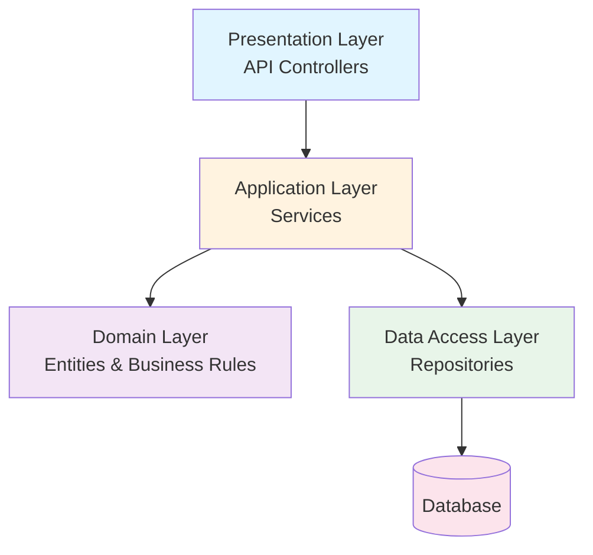
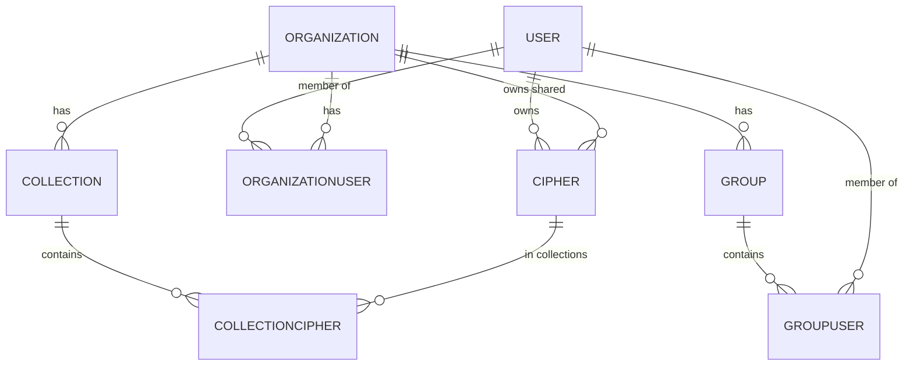

Bitwarden Server follows clean architecture principles with clear separation of concerns between domain logic, data access, and application services.

## Architectural Patterns

### Layered Architecture

The application is organized into distinct layers:



#### Layer Responsibilities

**Presentation Layer** (`src/Api/Controllers/`)
- HTTP request/response handling
- Input validation
- DTO mapping
- Authorization checks

**Application Layer** (`src/Core/Services/`)
- Business logic orchestration
- Transaction management
- Cross-cutting concerns
- Domain event coordination

**Domain Layer** (`src/Core/Entities/`, `src/Core/{Domain}/`)
- Entity definitions
- Business rules
- Domain invariants
- Value objects

**Data Access Layer** (`src/Infrastructure.Dapper/`, `src/Infrastructure.EntityFramework/`)
- Database queries
- ORM mappings
- Data persistence
- Query optimization

## Core Patterns

### Repository Pattern

Repositories abstract data access and provide a collection-like interface:

```csharp src/Core/Repositories/IRepository.cs
public interface IRepository<T, TId> 
    where TId : IEquatable<TId> 
    where T : class, ITableObject<TId>
{
    Task<T?> GetByIdAsync(TId id);
    Task<T> CreateAsync(T obj);
    Task ReplaceAsync(T obj);
    Task UpsertAsync(T obj);
    Task DeleteAsync(T obj);
}
```

**Benefits**:
- Decouples business logic from data access
- Enables unit testing with mocks
- Allows switching between Dapper and EF
- Centralizes query logic

**Example Implementation**:

```csharp src/Infrastructure.Dapper/Repositories/UserRepository.cs
public class UserRepository : Repository<User, Guid>, IUserRepository
{
    public async Task<User?> GetByEmailAsync(string email)
    {
        using (var connection = new SqlConnection(ConnectionString))
        {
            var results = await connection.QueryAsync<User>(
                "[dbo].[User_ReadByEmail]",
                new { Email = email },
                commandType: CommandType.StoredProcedure);

            return results.SingleOrDefault();
        }
    }
}
```

### Service Pattern

Services contain business logic and coordinate between repositories:

```csharp src/Core/Services/IUserService.cs
public interface IUserService
{
    Task<User> GetUserByIdAsync(Guid userId);
    Task<IdentityResult> CreateUserAsync(User user, string masterPasswordHash);
    Task SaveUserAsync(User user, bool push = false);
    Task<IdentityResult> DeleteAsync(User user);
}
```

**Service Responsibilities**:
- Validate business rules
- Coordinate multiple repositories
- Manage transactions
- Trigger side effects (emails, events, push notifications)

**Example**:

```csharp
public class UserService : IUserService
{
    private readonly IUserRepository _userRepository;
    private readonly IMailService _mailService;
    private readonly IPushNotificationService _pushService;
    
    public async Task SaveUserAsync(User user, bool push = false)
    {
        // Business logic validation
        if (string.IsNullOrWhiteSpace(user.Email))
        {
            throw new BadRequestException("Email is required.");
        }
        
        // Data access
        await _userRepository.ReplaceAsync(user);
        
        // Side effects
        if (push)
        {
            await _pushService.PushSyncAsync(user.Id);
        }
    }
}
```

### Entity Pattern

Entities represent domain objects with identity:

```csharp src/Core/Entities/User.cs
public class User : ITableObject<Guid>, IStorableSubscriber, IRevisable
{
    public Guid Id { get; set; }
    public string Email { get; set; }
    public string Name { get; set; }
    public DateTime CreationDate { get; set; } = DateTime.UtcNow;
    public DateTime RevisionDate { get; set; } = DateTime.UtcNow;
    
    public void SetNewId()
    {
        Id = CoreHelpers.GenerateComb();
    }
    
    // Business logic methods
    public bool HasMasterPassword()
    {
        return MasterPassword != null;
    }
}
```

**Entity Interfaces**:

```csharp src/Core/Entities/ITableObject.cs
public interface ITableObject<TId> where TId : IEquatable<TId>
{
    TId Id { get; set; }
    void SetNewId();
}

public interface IRevisable
{
    DateTime RevisionDate { get; set; }
}
```

**Key Characteristics**:
- Have unique identity (Id)
- Contain business logic methods
- Maintain their own invariants
- Track creation and revision dates

## Domain Organization

### Domain-Driven Design Structure

The codebase is organized by domain:

```
Core/
├── AdminConsole/       # Organization management domain
│   ├── Entities/
│   │   ├── Organization.cs
│   │   ├── OrganizationUser.cs
│   │   └── Policy.cs
│   ├── Services/
│   │   ├── IOrganizationService.cs
│   │   └── Implementations/
│   └── Enums/
├── Vault/              # Vault domain
│   ├── Entities/
│   │   └── Cipher.cs
│   └── Services/
├── Auth/               # Authentication domain
└── Billing/            # Billing domain
```

### Bounded Contexts

Each domain represents a bounded context with:

- **Entities** - Core domain objects
- **Services** - Domain operations
- **Repositories** - Data access contracts
- **Enums** - Domain-specific enumerations
- **Models** - DTOs and value objects

## Key Entities

### User

Represents a Bitwarden user account:

```csharp src/Core/Entities/User.cs
public class User : ITableObject<Guid>
{
    public Guid Id { get; set; }
    public string Email { get; set; }        // Unique identifier
    public string? Name { get; set; }
    public string? MasterPassword { get; set; }  // Hashed
    public string? Key { get; set; }         // Encrypted user key
    public bool Premium { get; set; }
    public DateTime CreationDate { get; set; }
    public DateTime AccountRevisionDate { get; set; }
    
    // Business logic
    public bool HasMasterPassword() => MasterPassword != null;
    public bool IsExpired() => PremiumExpirationDate.HasValue && 
                                PremiumExpirationDate.Value <= DateTime.UtcNow;
}
```

### Organization

Represents a shared vault organization:

```csharp src/Core/AdminConsole/Entities/Organization.cs
public class Organization : ITableObject<Guid>, IStorableSubscriber
{
    public Guid Id { get; set; }
    public string Name { get; set; }
    public string BillingEmail { get; set; }
    public PlanType PlanType { get; set; }
    public int? Seats { get; set; }
    public bool UseGroups { get; set; }
    public bool UsePolicies { get; set; }
    public bool UseSecretsManager { get; set; }
    public DateTime CreationDate { get; set; }
    
    // Business logic
    public bool IsExpired() => ExpirationDate.HasValue && 
                                ExpirationDate.Value <= DateTime.UtcNow;
    public string DisplayName() => WebUtility.HtmlDecode(Name);
}
```

### Cipher

Represents a vault item (password, note, card, identity):

```csharp src/Core/Vault/Entities/Cipher.cs
public class Cipher : ITableObject<Guid>, ICloneable
{
    public Guid Id { get; set; }
    public Guid? UserId { get; set; }         // Personal vault
    public Guid? OrganizationId { get; set; } // Organization vault
    public CipherType Type { get; set; }      // Login, SecureNote, Card, Identity
    public string Data { get; set; }          // Encrypted JSON
    public DateTime CreationDate { get; set; }
    public DateTime RevisionDate { get; set; }
    public DateTime? DeletedDate { get; set; } // Soft delete
    
    // Attachment management
    public Dictionary<string, CipherAttachment.MetaData> GetAttachments() { }
    public void SetAttachments(Dictionary<string, CipherAttachment.MetaData> data) { }
}
```

## Entity Relationships



### Key Relationships

- **User ↔ Cipher**: One-to-many (personal vault items)
- **Organization ↔ Cipher**: One-to-many (organization vault items)
- **User ↔ Organization**: Many-to-many via OrganizationUser
- **Cipher ↔ Collection**: Many-to-many via CollectionCipher
- **User ↔ Group**: Many-to-many via GroupUser

## Dependency Injection

All dependencies are registered in `Startup.cs`:

```csharp src/Api/Startup.cs
public void ConfigureServices(IServiceCollection services)
{
    // Repositories
    services.AddScoped<IUserRepository, UserRepository>();
    services.AddScoped<IOrganizationRepository, OrganizationRepository>();
    services.AddScoped<ICipherRepository, CipherRepository>();
    
    // Services
    services.AddScoped<IUserService, UserService>();
    services.AddScoped<IOrganizationService, OrganizationService>();
    services.AddScoped<ICipherService, CipherService>();
    
    // Infrastructure
    services.AddScoped<IMailService, MailService>();
    services.AddScoped<IPushNotificationService, PushNotificationService>();
}
```

### Service Lifetimes

- **Scoped** - Most services and repositories (per HTTP request)
- **Singleton** - Application cache, configuration
- **Transient** - Lightweight utilities

## Command Pattern

Complex operations use the command pattern:

```csharp
public interface ICreateOrganizationCommand
{
    Task<Organization> CreateAsync(OrganizationSignup signup);
}

public class CreateOrganizationCommand : ICreateOrganizationCommand
{
    private readonly IOrganizationRepository _organizationRepository;
    private readonly IOrganizationUserRepository _organizationUserRepository;
    private readonly IPaymentService _paymentService;
    private readonly IMailService _mailService;
    
    public async Task<Organization> CreateAsync(OrganizationSignup signup)
    {
        // Multi-step operation
        var org = new Organization { /* ... */ };
        await _organizationRepository.CreateAsync(org);
        
        var orgUser = new OrganizationUser { /* ... */ };
        await _organizationUserRepository.CreateAsync(orgUser);
        
        await _paymentService.CreateSubscriptionAsync(org);
        await _mailService.SendOrganizationConfirmedEmailAsync(org, orgUser);
        
        return org;
    }
}
```

## Error Handling

### Custom Exceptions

```csharp src/Core/Exceptions/
public class BadRequestException : Exception { }
public class NotFoundException : Exception { }
public class UnauthorizedException : Exception { }
```

### Exception Middleware

Exceptions are caught and converted to appropriate HTTP responses:

```csharp
app.UseMiddleware<ExceptionHandlerMiddleware>();

// BadRequestException → 400
// NotFoundException → 404
// UnauthorizedException → 401
```

## Authorization

### Permission-Based Authorization

```csharp
public class OrganizationAuthorizationHandler : 
    AuthorizationHandler<OrganizationOperationRequirement, Organization>
{
    protected override Task HandleRequirementAsync(
        AuthorizationHandlerContext context,
        OrganizationOperationRequirement requirement,
        Organization resource)
    {
        var userId = context.User.GetUserId();
        var orgUser = GetOrganizationUser(userId, resource.Id);
        
        if (requirement.Name == nameof(OrganizationOperations.Update))
        {
            if (orgUser?.Type == OrganizationUserType.Owner ||
                orgUser?.Type == OrganizationUserType.Admin)
            {
                context.Succeed(requirement);
            }
        }
        
        return Task.CompletedTask;
    }
}
```

## Event Sourcing

Audit events are tracked for compliance:

```csharp
public interface IEventService
{
    Task LogUserEventAsync(Guid userId, EventType type);
    Task LogCipherEventAsync(Cipher cipher, EventType type);
    Task LogOrganizationEventAsync(Organization org, EventType type);
}
```

Events are written to the Events service and processed asynchronously.

## Caching Strategy

```csharp
public interface IApplicationCacheService
{
    Task<T> GetOrSetAsync<T>(string key, Func<Task<T>> factory, TimeSpan? expiration = null);
    Task RemoveAsync(string key);
}
```

Cached data:
- Organization abilities (permissions)
- User premium status
- Feature flags

## See Also

- [Data Models](/development/data-models) - Detailed entity reference
- [Repositories](/development/repositories) - Data access patterns
- [Project Structure](/development/project-structure) - Solution organization