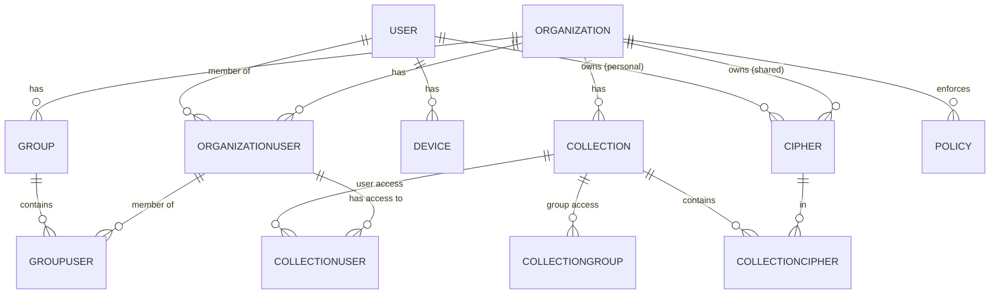

Bitwarden Server uses a rich domain model with entities representing users, organizations, vault items, and more. All entities inherit from `ITableObject<T>` and follow consistent patterns.

## Entity Base Interfaces

### ITableObject

The foundation interface for all entities:

```csharp src/Core/Entities/ITableObject.cs
public interface ITableObject<TId> where TId : IEquatable<TId>
{
    TId Id { get; set; }
    void SetNewId();
}
```

All entities have:
- **Unique identifier** (`Guid` for most entities)
- **SetNewId() method** - Generates COMB GUIDs for better indexing

### IRevisable

Tracks when entities were last modified:

```csharp src/Core/Entities/IRevisable.cs
public interface IRevisable
{
    DateTime RevisionDate { get; set; }
}
```

Used for synchronization - clients only fetch entities modified since last sync.

### IStorableSubscriber

Marks entities related to billing:

```csharp src/Core/Entities/IStorableSubscriber.cs
public interface IStorableSubscriber : ISubscriber
{
    bool IsOrganization();
    bool IsUser();
}
```

## Core Entities

### User

Represents a Bitwarden user account.

```csharp src/Core/Entities/User.cs
public class User : ITableObject<Guid>, IStorableSubscriber, IRevisable
{
    // Identity
    public Guid Id { get; set; }
    public string Email { get; set; }              // Unique, normalized
    public bool EmailVerified { get; set; }
    public string? Name { get; set; }
    
    // Authentication
    public string? MasterPassword { get; set; }    // Server-side hash
    public string? MasterPasswordHint { get; set; }
    public string SecurityStamp { get; set; }      // For invalidating sessions
    public string? TwoFactorProviders { get; set; } // JSON
    public string? TwoFactorRecoveryCode { get; set; }
    
    // Encryption Keys
    public string? Key { get; set; }               // Master-password-sealed user key
    public string? PublicKey { get; set; }         // For sharing
    public string? PrivateKey { get; set; }        // User-key-wrapped private key
    public string? SignedPublicKey { get; set; }   // Signed by signature key
    
    // Key Derivation
    public KdfType Kdf { get; set; }               // PBKDF2, Argon2
    public int KdfIterations { get; set; }
    public int? KdfMemory { get; set; }            // For Argon2
    public int? KdfParallelism { get; set; }       // For Argon2
    
    // Premium
    public bool Premium { get; set; }              // Personal subscription
    public DateTime? PremiumExpirationDate { get; set; }
    public long? Storage { get; set; }             // Bytes used
    public short? MaxStorageGb { get; set; }
    
    // Billing
    public GatewayType? Gateway { get; set; }      // Stripe, Braintree
    public string? GatewayCustomerId { get; set; }
    public string? GatewaySubscriptionId { get; set; }
    
    // Tracking
    public DateTime CreationDate { get; set; }
    public DateTime RevisionDate { get; set; }
    public DateTime AccountRevisionDate { get; set; }  // For sync
    public DateTime? LastPasswordChangeDate { get; set; }
    public DateTime? LastKeyRotationDate { get; set; }
    
    // Security
    public bool VerifyDevices { get; set; }        // New device verification
    public int FailedLoginCount { get; set; }
    public DateTime? LastFailedLoginDate { get; set; }
    
    // Methods
    public bool HasMasterPassword() => MasterPassword != null;
    public bool IsExpired() => PremiumExpirationDate.HasValue && 
                                PremiumExpirationDate.Value <= DateTime.UtcNow;
    public Dictionary<TwoFactorProviderType, TwoFactorProvider>? GetTwoFactorProviders() { }
}
```

**Key Properties**:

- **Email**: Unique identifier, used for login
- **MasterPassword**: Server-side hash (not the client hash!)
- **Key**: User's encryption key, encrypted with master password
- **AccountRevisionDate**: Updated whenever sync data changes

### Organization

Represents a shared organization vault.

```csharp src/Core/AdminConsole/Entities/Organization.cs
public class Organization : ITableObject<Guid>, IStorableSubscriber, IRevisable
{
    // Identity
    public Guid Id { get; set; }
    public string? Identifier { get; set; }        // Custom identifier
    public string Name { get; set; }               // HTML encoded
    public string BillingEmail { get; set; }
    
    // Subscription
    public string Plan { get; set; }               // Plan identifier
    public PlanType PlanType { get; set; }         // Free, Families, Teams, Enterprise
    public int? Seats { get; set; }                // Licensed seats
    public short? MaxCollections { get; set; }
    public bool Enabled { get; set; }
    public DateTime? ExpirationDate { get; set; }
    
    // Features
    public bool UsePasswordManager { get; set; }
    public bool UseSecretsManager { get; set; }
    public bool UsePolicies { get; set; }
    public bool UseSso { get; set; }
    public bool UseKeyConnector { get; set; }
    public bool UseScim { get; set; }
    public bool UseGroups { get; set; }
    public bool UseDirectory { get; set; }
    public bool UseEvents { get; set; }
    public bool UseTotp { get; set; }
    public bool Use2fa { get; set; }
    public bool UseApi { get; set; }
    public bool UseResetPassword { get; set; }
    public bool UseCustomPermissions { get; set; }
    public bool UsersGetPremium { get; set; }      // Members get premium
    public bool UseRiskInsights { get; set; }
    public bool UseOrganizationDomains { get; set; }
    
    // Secrets Manager
    public int? SmSeats { get; set; }
    public int? SmServiceAccounts { get; set; }
    public int? MaxAutoscaleSmSeats { get; set; }
    public int? MaxAutoscaleSmServiceAccounts { get; set; }
    
    // Billing
    public GatewayType? Gateway { get; set; }
    public string? GatewayCustomerId { get; set; }
    public string? GatewaySubscriptionId { get; set; }
    
    // Storage
    public long? Storage { get; set; }             // Bytes used
    public short? MaxStorageGb { get; set; }
    
    // Permissions
    public bool LimitCollectionCreation { get; set; }
    public bool LimitCollectionDeletion { get; set; }
    public bool AllowAdminAccessToAllCollectionItems { get; set; }
    public bool LimitItemDeletion { get; set; }
    
    // Tracking
    public DateTime CreationDate { get; set; }
    public DateTime RevisionDate { get; set; }
    public OrganizationStatusType Status { get; set; }
    
    // Methods
    public string DisplayName() => WebUtility.HtmlDecode(Name);
    public bool IsExpired() => ExpirationDate.HasValue && 
                                ExpirationDate.Value <= DateTime.UtcNow;
}
```

**Plan Types**:

```csharp
public enum PlanType
{
    Free = 0,
    FamiliesAnnually2019 = 1,
    TeamsMonthly2019 = 2,
    TeamsAnnually2019 = 3,
    EnterpriseMonthly2019 = 4,
    EnterpriseAnnually2019 = 5,
    Custom = 6
}
```

### Cipher

Represents a vault item (password, note, card, or identity).

```csharp src/Core/Vault/Entities/Cipher.cs
public class Cipher : ITableObject<Guid>, ICloneable
{
    // Identity
    public Guid Id { get; set; }
    public Guid? UserId { get; set; }              // Personal vault
    public Guid? OrganizationId { get; set; }      // Organization vault
    
    // Content
    public CipherType Type { get; set; }           // Login, SecureNote, Card, Identity
    public string Data { get; set; }               // Encrypted JSON payload
    
    // Organization
    public string? Favorites { get; set; }         // JSON: userId -> bool
    public string? Folders { get; set; }           // JSON: userId -> folderId
    public string? Archives { get; set; }          // JSON: userId -> bool
    
    // Attachments
    public string? Attachments { get; set; }       // JSON: attachmentId -> metadata
    
    // Encryption
    public string? Key { get; set; }               // Item-specific encryption key
    
    // Tracking
    public DateTime CreationDate { get; set; }
    public DateTime RevisionDate { get; set; }
    public DateTime? DeletedDate { get; set; }     // Soft delete for recovery
    
    // Security
    public CipherRepromptType? Reprompt { get; set; }  // Require master password
    
    // Methods
    public Dictionary<string, CipherAttachment.MetaData>? GetAttachments() { }
    public void SetAttachments(Dictionary<string, CipherAttachment.MetaData> data) { }
    public void AddAttachment(string id, CipherAttachment.MetaData data) { }
    public void DeleteAttachment(string id) { }
}
```

**Cipher Types**:

```csharp
public enum CipherType
{
    Login = 1,
    SecureNote = 2,
    Card = 3,
    Identity = 4
}
```

**Data Structure** (encrypted JSON):

```json
// Login type
{
  "name": "2.encrypted",
  "username": "2.encrypted",
  "password": "2.encrypted",
  "uris": [
    { "uri": "2.encrypted", "match": 0 }
  ],
  "totp": "2.encrypted"
}
```

### Collection

Groups ciphers within an organization.

```csharp src/Core/Entities/Collection.cs
public class Collection : ITableObject<Guid>, IRevisable
{
    public Guid Id { get; set; }
    public Guid OrganizationId { get; set; }
    public string Name { get; set; }               // Encrypted
    public string? ExternalId { get; set; }        // For directory sync
    public DateTime CreationDate { get; set; }
    public DateTime RevisionDate { get; set; }
}
```

### OrganizationUser

Links users to organizations with roles.

```csharp src/Core/AdminConsole/Entities/OrganizationUser.cs
public class OrganizationUser : ITableObject<Guid>
{
    public Guid Id { get; set; }
    public Guid OrganizationId { get; set; }
    public Guid? UserId { get; set; }              // Null until invite accepted
    public string? Email { get; set; }             // For pending invites
    public string? Key { get; set; }               // Org key encrypted for user
    public OrganizationUserType Type { get; set; } // Owner, Admin, User, etc.
    public OrganizationUserStatusType Status { get; set; }  // Invited, Accepted, Confirmed
    public bool AccessSecretsManager { get; set; }
    public string? Permissions { get; set; }       // JSON: custom permissions
    public DateTime CreationDate { get; set; }
    public DateTime RevisionDate { get; set; }
}
```

**User Types**:

```csharp
public enum OrganizationUserType
{
    Owner = 0,
    Admin = 1,
    User = 2,
    Manager = 3,
    Custom = 4
}
```

**Status Types**:

```csharp
public enum OrganizationUserStatusType
{
    Invited = 0,      // Invite sent, not accepted
    Accepted = 1,     // Accepted, awaiting confirmation
    Confirmed = 2     // Fully confirmed and active
}
```

### Group

Groups users within an organization.

```csharp src/Core/AdminConsole/Entities/Group.cs
public class Group : ITableObject<Guid>, IRevisable
{
    public Guid Id { get; set; }
    public Guid OrganizationId { get; set; }
    public string Name { get; set; }               // Encrypted
    public bool AccessAll { get; set; }            // Access to all collections
    public string? ExternalId { get; set; }        // For directory sync
    public DateTime CreationDate { get; set; }
    public DateTime RevisionDate { get; set; }
}
```

### Policy

Enforces organization-wide rules.

```csharp src/Core/AdminConsole/Entities/Policy.cs
public class Policy : ITableObject<Guid>, IRevisable
{
    public Guid Id { get; set; }
    public Guid OrganizationId { get; set; }
    public PolicyType Type { get; set; }
    public string? Data { get; set; }              // JSON: policy-specific data
    public bool Enabled { get; set; }
    public DateTime CreationDate { get; set; }
    public DateTime RevisionDate { get; set; }
}
```

**Policy Types**:

```csharp
public enum PolicyType
{
    TwoFactorAuthentication = 0,
    MasterPassword = 1,
    PasswordGenerator = 2,
    SingleOrg = 3,
    RequireSso = 4,
    PersonalOwnership = 5,
    DisableSend = 6,
    SendOptions = 7,
    ResetPassword = 8,
    MaximumVaultTimeout = 9,
    DisablePersonalVaultExport = 10
}
```

## Relationship Entities

### CollectionCipher

Links ciphers to collections (many-to-many).

```csharp src/Core/Entities/CollectionCipher.cs
public class CollectionCipher
{
    public Guid CollectionId { get; set; }
    public Guid CipherId { get; set; }
}
```

### CollectionUser

Grants users access to collections.

```csharp src/Core/Entities/CollectionUser.cs
public class CollectionUser
{
    public Guid CollectionId { get; set; }
    public Guid OrganizationUserId { get; set; }  // Not UserId!
    public bool ReadOnly { get; set; }
    public bool HidePasswords { get; set; }
    public bool Manage { get; set; }
}
```

### CollectionGroup

Grants groups access to collections.

```csharp src/Core/Entities/CollectionGroup.cs
public class CollectionGroup
{
    public Guid CollectionId { get; set; }
    public Guid GroupId { get; set; }
    public bool ReadOnly { get; set; }
    public bool HidePasswords { get; set; }
    public bool Manage { get; set; }
}
```

### GroupUser

Links users to groups (many-to-many).

```csharp src/Core/AdminConsole/Entities/GroupUser.cs
public class GroupUser
{
    public Guid GroupId { get; set; }
    public Guid OrganizationUserId { get; set; }
}
```

## Entity Relationship Diagram



## Supporting Entities

### Device

Tracks user devices for push notifications and verification.

```csharp src/Core/Entities/Device.cs
public class Device : ITableObject<Guid>, IRevisable
{
    public Guid Id { get; set; }
    public Guid UserId { get; set; }
    public string Name { get; set; }               // User-friendly name
    public DeviceType Type { get; set; }           // Android, iOS, Web, etc.
    public string Identifier { get; set; }         // Device-specific ID
    public string? PushToken { get; set; }         // For push notifications
    public DateTime CreationDate { get; set; }
    public DateTime RevisionDate { get; set; }
}
```

### Folder

Personal organization folders for ciphers.

```csharp src/Core/Entities/Folder.cs
public class Folder : ITableObject<Guid>, IRevisable
{
    public Guid Id { get; set; }
    public Guid UserId { get; set; }
    public string Name { get; set; }               // Encrypted
    public DateTime CreationDate { get; set; }
    public DateTime RevisionDate { get; set; }
}
```

## Data Encryption

### Encryption Patterns

**User Data**:
- Encrypted with user's encryption key
- Key derived from master password
- Stored as: `{encType}.{base64EncodedData}`

**Organization Data**:
- Encrypted with organization key
- Organization key encrypted per-user
- Shared among all members

**Encryption Types**:
```
0 = AesCbc256_B64
1 = AesCbc128_HmacSha256_B64
2 = AesCbc256_HmacSha256_B64  (current standard)
3 = Rsa2048_OaepSha256_B64
4 = Rsa2048_OaepSha1_B64
5 = Rsa2048_OaepSha256_HmacSha256_B64
6 = Rsa2048_OaepSha1_HmacSha256_B64
```

## Database Schema

### Naming Conventions

- **Tables**: PascalCase (e.g., `User`, `OrganizationUser`)
- **Columns**: PascalCase (e.g., `CreationDate`, `RevisionDate`)
- **Stored Procedures**: `[TableName]_[Operation]` (e.g., `User_ReadByEmail`)

### Common Patterns

All tables have:
- **Id**: UNIQUEIDENTIFIER (GUID), primary key
- **CreationDate**: DATETIME2(7), defaults to GETUTCDATE()
- **RevisionDate**: DATETIME2(7), defaults to GETUTCDATE()

## JSON Properties

Many entities store complex data as JSON strings:

- **User.TwoFactorProviders**: Dictionary of 2FA configurations
- **Organization.TwoFactorProviders**: Organization-level 2FA
- **Cipher.Data**: Encrypted vault item data
- **Cipher.Attachments**: Attachment metadata
- **Policy.Data**: Policy-specific configuration

### Example: TwoFactorProviders JSON

```json
{
  "0": {  // Authenticator
    "Enabled": true,
    "MetaData": { "Key": "SECRETKEY" }
  },
  "3": {  // Email
    "Enabled": true,
    "MetaData": { "Email": "user@example.com" }
  }
}
```

## See Also

- [Repositories](/development/repositories) - How to query these entities
- [Core Concepts](/development/core-concepts) - Architectural patterns
- [Project Structure](/development/project-structure) - Where entities are defined