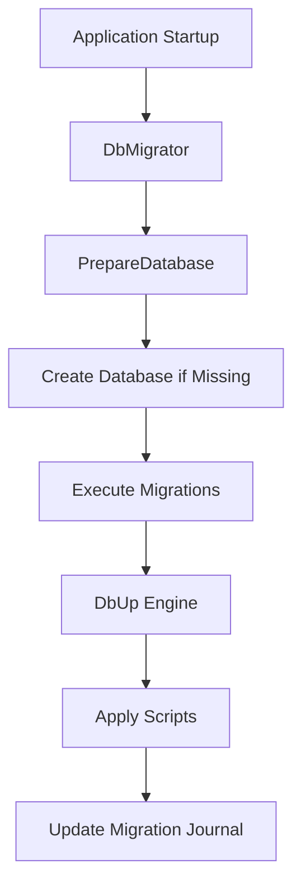

Bitwarden Server uses [DbUp](https://dbup.readthedocs.io/) for database schema migrations. The migration system supports multiple database providers including SQL Server, MySQL, and PostgreSQL.

## Migration Architecture

Migrations are managed by the **Migrator** class library located in `util/Migrator/`.



## Understanding the Migrator

The core migration logic is in `util/Migrator/DbMigrator.cs`:

```csharp src/Migrator/DbMigrator.cs
public class DbMigrator
{
    private readonly string _connectionString;
    private readonly ILogger<DbMigrator> _logger;
    private readonly bool _skipDatabasePreparation;
    private readonly bool _noTransactionMigration;

    public bool MigrateMsSqlDatabaseWithRetries(
        bool enableLogging = true,
        bool repeatable = false,
        string folderName = MigratorConstants.DefaultMigrationsFolderName,
        bool dryRun = false,
        CancellationToken cancellationToken = default)
    {
        // Retry logic for SQL Server script upgrade mode
        var attempt = 1;
        while (attempt < 10)
        {
            try
            {
                if (!_skipDatabasePreparation)
                {
                    PrepareDatabase(cancellationToken);
                }
                return MigrateDatabase(enableLogging, repeatable, folderName, dryRun, cancellationToken);
            }
            catch (SqlException ex)
            {
                if (ex.Message.Contains("Server is in script upgrade mode."))
                {
                    attempt++;
                    Thread.Sleep(20000);
                }
                else
                {
                    throw;
                }
            }
        }
        return false;
    }
}
```

### Key Features

- **Automatic Database Creation** - Creates the database if it doesn't exist
- **Retry Logic** - Handles SQL Server upgrade mode automatically
- **Transaction Support** - Wraps migrations in transactions by default
- **Dry Run Mode** - Preview migrations without applying them
- **Multiple Providers** - SQL Server, MySQL, PostgreSQL support

## Migration Folders

Migrations are organized in the `util/Migrator/DbScripts/` directory:

- **DbScripts/** - Main migration scripts (SQL Server)
- **DbScripts_transition/** - Transitional scripts for major changes
- **DbScripts_finalization/** - Post-migration cleanup scripts
- **MySql/** - MySQL-specific migrations
- **Postgres/** - PostgreSQL-specific migrations

## Running Migrations

### Local Development

<Steps>

<Step title="Using the MsSqlMigratorUtility">

```bash
cd util/MsSqlMigratorUtility
dotnet run "Server=localhost;Database=vault_dev;User Id=SA;Password=your_password;Encrypt=True;TrustServerCertificate=True"
```
</Step>

<Step title="Preview migrations (dry run)">

```bash
dotnet run --dry-run "connection_string_here"
```

This shows which scripts will be executed without applying them.
</Step>

<Step title="Verify migration status">

Check the migration journal table:

```sql
SELECT * FROM dbo.Migration
ORDER BY ScriptName;
```
</Step>

</Steps>

### Production Deployment

In production environments, migrations typically run:

1. **During Application Startup** - Via `DatabaseMigrationHostedService` in the Admin service:

```csharp src/Admin/HostedServices/DatabaseMigrationHostedService.cs
public class DatabaseMigrationHostedService : IHostedService
{
    public async Task StartAsync(CancellationToken cancellationToken)
    {
        var migrator = new DbMigrator(_connectionString, _logger);
        var success = migrator.MigrateMsSqlDatabaseWithRetries(
            enableLogging: true,
            cancellationToken: cancellationToken
        );
        
        if (!success)
        {
            throw new Exception("Database migration failed");
        }
    }
}
```

2. **As Part of CI/CD** - Before deploying application containers

## Creating New Migrations

<Steps>

<Step title="Determine migration type">

Migrations are named with a timestamp prefix:

```
YYYY-MM-DD-HH-MM_DescriptiveName.sql
```

Example: `2026-03-10-14-30_AddUserPreferences.sql`
</Step>

<Step title="Create the migration file">

Create a new `.sql` file in `util/Migrator/DbScripts/`:

```sql
-- Add new column to User table
IF COL_LENGTH('[dbo].[User]', 'Preferences') IS NULL
BEGIN
    ALTER TABLE [dbo].[User]
    ADD [Preferences] NVARCHAR(MAX) NULL
END
GO

-- Create index if it doesn't exist
IF NOT EXISTS (SELECT * FROM sys.indexes WHERE name = 'IX_User_Preferences')
BEGIN
    CREATE NONCLUSTERED INDEX [IX_User_Preferences]
    ON [dbo].[User]([Preferences])
END
GO
```

<Note>
Always make migrations idempotent - they should handle cases where they've been partially applied.
</Note>
</Step>

<Step title="Set the file as an Embedded Resource">

Edit `util/Migrator/Migrator.csproj` to include the new script:

```xml
<ItemGroup>
  <EmbeddedResource Include="DbScripts\*.sql" />
</ItemGroup>
```

The wildcard pattern typically already includes all `.sql` files.
</Step>

<Step title="Test the migration">

```bash
cd util/MsSqlMigratorUtility

# Dry run first
dotnet run --dry-run "your_test_connection_string"

# Apply to test database
dotnet run "your_test_connection_string"
```
</Step>

<Step title="Create corresponding provider-specific migrations">

If supporting multiple databases, create equivalent migrations for:

- `util/MySqlMigrations/Migrations/`
- `util/PostgresMigrations/Migrations/`
</Step>

</Steps>

## Migration Best Practices

### Make Migrations Idempotent

Always check if changes exist before applying:

```sql
-- Good: Check before adding column
IF COL_LENGTH('[dbo].[Table]', 'NewColumn') IS NULL
BEGIN
    ALTER TABLE [dbo].[Table]
    ADD [NewColumn] NVARCHAR(50) NULL
END
GO

-- Bad: Will fail if run twice
ALTER TABLE [dbo].[Table]
ADD [NewColumn] NVARCHAR(50) NULL
GO
```

### Use Transactions Appropriately

Most migrations run in transactions by default. For long-running operations, consider:

```csharp
var migrator = new DbMigrator(
    connectionString,
    logger,
    noTransactionMigration: true  // Disable transaction for this migration
);
```

### Handle Large Data Migrations

For migrations affecting millions of rows:

```sql
-- Process in batches
DECLARE @BatchSize INT = 10000;
DECLARE @RowsAffected INT = @BatchSize;

WHILE @RowsAffected = @BatchSize
BEGIN
    UPDATE TOP (@BatchSize) [dbo].[LargeTable]
    SET [NewColumn] = 'DefaultValue'
    WHERE [NewColumn] IS NULL;
    
    SET @RowsAffected = @@ROWCOUNT;
END
GO
```

### Maintain Backward Compatibility

When removing columns:

1. **Step 1**: Deploy code that no longer uses the column
2. **Step 2**: After deployment, create migration to drop the column

### Document Complex Migrations

```sql
-- Migration: Add support for user preferences
-- Jira: BW-12345
-- Description: Adds a JSONB column to store user UI preferences
-- Author: developer@bitwarden.com
-- Date: 2026-03-10

IF COL_LENGTH('[dbo].[User]', 'Preferences') IS NULL
BEGIN
    ALTER TABLE [dbo].[User]
    ADD [Preferences] NVARCHAR(MAX) NULL
END
GO
```

## Migration Execution Order

Migrations execute in this order:

1. **DbScripts/** - Main schema changes
2. **DbScripts_transition/** - Transitional logic
3. **DbScripts_finalization/** - Cleanup and finalization

Each folder's scripts execute alphabetically by filename (timestamp-based naming ensures chronological order).

## Troubleshooting

### Migration Failed Mid-Execution

If a migration fails:

1. Check the migration journal:
   ```sql
   SELECT * FROM dbo.Migration ORDER BY ScriptName DESC;
   ```

2. Manually rollback changes if needed
3. Fix the migration script
4. The migrator will retry on next run

### Script Upgrade Mode Error

The migrator automatically retries with 20-second delays. If persistent:

```bash
# Check SQL Server status
docker logs bitwarden_mssql

# Restart SQL Server
docker restart bitwarden_mssql
```

### Multiple Database Providers Out of Sync

Ensure all provider migrations are equivalent:

```bash
# Compare migration counts
ls util/Migrator/DbScripts/*.sql | wc -l
ls util/MySqlMigrations/Migrations/*.sql | wc -l
ls util/PostgresMigrations/Migrations/*.sql | wc -l
```

## Related Files

- `util/Migrator/DbMigrator.cs:15` - Core migration logic
- `util/Migrator/SqlServerDbMigrator.cs:1` - SQL Server-specific implementation
- `src/Admin/HostedServices/DatabaseMigrationHostedService.cs:1` - Production migration service

## See Also

- [DbUp Documentation](https://dbup.readthedocs.io/)
- [Contributing Guide](/development/contribution-guide) - Submit migration changes
- [Testing Guide](/development/testing) - Test migrations with integration tests