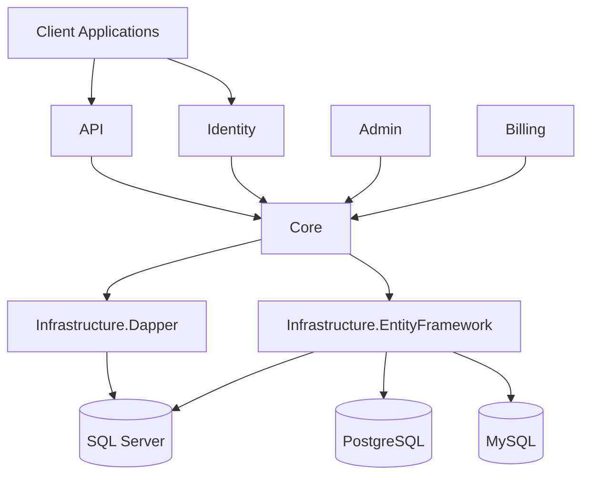
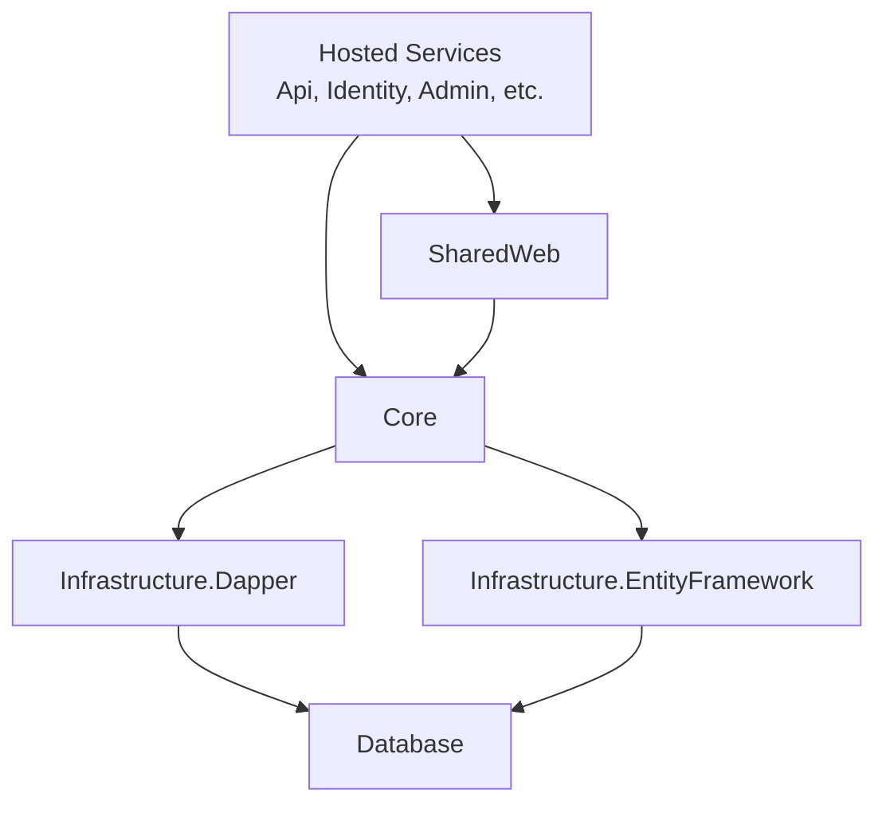

Bitwarden Server is a large .NET solution containing **55+ projects** organized into core libraries, hosted services, infrastructure implementations, and utilities.

## Solution Organization

The repository is organized into three main directories:

```
bitwarden-server/
├── src/          # Application code (AGPL licensed)
├── test/         # Test projects
└── util/         # Utility projects and tools
```

## Source Projects (`src/`)

The `src/` directory contains all application code:



### Core Library

**Location**: `src/Core/`

The Core project is the heart of the application, containing:

- **Entities** - Domain models (`User`, `Organization`, `Cipher`, etc.)
- **Repository Interfaces** - Data access contracts
- **Service Interfaces** - Business logic contracts
- **Enums** - Application-wide enumerations
- **Constants** - Application constants

```
Core/
├── AdminConsole/          # Organization & user management
│   ├── Entities/
│   │   ├── Organization.cs
│   │   ├── OrganizationUser.cs
│   │   ├── Group.cs
│   │   └── Policy.cs
│   ├── Services/
│   └── Repositories/
├── Auth/                  # Authentication & authorization
├── Billing/               # Subscription & payment logic
├── Vault/                 # Password vault features
│   ├── Entities/
│   │   ├── Cipher.cs          # Vault items (passwords, notes, etc.)
│   │   └── SecurityTask.cs
│   ├── Services/
│   └── Repositories/
├── SecretsManager/        # Secrets Manager features
├── NotificationCenter/    # In-app notifications
├── Entities/              # Shared entities
│   ├── User.cs
│   ├── Device.cs
│   ├── Collection.cs
│   └── ITableObject.cs    # Base interface
├── Repositories/          # Repository interfaces
│   ├── IRepository.cs
│   ├── IUserRepository.cs
│   └── ICollectionRepository.cs
├── Services/              # Service interfaces & implementations
│   ├── IUserService.cs
│   └── Implementations/
├── Models/                # DTOs and view models
├── Enums/                 # Application enumerations
└── Settings/              # Configuration classes
```

<Note>
Core is a **class library** (`.csproj`) and contains no ASP.NET dependencies. It's referenced by all other projects.
</Note>

### Hosted Services

These are ASP.NET applications that run as microservices:

#### API (`src/Api/`)

The main REST API for vault operations:

```
Api/
├── Controllers/
│   ├── AccountsController.cs      # User account management
│   ├── CiphersController.cs       # Vault items
│   ├── OrganizationsController.cs # Organization management
│   └── SyncController.cs          # Vault synchronization
├── Models/                      # Request/response DTOs
├── Utilities/                   # Helpers and middleware
├── Startup.cs                   # Service configuration
└── Program.cs                   # Application entry point
```

**Runs on**: Port 4000 (development)

#### Identity (`src/Identity/`)

Authentication service based on IdentityServer:

```
Identity/
├── Controllers/
│   ├── AccountController.cs       # Login, register
│   └── TwoFactorController.cs     # 2FA authentication
├── IdentityServer/              # OAuth/OIDC configuration
└── Models/
```

**Runs on**: Port 33656 (development)

#### Admin (`src/Admin/`)

Administration portal and system utilities:

```
Admin/
├── Controllers/
├── HostedServices/
│   └── DatabaseMigrationHostedService.cs  # Runs migrations on startup
├── Views/
└── Models/
```

#### Billing (`src/Billing/`)

Billing and subscription management service:

```
Billing/
├── Controllers/
├── Services/
└── Models/
```

#### Events (`src/Events/`)

Event logging service for audit trails:

```
Events/
├── Controllers/
└── Models/
```

#### EventsProcessor (`src/EventsProcessor/`)

Background worker for processing event data.

#### Notifications (`src/Notifications/`)

Real-time notification hub using SignalR:

```
Notifications/
├── Hubs/
│   └── SyncHub.cs                 # Real-time vault sync
└── Controllers/
```

#### Icons (`src/Icons/`)

Website icon fetching service for login entries.

### Infrastructure Projects

These implement data access using different ORMs:

#### Infrastructure.Dapper (`src/Infrastructure.Dapper/`)

Dapper-based repository implementations using stored procedures:

```
Infrastructure.Dapper/
├── Repositories/
│   ├── UserRepository.cs
│   │   # Uses stored procedures like [dbo].[User_ReadByEmail]
│   ├── OrganizationRepository.cs
│   └── CipherRepository.cs
├── AdminConsole/
│   └── Repositories/
└── Vault/
    └── Repositories/
```

**Database**: SQL Server (primary)

#### Infrastructure.EntityFramework (`src/Infrastructure.EntityFramework/`)

Entity Framework Core implementations:

```
Infrastructure.EntityFramework/
├── Repositories/
│   ├── UserRepository.cs          # EF Core LINQ queries
│   └── OrganizationRepository.cs
├── Models/                      # EF entity configurations
├── Configurations/              # Fluent API configurations
└── DatabaseContext.cs           # DbContext
```

**Databases**: PostgreSQL, MySQL

### Shared Projects

#### SharedWeb (`src/SharedWeb/`)

Shared utilities for web applications:

- Middleware
- Filters
- Model binders

## Utility Projects (`util/`)

Utilities for database management and deployment:

```
util/
├── Migrator/                   # Core migration library
│   ├── DbMigrator.cs
│   ├── DbScripts/              # SQL Server migrations
│   └── MySql/                  # MySQL-specific scripts
├── MsSqlMigratorUtility/       # SQL Server migration CLI
├── MySqlMigrations/            # MySQL migration runner
├── PostgresMigrations/         # PostgreSQL migration runner
├── Setup/                      # Installation utilities
├── Server/                     # Combined server runner
└── Seeder/                     # Database seeding tools
```

## Test Projects (`test/`)

Organized by the source project they test:

```
test/
├── Core.Test/                  # Unit tests for Core
├── Core.IntegrationTest/       # Integration tests for Core
├── Api.Test/                   # Unit tests for API
├── Api.IntegrationTest/        # Integration tests for API
├── Identity.Test/              # Unit tests for Identity
├── Infrastructure.Dapper.Test/ # Dapper repository tests
├── Infrastructure.EFIntegration.Test/ # EF integration tests
├── Common/                     # Shared test utilities
└── IntegrationTestCommon/      # Integration test helpers
```

## Project Dependencies

The dependency flow follows this hierarchy:



### Dependency Rules

1. **Core** has no dependencies on hosted services or infrastructure
2. **Infrastructure** projects reference Core only
3. **Hosted services** reference Core and one Infrastructure project
4. **SharedWeb** can reference Core but not Infrastructure

## Domain Organization

Core domains are organized as subdirectories within `Core/`:

- **AdminConsole** - Organizations, users, groups, policies
- **Auth** - Authentication, SSO, device management
- **Vault** - Ciphers (vault items), collections, folders
- **Billing** - Subscriptions, payments, invoices
- **SecretsManager** - Secrets Manager specific features
- **NotificationCenter** - In-app notifications
- **Tools** - Send, emergency access, reports
- **Platform** - Cross-cutting concerns (push, email, etc.)

Each domain typically contains:

```
DomainName/
├── Entities/              # Domain entities
├── Enums/                 # Domain enumerations
├── Services/              # Business logic interfaces
├── Repositories/          # Data access interfaces
├── Models/                # DTOs and data models
└── Commands/              # Command pattern implementations
```

## Configuration Files

### Solution Level

- **bitwarden-server.sln** - Main Visual Studio solution
- **global.json** - .NET SDK version configuration
- **Directory.Build.props** - Shared MSBuild properties
- **.editorconfig** - Code style rules

### Development

- **.devcontainer/** - VS Code dev container configurations
- **dev/** - Local development settings and secrets
- **docker-compose.yml** - Local development services

### Git

- **.gitignore** - Ignored files and directories
- **.git-hooks/** - Pre-commit hooks for formatting
- **.github/** - GitHub Actions workflows

## Technology Stack

### Framework & Language

- **.NET 8.0** - Application framework
- **C# 11** - Programming language
- **ASP.NET Core** - Web framework

### Data Access

- **Dapper** - Micro-ORM for SQL Server
- **Entity Framework Core** - ORM for PostgreSQL/MySQL
- **SQL Server** - Primary database
- **PostgreSQL** - Alternative database
- **MySQL** - Alternative database

### Testing

- **xUnit** - Test framework
- **AutoFixture** - Test data generation
- **NSubstitute** - Mocking framework

### Third-Party Libraries

- **IdentityServer** - OAuth/OIDC provider
- **SignalR** - Real-time communications
- **Stripe/Braintree** - Payment processing
- **Azure Storage** - File storage

## Build Artifacts

Build outputs are organized by project:

```
bin/
├── Debug/
│   └── net8.0/
└── Release/
    └── net8.0/

obj/
└── Debug/
    └── net8.0/
```

## Docker Structure

Each hosted service has its own Dockerfile:

```
src/Api/Dockerfile
src/Identity/Dockerfile
src/Admin/Dockerfile
src/Billing/Dockerfile
src/Events/Dockerfile
src/EventsProcessor/Dockerfile
src/Notifications/Dockerfile
src/Icons/Dockerfile
```

Images are published to GitHub Container Registry.

## Key Files to Know

| File | Purpose |
|------|----------|
| `src/Core/Constants.cs:1` | Application-wide constants |
| `src/Core/Entities/ITableObject.cs:1` | Base entity interface |
| `src/Core/Repositories/IRepository.cs:1` | Base repository interface |
| `src/Api/Startup.cs:1` | API service configuration |
| `src/Identity/Startup.cs:1` | Identity service configuration |
| `util/Migrator/DbMigrator.cs:15` | Database migration engine |

## Navigation Tips

### Finding Features

1. **Business Logic** - Look in `Core/{Domain}/Services/`
2. **Data Models** - Look in `Core/{Domain}/Entities/`
3. **API Endpoints** - Look in `src/Api/Controllers/`
4. **Database Queries** - Look in `Infrastructure.Dapper/Repositories/`

### Understanding Flow

Typical request flow:

```
Client Request
  → Api/Controller
  → Core/Service (business logic)
  → Core/Repository interface
  → Infrastructure.Dapper/Repository (database access)
  → SQL Server
```

## See Also

- [Core Concepts](/development/core-concepts) - Understand the architecture patterns
- [Data Models](/development/data-models) - Explore entity relationships
- [Repositories](/development/repositories) - Learn the data access layer