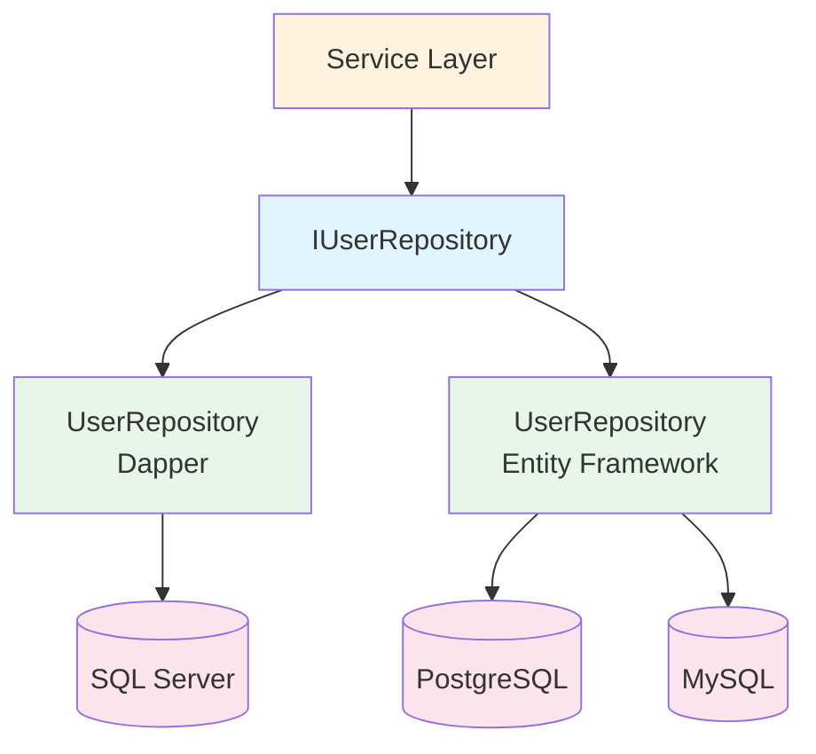

Bitwarden Server uses the Repository pattern to abstract data access. Repositories provide a collection-like interface for accessing entities while hiding the underlying database implementation details.

## Repository Architecture



## Base Repository Interface

All repositories inherit from `IRepository<T, TId>`:

```csharp src/Core/Repositories/IRepository.cs
public interface IRepository<T, TId> 
    where TId : IEquatable<TId> 
    where T : class, ITableObject<TId>
{
    Task<T?> GetByIdAsync(TId id);
    Task<T> CreateAsync(T obj);
    Task ReplaceAsync(T obj);
    Task UpsertAsync(T obj);
    Task DeleteAsync(T obj);
}
```

### Standard Operations

- **GetByIdAsync** - Retrieve entity by primary key
- **CreateAsync** - Insert new entity, returns created entity with generated ID
- **ReplaceAsync** - Update existing entity
- **UpsertAsync** - Insert or update based on existence
- **DeleteAsync** - Delete entity

## Domain Repository Interfaces

Domain repositories extend the base interface with specific queries.

### IUserRepository

```csharp src/Core/Repositories/IUserRepository.cs
public interface IUserRepository : IRepository<User, Guid>
{
    // Lookup methods
    Task<User?> GetByEmailAsync(string email);
    Task<IEnumerable<User>> GetManyByEmailsAsync(IEnumerable<string> emails);
    Task<User?> GetBySsoUserAsync(string externalId, Guid? organizationId);
    
    // Billing methods
    Task<User?> GetByGatewayCustomerIdAsync(string gatewayCustomerId);
    Task<User?> GetByGatewaySubscriptionIdAsync(string gatewaySubscriptionId);
    
    // Queries
    Task<ICollection<User>> SearchAsync(string email, int skip, int take);
    Task<IEnumerable<User>> GetManyAsync(IEnumerable<Guid> ids);
    Task<ICollection<User>> GetManyByPremiumAsync(bool premium);
    
    // Specialized operations
    Task<string?> GetPublicKeyAsync(Guid id);
    Task<DateTime> GetAccountRevisionDateAsync(Guid id);
    Task UpdateStorageAsync(Guid id);
    
    // Key rotation
    Task UpdateUserKeyAndEncryptedDataAsync(
        User user,
        IEnumerable<UpdateEncryptedDataForKeyRotation> updateDataActions);
}
```

### IOrganizationRepository

```csharp
public interface IOrganizationRepository : IRepository<Organization, Guid>
{
    Task<Organization?> GetByIdentifierAsync(string identifier);
    Task<IEnumerable<Organization>> GetManyByEnabledAsync();
    Task<IEnumerable<Organization>> GetManyByUserIdAsync(Guid userId);
    Task<IEnumerable<Organization>> SearchAsync(string name, string userEmail, bool? paid, int skip, int take);
}
```

### ICipherRepository

```csharp
public interface ICipherRepository : IRepository<Cipher, Guid>
{
    Task<Cipher?> GetByIdAsync(Guid id, Guid userId);
    Task<IEnumerable<Cipher>> GetManyByUserIdAsync(Guid userId, bool withOrganizations = true);
    Task<IEnumerable<Cipher>> GetManyByOrganizationIdAsync(Guid organizationId);
    Task<IEnumerable<CipherDetails>> GetManyByUserIdAsync(Guid userId, CipherType type);
    Task SoftDeleteAsync(Guid id);
    Task RestoreAsync(Guid id);
    Task DeleteByIdsAsync(IEnumerable<Guid> ids);
}
```

## Implementation: Dapper

The Dapper implementation uses stored procedures for all operations.

### UserRepository Example

```csharp src/Infrastructure.Dapper/Repositories/UserRepository.cs
public class UserRepository : Repository<User, Guid>, IUserRepository
{
    private readonly IDataProtector _dataProtector;

    public UserRepository(
        GlobalSettings globalSettings,
        IDataProtectionProvider dataProtectionProvider)
        : base(globalSettings.SqlServer.ConnectionString, 
               globalSettings.SqlServer.ReadOnlyConnectionString)
    {
        _dataProtector = dataProtectionProvider
            .CreateProtector(Constants.DatabaseFieldProtectorPurpose);
    }

    public async Task<User?> GetByEmailAsync(string email)
    {
        using (var connection = new SqlConnection(ConnectionString))
        {
            var results = await connection.QueryAsync<User>(
                "[dbo].[User_ReadByEmail]",
                new { Email = email },
                commandType: CommandType.StoredProcedure);

            UnprotectData(results);
            return results.SingleOrDefault();
        }
    }

    public async Task<IEnumerable<User>> GetManyByEmailsAsync(IEnumerable<string> emails)
    {
        var emailTable = new DataTable();
        emailTable.Columns.Add("Email", typeof(string));
        foreach (var email in emails)
        {
            emailTable.Rows.Add(email);
        }

        using (var connection = new SqlConnection(ConnectionString))
        {
            var results = await connection.QueryAsync<User>(
                "[dbo].[User_ReadByEmails]",
                new { Emails = emailTable.AsTableValuedParameter("dbo.EmailArray") },
                commandType: CommandType.StoredProcedure);

            UnprotectData(results);
            return results.ToList();
        }
    }

    private void UnprotectData(IEnumerable<User>? users)
    {
        if (users == null)
        {
            return;
        }

        foreach (var user in users)
        {
            UnprotectData(user);
        }
    }

    private void UnprotectData(User? user)
    {
        if (user == null || string.IsNullOrWhiteSpace(user.ApiKey))
        {
            return;
        }

        try
        {
            user.ApiKey = _dataProtector.Unprotect(user.ApiKey);
        }
        catch { }
    }
}
```

### Key Dapper Patterns

**Stored Procedure Calls**:
```csharp
await connection.QueryAsync<User>(
    "[dbo].[User_ReadByEmail]",  // Stored procedure name
    new { Email = email },         // Parameters
    commandType: CommandType.StoredProcedure);
```

**Table-Valued Parameters**:
```csharp
var emailTable = new DataTable();
emailTable.Columns.Add("Email", typeof(string));
foreach (var email in emails)
{
    emailTable.Rows.Add(email);
}

var parameter = emailTable.AsTableValuedParameter("dbo.EmailArray");
```

**Read-Only Replicas**:
```csharp
public UserRepository(
    GlobalSettings globalSettings)
    : base(
        globalSettings.SqlServer.ConnectionString,        // Write
        globalSettings.SqlServer.ReadOnlyConnectionString) // Read
```

## Implementation: Entity Framework

The EF Core implementation uses LINQ queries.

### UserRepository Example

```csharp src/Infrastructure.EntityFramework/Repositories/UserRepository.cs
public class UserRepository : Repository<Core.Entities.User, User, Guid>, IUserRepository
{
    public UserRepository(
        IServiceScopeFactory serviceScopeFactory, 
        IMapper mapper)
        : base(serviceScopeFactory, mapper, (DatabaseContext context) => context.Users)
    { }

    public async Task<Core.Entities.User?> GetByEmailAsync(string email)
    {
        using (var scope = ServiceScopeFactory.CreateScope())
        {
            var dbContext = GetDatabaseContext(scope);
            var entity = await GetDbSet(dbContext)
                .FirstOrDefaultAsync(e => e.Email == email);
            return Mapper.Map<Core.Entities.User>(entity);
        }
    }

    public async Task<IEnumerable<Core.Entities.User>> GetManyByEmailsAsync(
        IEnumerable<string> emails)
    {
        using (var scope = ServiceScopeFactory.CreateScope())
        {
            var dbContext = GetDatabaseContext(scope);
            var users = await GetDbSet(dbContext)
                .Where(u => emails.Contains(u.Email))
                .ToListAsync();
            return Mapper.Map<List<Core.Entities.User>>(users);
        }
    }

    public async Task<ICollection<Core.Entities.User>> SearchAsync(
        string email, int skip, int take)
    {
        using (var scope = ServiceScopeFactory.CreateScope())
        {
            var dbContext = GetDatabaseContext(scope);
            List<User> users;
            
            if (dbContext.Database.IsNpgsql())
            {
                users = await GetDbSet(dbContext)
                    .Where(e => e.Email == null ||
                        EF.Functions.ILike(EF.Functions.Collate(e.Email, "default"), $"{email}%"))
                    .OrderBy(e => e.Email)
                    .Skip(skip).Take(take)
                    .ToListAsync();
            }
            else
            {
                users = await GetDbSet(dbContext)
                    .Where(e => email == null || e.Email.StartsWith(email))
                    .OrderBy(e => e.Email)
                    .Skip(skip).Take(take)
                    .ToListAsync();
            }
            
            return Mapper.Map<List<Core.Entities.User>>(users);
        }
    }
}
```

### Key EF Patterns

**LINQ Queries**:
```csharp
var users = await dbContext.Users
    .Where(u => u.Email == email)
    .Include(u => u.OrganizationUsers)
    .ToListAsync();
```

**Database-Specific Logic**:
```csharp
if (dbContext.Database.IsNpgsql())
{
    // PostgreSQL-specific query
}
else
{
    // SQL Server / MySQL query
}
```

**AutoMapper Integration**:
```csharp
// Map from EF entity to domain entity
var domainUser = Mapper.Map<Core.Entities.User>(efUser);

// Map from domain entity to EF entity
var efUser = Mapper.Map<User>(domainUser);
```

## Stored Procedures (Dapper)

### Naming Convention

Stored procedures follow the pattern: `[TableName]_[Operation][Descriptor?]`

**Examples**:
- `User_ReadByEmail`
- `User_ReadByGatewayCustomerId`
- `User_Create`
- `User_Update`
- `User_DeleteById`
- `OrganizationUser_ReadByOrganizationId`
- `Cipher_SoftDelete`

### Common Stored Procedures

**Read Operations**:
- `[Table]_ReadById`
- `[Table]_ReadBy[Column]`
- `[Table]_ReadByUserId`
- `[Table]_ReadByOrganizationId`

**Write Operations**:
- `[Table]_Create`
- `[Table]_Update`
- `[Table]_DeleteById`

**Bulk Operations**:
- `[Table]_CreateMany`
- `[Table]_UpdateMany`
- `[Table]_DeleteByIds`

## Repository Usage in Services

Repositories are injected into services via dependency injection:

```csharp
public class UserService : IUserService
{
    private readonly IUserRepository _userRepository;
    private readonly IMailService _mailService;
    private readonly IEventService _eventService;

    public UserService(
        IUserRepository userRepository,
        IMailService mailService,
        IEventService eventService)
    {
        _userRepository = userRepository;
        _mailService = mailService;
        _eventService = eventService;
    }

    public async Task<User> GetUserByIdAsync(Guid userId)
    {
        var user = await _userRepository.GetByIdAsync(userId);
        if (user == null)
        {
            throw new NotFoundException("User not found.");
        }
        return user;
    }

    public async Task SaveUserAsync(User user, bool push = false)
    {
        if (user.Id == default(Guid))
        {
            await _userRepository.CreateAsync(user);
            await _eventService.LogUserEventAsync(user.Id, EventType.User_Created);
        }
        else
        {
            await _userRepository.ReplaceAsync(user);
            await _eventService.LogUserEventAsync(user.Id, EventType.User_Updated);
        }

        if (push)
        {
            // Push sync notification
        }
    }
}
```

## Transactions

### Dapper Transactions

```csharp
using (var connection = new SqlConnection(ConnectionString))
{
    await connection.OpenAsync();
    using (var transaction = connection.BeginTransaction())
    {
        try
        {
            await connection.ExecuteAsync(
                "[dbo].[User_Create]",
                user,
                transaction: transaction,
                commandType: CommandType.StoredProcedure);

            await connection.ExecuteAsync(
                "[dbo].[Device_Create]",
                device,
                transaction: transaction,
                commandType: CommandType.StoredProcedure);

            transaction.Commit();
        }
        catch
        {
            transaction.Rollback();
            throw;
        }
    }
}
```

### Entity Framework Transactions

```csharp
using (var scope = ServiceScopeFactory.CreateScope())
{
    var dbContext = GetDatabaseContext(scope);
    using (var transaction = await dbContext.Database.BeginTransactionAsync())
    {
        try
        {
            dbContext.Users.Add(efUser);
            await dbContext.SaveChangesAsync();

            dbContext.Devices.Add(efDevice);
            await dbContext.SaveChangesAsync();

            await transaction.CommitAsync();
        }
        catch
        {
            await transaction.RollbackAsync();
            throw;
        }
    }
}
```

## Choosing an Implementation

The repository implementation is configured in `Startup.cs`:

```csharp src/Api/Startup.cs
public void ConfigureServices(IServiceCollection services)
{
    // Use Dapper for SQL Server
    if (globalSettings.DatabaseProvider == "sqlServer")
    {
        services.AddScoped<IUserRepository, 
            Infrastructure.Dapper.Repositories.UserRepository>();
    }
    // Use EF Core for PostgreSQL/MySQL
    else
    {
        services.AddScoped<IUserRepository, 
            Infrastructure.EntityFramework.Repositories.UserRepository>();
    }
}
```

## Performance Considerations

### Connection Management

```csharp
// Good: Use using statement
using (var connection = new SqlConnection(ConnectionString))
{
    return await connection.QueryAsync<User>(...);
}

// Bad: Connection not disposed
var connection = new SqlConnection(ConnectionString);
return await connection.QueryAsync<User>(...);  // Leak!
```

### Query Optimization

**Use read replicas for queries**:
```csharp
protected string ReadOnlyConnectionString { get; set; }

// Use read-only connection for SELECT queries
using (var connection = new SqlConnection(ReadOnlyConnectionString))
```

**Paginate large result sets**:
```csharp
public async Task<ICollection<User>> SearchAsync(
    string email, 
    int skip,   // Pagination offset
    int take)   // Page size
{
    // Query with OFFSET/FETCH
}
```

**Use specific projections**:
```csharp
// Good: Select only needed columns
public async Task<string?> GetPublicKeyAsync(Guid id)
{
    return await connection.QuerySingleOrDefaultAsync<string>(
        "SELECT PublicKey FROM [dbo].[User] WHERE Id = @Id",
        new { Id = id });
}

// Bad: Select entire entity when only need one column
public async Task<string?> GetPublicKeyAsync(Guid id)
{
    var user = await GetByIdAsync(id);
    return user?.PublicKey;
}
```

## Testing Repositories

### Unit Testing with Mocks

```csharp
[Theory]
[BitAutoData]
public async Task GetUserByEmail_ReturnsUser(
    SutProvider<UserService> sutProvider,
    User user)
{
    // Arrange
    sutProvider.GetDependency<IUserRepository>()
        .GetByEmailAsync(user.Email)
        .Returns(user);

    // Act
    var result = await sutProvider.Sut.GetUserByEmailAsync(user.Email);

    // Assert
    Assert.Equal(user.Id, result.Id);
}
```

### Integration Testing

```csharp
public class UserRepositoryTests : IClassFixture<DatabaseFixture>
{
    private readonly IUserRepository _repository;

    [Fact]
    public async Task CreateUser_PersistsToDatabase()
    {
        // Arrange
        var user = new User
        {
            Email = "test@example.com",
            Name = "Test User"
        };

        // Act
        var created = await _repository.CreateAsync(user);

        // Assert
        var retrieved = await _repository.GetByIdAsync(created.Id);
        Assert.NotNull(retrieved);
        Assert.Equal(user.Email, retrieved.Email);
    }
}
```

## See Also

- [Data Models](/development/data-models) - Entity definitions
- [Core Concepts](/development/core-concepts) - Service layer patterns
- [Testing Guide](/development/testing) - Test repository interactions