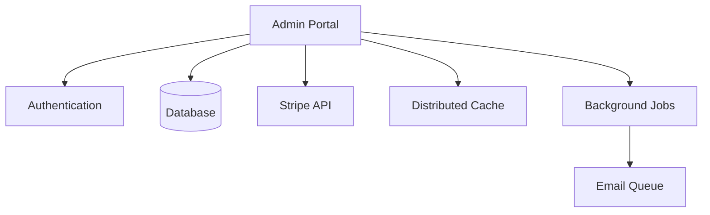

The Admin service provides a web-based administrative portal for Bitwarden cloud operations, offering tools for user management, organization administration, billing operations, and system utilities.

## Overview

<Warning>
The Admin service is primarily for Bitwarden cloud infrastructure. Self-hosted instances have limited admin functionality.
</Warning>

The Admin service provides:

- **User Management**: View, edit, and delete user accounts
- **Organization Management**: Organization configuration and licensing
- **Billing Operations**: Manual billing adjustments and Stripe operations
- **System Tools**: Database migrations, cache management, utilities
- **Provider Administration**: MSP provider management
- **Reporting**: System statistics and usage reports

## Architecture



## Configuration

### Application Settings

From `src/Admin/Startup.cs:33`:

```csharp Service Configuration
public void ConfigureServices(IServiceCollection services)
{
    // Settings
    var globalSettings = services.AddGlobalSettingsServices(Configuration, Environment);
    services.Configure<AdminSettings>(Configuration.GetSection("AdminSettings"));
    
    // Data Protection
    services.AddCustomDataProtectionServices(Environment, globalSettings);
    
    // Stripe Billing
    StripeConfiguration.ApiKey = globalSettings.Stripe.ApiKey;
    StripeConfiguration.MaxNetworkRetries = globalSettings.Stripe.MaxNetworkRetries;
    
    // Repositories with database provider selection
    var databaseProvider = services.AddDatabaseRepositories(globalSettings);
    switch (databaseProvider)
    {
        case Core.Enums.SupportedDatabaseProviders.SqlServer:
            services.AddSingleton<IDbMigrator, Migrator.SqlServerDbMigrator>();
            break;
        case Core.Enums.SupportedDatabaseProviders.MySql:
            services.AddSingleton<IDbMigrator, MySqlMigrations.MySqlDbMigrator>();
            break;
        case Core.Enums.SupportedDatabaseProviders.Postgres:
            services.AddSingleton<IDbMigrator, PostgresDbMigrator>();
            break;
        case Core.Enums.SupportedDatabaseProviders.Sqlite:
            services.AddSingleton<IDbMigrator, SqliteDbMigrator>();
            break;
    }
    
    // Identity with read-only user store
    services.AddPasswordlessIdentityServices<ReadOnlyEnvIdentityUserStore>(globalSettings);
    
    // Access control
    services.AddScoped<IAccessControlService, AccessControlService>();
}
```

### Admin Settings

```json AdminSettings Configuration
{
  "AdminSettings": {
    "Admins": "admin1@bitwarden.com,admin2@bitwarden.com",
    "ReadOnlyAdmins": "readonly@bitwarden.com"
  }
}
```

## Authentication

### Read-Only Identity Store

The Admin service uses a read-only environment-based identity store:

<Note>
Admin users are configured via environment variables, not stored in the database.
</Note>

```csharp Read-Only User Store
services.AddPasswordlessIdentityServices<ReadOnlyEnvIdentityUserStore>(globalSettings);

services.Configure<SecurityStampValidatorOptions>(options =>
{
    options.ValidationInterval = TimeSpan.FromMinutes(5);
});
```

### Cookie Configuration

For self-hosted deployments:

```csharp Cookie Path
if (globalSettings.SelfHosted)
{
    services.ConfigureApplicationCookie(options =>
    {
        options.Cookie.Path = "/admin";
    });
}
```

## Controllers

The Admin service includes several controller areas:

### Core Controllers

```
HomeController.cs - Dashboard and navigation
UsersController.cs - User account management
ToolsController.cs - Administrative utilities
InfoController.cs - System information
ErrorController.cs - Error handling
```

### Tools Controller

From `src/Admin/Controllers/ToolsController.cs:25`:

Provides administrative utilities:

<CardGroup cols={2}>
  <Card title="Braintree Charging" icon="credit-card">
    Manual payment processing for Braintree customers
  </Card>
  <Card title="Stripe Operations" icon="stripe">
    Direct Stripe API operations and adjustments
  </Card>
  <Card title="License Generation" icon="key">
    Generate organization licenses
  </Card>
  <Card title="User Promotion" icon="user-shield">
    Promote users to premium
  </Card>
</CardGroup>

### Organization Management

Administrative organization operations:

```csharp Organization Tools
// License generation
GET /Tools/GenerateOrganizationLicense?organizationId={guid}

// Manual billing adjustments
POST /Tools/ChargeBraintree
POST /Tools/AdjustStorage

// Organization upgrades
POST /Organizations/{id}/Upgrade
```

## Database Migrations

<Note>
Database migrations run automatically on startup for self-hosted instances.
</Note>

From `src/Admin/Startup.cs:120`:

```csharp Migration Service
if (globalSettings.SelfHosted)
{
    services.AddHostedService<HostedServices.DatabaseMigrationHostedService>();
}
```

Supported database providers:
- SQL Server
- MySQL
- PostgreSQL
- SQLite

## Background Jobs

From `src/Admin/Startup.cs:118`:

```csharp Job Services
Jobs.JobsHostedService.AddJobsServices(services, globalSettings.SelfHosted);
services.AddHostedService<Jobs.JobsHostedService>();

if (!globalSettings.SelfHosted)
{
    if (CoreHelpers.SettingHasValue(globalSettings.Mail.ConnectionString))
    {
        services.AddHostedService<HostedServices.AzureQueueMailHostedService>();
    }
}
```

Background jobs handle:
- Email queue processing (cloud only)
- Database migrations (self-hosted)
- Scheduled maintenance tasks

## View Structure

The Admin service uses Razor views organized by feature:

```csharp View Locations
services.Configure<RazorViewEngineOptions>(o =>
{
    o.ViewLocationFormats.Add("/Auth/Views/{1}/{0}.cshtml");
    o.ViewLocationFormats.Add("/AdminConsole/Views/{1}/{0}.cshtml");
    o.ViewLocationFormats.Add("/Billing/Views/{1}/{0}.cshtml");
});
```

View areas:
- **Auth**: Login and authentication views
- **AdminConsole**: Organization and user management
- **Billing**: Billing operations and reports

## Middleware Pipeline

From `src/Admin/Startup.cs:133`:

```csharp Request Pipeline
public void Configure(IApplicationBuilder app)
{
    // Security headers
    app.UseMiddleware<SecurityHeadersMiddleware>();
    
    // Self-hosted path base
    if (globalSettings.SelfHosted)
    {
        app.UsePathBase("/admin");
        app.UseForwardedHeaders(globalSettings);
    }
    
    // Error handling
    if (env.IsDevelopment())
    {
        app.UseDeveloperExceptionPage();
    }
    else
    {
        app.UseExceptionHandler("/error");
    }
    
    // Static files
    app.UseStaticFiles();
    
    // Routing
    app.UseRouting();
    
    // Authentication & Authorization
    app.UseAuthentication();
    app.UseAuthorization();
    
    // Endpoints
    app.UseEndpoints(endpoints => endpoints.MapDefaultControllerRoute());
}
```

## Access Control

The Admin service implements permission-based access control:

```csharp Permission System
public enum Permission
{
    Tools_ChargeBrainTreeCustomer,
    Tools_CreateEditTransaction,
    Tools_ManageStripeSubscription,
    Tools_GenerateLicenseFile,
    Tools_ManageOrganization,
    Tools_ViewUser,
    Tools_EditUser,
    Tools_DeleteUser
}
```

Permissions are enforced via attributes:

```csharp Permission Attribute
[RequirePermission(Permission.Tools_ChargeBrainTreeCustomer)]
public IActionResult ChargeBraintree()
{
    return View(new ChargeBraintreeModel());
}
```

## Deployment

### Environment Variables

```bash
GLOBALSETTINGS__SELFHOSTED=true
GLOBALSETTINGS__SQLSERVER__CONNECTIONSTRING=<connection>
GLOBALSETTINGS__STRIPE__APIKEY=<stripe_key>
ADMINSETTINGS__ADMINS=admin@example.com
```

### Docker

```bash
docker run -d \
  --name bitwarden-admin \
  -p 5004:5000 \
  -e GLOBALSETTINGS__SelfHosted=true \
  -e GLOBALSETTINGS__SqlServer__ConnectionString="<connection>" \
  bitwarden/admin:latest
```

### Self-Hosted Access

<Warning>
In self-hosted deployments, admin functionality is limited. The portal runs at `/admin` path.
</Warning>

```nginx Nginx Configuration
location /admin {
    proxy_pass http://admin:5000/admin;
    proxy_set_header Host $host;
    proxy_set_header X-Real-IP $remote_addr;
}
```

## Self-Hosted vs Cloud

| Feature | Self-Hosted | Cloud |
|---------|-------------|-------|
| Database Migrations | Automatic | Manual |
| User Management | Limited | Full |
| Billing Tools | Disabled | Enabled |
| Stripe Integration | N/A | Enabled |
| Email Queue | N/A | Enabled |
| Access Control | Basic | Permission-based |

## Integration with Other Services

<CardGroup cols={2}>
  <Card title="Stripe" icon="stripe">
    Direct Stripe API integration for billing operations
  </Card>
  <Card title="Database" icon="database">
    Direct database access for administrative queries
  </Card>
  <Card title="Email" icon="envelope">
    Azure Queue integration for email processing (cloud)
  </Card>
  <Card title="Cache" icon="bolt">
    Distributed cache for performance
  </Card>
</CardGroup>

## Security Considerations

<Warning>
The Admin service should only be accessible to trusted administrators.
</Warning>

- Environment-based user authentication
- No user self-registration
- Permission-based access control
- Read-only operations preferred
- Audit logging for sensitive operations

## Related Services

- [API Service](/services/api) - Main application API
- [Billing Service](/services/billing) - Webhook-based billing processing
- [Identity Service](/services/identity) - User authentication