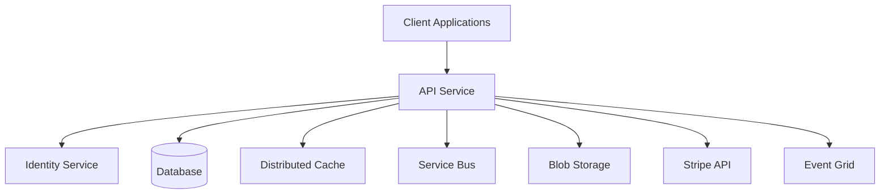

The API service is the primary REST API for Bitwarden Server, handling all vault operations, account management, organization administration, and integrations with client applications.

## Overview

The API service provides comprehensive endpoints for:

- **Vault Management**: Ciphers, folders, collections, and sync operations
- **Account Operations**: User registration, authentication, profile management
- **Organization Administration**: Organization and user management, groups, policies
- **Secrets Manager**: Service accounts, projects, and secrets
- **Billing**: Subscription management, payment processing
- **Send**: Secure file and text sharing
- **Public API**: Organization-level API for integrations

## Architecture



## Configuration

### Application Settings

The API service is configured via `appsettings.json` and environment variables:

```json appsettings.json
{
  "globalSettings": {
    "selfHosted": false,
    "siteName": "Bitwarden",
    "projectName": "Api",
    "stripe": {
      "apiKey": "SECRET"
    },
    "sqlServer": {
      "connectionString": "SECRET"
    },
    "identityServer": {
      "certificateThumbprint": "SECRET"
    },
    "storage": {
      "connectionString": "SECRET"
    },
    "serviceBus": {
      "connectionString": "SECRET",
      "applicationCacheTopicName": "SECRET"
    }
  }
}
```

### Rate Limiting

<Note>
Rate limiting is automatically enabled for cloud deployments and can be configured per-endpoint.
</Note>

```json Rate Limit Configuration
{
  "IpRateLimitOptions": {
    "EnableEndpointRateLimiting": true,
    "RealIpHeader": "X-Connecting-IP",
    "HttpStatusCode": 429,
    "GeneralRules": [
      {
        "Endpoint": "post:*",
        "Period": "1m",
        "Limit": 60
      },
      {
        "Endpoint": "get:*",
        "Period": "1m",
        "Limit": 200
      }
    ]
  }
}
```

## Key Endpoints

### Vault Operations

<CardGroup cols={2}>
  <Card title="Sync" icon="rotate">
    `GET /api/sync` - Full vault synchronization for clients
  </Card>
  <Card title="Ciphers" icon="key">
    `/api/ciphers/*` - Vault item CRUD operations
  </Card>
  <Card title="Folders" icon="folder">
    `/api/folders/*` - Folder management
  </Card>
  <Card title="Collections" icon="layer-group">
    `/api/collections/*` - Organization collections
  </Card>
</CardGroup>

### Account Management

<Steps>
  <Step title="Account Registration">
    `POST /api/accounts/register` - Create new user account
  </Step>
  <Step title="Profile Management">
    `GET/PUT /api/accounts/profile` - User profile operations
  </Step>
  <Step title="Two-Factor">
    `/api/two-factor/*` - 2FA configuration and verification
  </Step>
</Steps>

### Organization Administration

Located in `/src/Api/AdminConsole/Controllers/`:

```csharp Key Controllers
// Organization management
OrganizationsController.cs - Organization CRUD, upgrades, licensing
OrganizationUsersController.cs - Member invitations, role management
GroupsController.cs - Group management and permissions
PoliciesController.cs - Organization policies

// SSO and domain verification
OrganizationConnectionsController.cs - SSO connections
OrganizationDomainController.cs - Domain verification
```

### Public API

The Public API provides organization-level access for integrations:

<CodeGroup>
```bash Members API
curl -X GET "https://api.bitwarden.com/public/members" \
  -H "Authorization: Bearer {api_key}"
```

```bash Collections API
curl -X POST "https://api.bitwarden.com/public/collections" \
  -H "Authorization: Bearer {api_key}" \
  -H "Content-Type: application/json" \
  -d '{"externalId": "ext_123", "groups": []}'
```
</CodeGroup>

## Service Configuration

### Startup Configuration

From `src/Api/Startup.cs:59`:

```csharp Service Registration
public void ConfigureServices(IServiceCollection services)
{
    // Settings
    var globalSettings = services.AddGlobalSettingsServices(Configuration, Environment);
    
    // Data Protection
    services.AddCustomDataProtectionServices(Environment, globalSettings);
    
    // Stripe Billing
    StripeConfiguration.ApiKey = globalSettings.Stripe.ApiKey;
    StripeConfiguration.MaxNetworkRetries = globalSettings.Stripe.MaxNetworkRetries;
    
    // Repositories
    services.AddDatabaseRepositories(globalSettings);
    
    // Caching
    services.AddMemoryCache();
    services.AddDistributedCache(globalSettings);
    
    // Identity & Authentication
    services.AddCustomIdentityServices(globalSettings);
    services.AddIdentityAuthenticationServices(globalSettings, Environment, config =>
    {
        config.AddPolicy(Policies.Application, policy =>
        {
            policy.RequireAuthenticatedUser();
            policy.RequireClaim(JwtClaimTypes.Scope, ApiScopes.Api);
        });
    });
    
    // Business Services
    services.AddBaseServices(globalSettings);
    services.AddDefaultServices(globalSettings);
    services.AddBillingOperations();
    services.AddImportServices();
    services.AddSendServices();
}
```

### Authentication Policies

The API uses multiple authorization policies:

| Policy | Scope | Purpose |
|--------|-------|----------|
| `Application` | `api` | Standard API access |
| `Web` | `api` | Web vault specific |
| `Push` | `api.push` | Push notification registration |
| `Licensing` | `api.licensing` | License validation |
| `Organization` | `api.organization` | Public organization API |
| `Secrets` | `api` or `api.secrets` | Secrets Manager access |

## Middleware Pipeline

From `src/Api/Startup.cs:234`:

```csharp Request Pipeline
public void Configure(IApplicationBuilder app)
{
    // Security headers
    app.UseMiddleware<SecurityHeadersMiddleware>();
    
    // Rate limiting (cloud only)
    if (!globalSettings.SelfHosted)
    {
        app.UseMiddleware<CustomIpRateLimitMiddleware>();
    }
    
    // Localization
    app.UseCoreLocalization();
    
    // Static files
    app.UseStaticFiles();
    
    // Routing
    app.UseRouting();
    
    // CORS
    app.UseCors(policy => policy
        .SetIsOriginAllowed(o => CoreHelpers.IsCorsOriginAllowed(o, globalSettings))
        .AllowAnyMethod()
        .AllowAnyHeader()
        .AllowCredentials());
    
    // Authentication & Authorization
    app.UseAuthentication();
    app.UseAuthorization();
    
    // Current context
    app.UseMiddleware<CurrentContextMiddleware>();
    
    // Endpoints
    app.UseEndpoints(endpoints =>
    {
        endpoints.MapDefaultControllerRoute();
        endpoints.MapHealthChecks("/healthz");
    });
}
```

## Secrets Manager

<Note>
Secrets Manager endpoints are available in the commercial version only.
</Note>

Secrets Manager provides secure storage and access control for application secrets:

- **Service Accounts**: Machine identity for API access
- **Projects**: Logical grouping of secrets
- **Secrets**: Key-value pairs with versioning
- **Access Policies**: Fine-grained permissions

Controllers located in `/src/Api/SecretsManager/Controllers/`:

```
ServiceAccountsController.cs
ProjectsController.cs
SecretsController.cs
SecretVersionsController.cs
AccessPoliciesController.cs
```

## Health Checks

<Warning>
Health checks are only enabled for cloud deployments by default.
</Warning>

The API exposes two health check endpoints:

- `/healthz` - Basic health check
- `/healthz/extended` - Detailed health information including database connectivity

## Swagger Documentation

API documentation is available via Swagger UI in development and self-hosted deployments:

```
URL: {api_url}/docs
Endpoint: {api_url}/specs/public/swagger.json
```

From `src/Api/Startup.cs:294`:

```csharp Swagger Configuration
if (Environment.IsDevelopment() || globalSettings.SelfHosted)
{
    app.UseSwagger(config =>
    {
        config.RouteTemplate = "specs/{documentName}/swagger.json";
    });
    
    app.UseSwaggerUI(config =>
    {
        config.DocumentTitle = "Bitwarden API Documentation";
        config.RoutePrefix = "docs";
        config.SwaggerEndpoint($"{globalSettings.BaseServiceUri.Api}/specs/public/swagger.json",
            "Bitwarden Public API");
    });
}
```

## Background Jobs

The API service runs background jobs for:

- **Cache Synchronization**: ServiceBus-based cache invalidation
- **Event Processing**: Handling event integrations (Slack, Teams)
- **Scheduled Tasks**: Cleanup and maintenance operations

From `src/Api/Startup.cs:219`:

```csharp Job Services
Jobs.JobsHostedService.AddJobsServices(services, globalSettings.SelfHosted);
services.AddHostedService<Jobs.JobsHostedService>();

if (CoreHelpers.SettingHasValue(globalSettings.ServiceBus.ConnectionString))
{
    services.AddHostedService<Core.HostedServices.ApplicationCacheHostedService>();
}
```

## Deployment

### Environment Variables

Key environment variables for the API service:

```bash
GLOBALSETTINGS__SELFHOSTED=true
GLOBALSETTINGS__SQLSERVER__CONNECTIONSTRING=<connection_string>
GLOBALSETTINGS__IDENTITYSERVER__CERTIFICATETHUMBPRINT=<thumbprint>
GLOBALSETTINGS__STRIPE__APIKEY=<stripe_key>
```

### Docker

```bash
docker run -d \
  --name bitwarden-api \
  -p 5000:5000 \
  -e GLOBALSETTINGS__SelfHosted=true \
  -e GLOBALSETTINGS__SqlServer__ConnectionString="<connection_string>" \
  bitwarden/api:latest
```

## Performance Considerations

<CardGroup cols={2}>
  <Card title="Distributed Cache" icon="database">
    Uses Redis for distributed caching to improve performance across multiple instances
  </Card>
  <Card title="Rate Limiting" icon="gauge">
    Endpoint-level rate limiting prevents abuse and ensures fair usage
  </Card>
  <Card title="Connection Pooling" icon="plug">
    Database connection pooling for efficient resource utilization
  </Card>
  <Card title="Async Operations" icon="clock">
    Fully async controllers and services for better throughput
  </Card>
</CardGroup>

## Related Services

- [Identity Service](/services/identity) - Authentication and OAuth/OIDC
- [Notifications Service](/services/notifications) - Real-time push notifications
- [Events Service](/services/events) - Event collection and tracking
- [Billing Service](/services/billing) - Stripe webhook processing