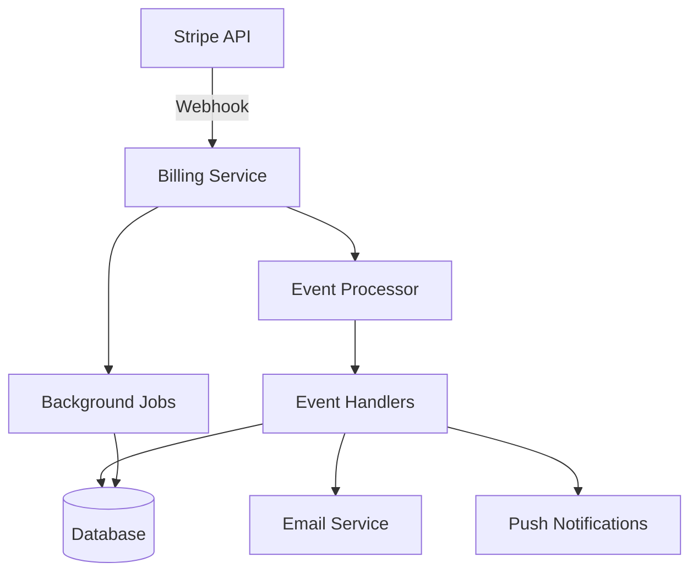

The Billing service processes Stripe webhooks and manages billing-related events for subscriptions, payments, and invoices in the Bitwarden ecosystem.

## Overview

The Billing service provides:

- **Stripe Webhooks**: Process payment and subscription events from Stripe
- **Event Handlers**: Specialized handlers for different Stripe event types
- **Provider Support**: Managed Service Provider (MSP) billing operations
- **Invoice Processing**: Handle invoices, payments, and refunds
- **Subscription Management**: Track subscription lifecycle events
- **Background Jobs**: Scheduled billing operations and maintenance

## Architecture



## Configuration

From `src/Billing/Startup.cs:32`:

```csharp Service Configuration
public void ConfigureServices(IServiceCollection services)
{
    // Settings
    var globalSettings = services.AddGlobalSettingsServices(Configuration, Environment);
    services.Configure<BillingSettings>(Configuration.GetSection("BillingSettings"));
    var billingSettings = Configuration.GetSection("BillingSettings").Get<BillingSettings>();
    
    // Stripe Configuration
    StripeConfiguration.ApiKey = globalSettings.Stripe.ApiKey;
    StripeConfiguration.MaxNetworkRetries = globalSettings.Stripe.MaxNetworkRetries;
    
    // Data Protection
    services.AddCustomDataProtectionServices(Environment, globalSettings);
    
    // Repositories
    services.AddDatabaseRepositories(globalSettings);
    
    // PayPal IPN Client
    services.AddHttpClient<IPayPalIPNClient, PayPalIPNClient>();
    
    // Context
    services.AddScoped<ICurrentContext, CurrentContext>();
    
    // Stripe Event Handlers
    services.AddScoped<IStripeEventUtilityService, StripeEventUtilityService>();
    services.AddScoped<ISubscriptionDeletedHandler, SubscriptionDeletedHandler>();
    services.AddScoped<ISubscriptionUpdatedHandler, SubscriptionUpdatedHandler>();
    services.AddScoped<IUpcomingInvoiceHandler, UpcomingInvoiceHandler>();
    services.AddScoped<IChargeSucceededHandler, ChargeSucceededHandler>();
    services.AddScoped<IChargeRefundedHandler, ChargeRefundedHandler>();
    services.AddScoped<ICustomerUpdatedHandler, CustomerUpdatedHandler>();
    services.AddScoped<IInvoiceCreatedHandler, InvoiceCreatedHandler>();
    services.AddScoped<IPaymentFailedHandler, PaymentFailedHandler>();
    services.AddScoped<IPaymentMethodAttachedHandler, PaymentMethodAttachedHandler>();
    services.AddScoped<IPaymentSucceededHandler, PaymentSucceededHandler>();
    services.AddScoped<IInvoiceFinalizedHandler, InvoiceFinalizedHandler>();
    services.AddScoped<ISetupIntentSucceededHandler, SetupIntentSucceededHandler>();
    services.AddScoped<ICouponDeletedHandler, CouponDeletedHandler>();
    services.AddScoped<IStripeEventProcessor, StripeEventProcessor>();
    
    // Services
    services.AddScoped<IStripeFacade, StripeFacade>();
    services.AddScoped<IStripeEventService, StripeEventService>();
    services.AddScoped<IProviderEventService, ProviderEventService>();
    services.AddScoped<IPushNotificationAdapter, PushNotificationAdapter>();
    
    // Quartz Job Scheduler
    services.AddQuartz(q =>
    {
        q.UseMicrosoftDependencyInjectionJobFactory();
    });
    services.AddQuartzHostedService();
    
    // Background Jobs
    Jobs.JobsHostedService.AddJobsServices(services);
    services.AddHostedService<Jobs.JobsHostedService>();
}
```

## Stripe Webhook Endpoint

From `src/Billing/Controllers/StripeController.cs:38`:

```csharp Webhook Handler
[HttpPost("webhook")]
public async Task<IActionResult> PostWebhook([FromQuery] string key)
{
    // Verify webhook key
    if (!CoreHelpers.FixedTimeEquals(key, _billingSettings.StripeWebhookKey))
    {
        _logger.LogError("Stripe webhook key does not match configured webhook key");
        return new BadRequestResult();
    }
    
    // Parse and validate event
    var parsedEvent = await TryParseEventFromRequestBodyAsync();
    if (parsedEvent is null)
    {
        return Ok(new
        {
            Processed = false,
            Message = "Could not find a configured webhook secret to process this event with"
        });
    }
    
    // Verify API version compatibility
    if (StripeConfiguration.ApiVersion != parsedEvent.ApiVersion)
    {
        _logger.LogWarning(
            "Stripe webhook's API version ({WebhookAPIVersion}) does not match SDK ({SDKAPIVersion})",
            parsedEvent.ApiVersion,
            StripeConfiguration.ApiVersion);
        return Ok(new { Processed = false, Message = "API version mismatch" });
    }
    
    // Validate cloud region
    if (!await _stripeEventService.ValidateCloudRegion(parsedEvent))
    {
        return Ok(new { Processed = false, Message = "Event is not for this cloud region" });
    }
    
    // Process the event
    await _stripeEventProcessor.ProcessEventAsync(parsedEvent);
    
    return Ok(new { Processed = true, Message = "Processed" });
}
```

**Endpoint**: `POST /stripe/webhook?key={webhook_key}`

**Authentication**: Webhook key verification

**Content-Type**: `application/json`

## Event Handlers

The Billing service implements specialized handlers for different Stripe event types:

### Subscription Events

<CardGroup cols={2}>
  <Card title="customer.subscription.deleted" icon="trash">
    Handle subscription cancellation and cleanup
  </Card>
  <Card title="customer.subscription.updated" icon="rotate">
    Process subscription plan changes and upgrades
  </Card>
  <Card title="invoice.upcoming" icon="clock">
    Preview upcoming invoice and notify user
  </Card>
  <Card title="invoice.finalized" icon="file-invoice">
    Finalize invoice before payment attempt
  </Card>
</CardGroup>

### Payment Events

<CardGroup cols={2}>
  <Card title="charge.succeeded" icon="check">
    Process successful payment
  </Card>
  <Card title="charge.refunded" icon="rotate-left">
    Handle payment refunds
  </Card>
  <Card title="payment_intent.succeeded" icon="credit-card">
    Confirm payment intent completion
  </Card>
  <Card title="payment_intent.payment_failed" icon="xmark">
    Handle failed payment attempts
  </Card>
</CardGroup>

### Customer Events

<CardGroup cols={2}>
  <Card title="customer.updated" icon="user">
    Sync customer data changes
  </Card>
  <Card title="payment_method.attached" icon="link">
    Track new payment method additions
  </Card>
  <Card title="setup_intent.succeeded" icon="gear">
    Confirm payment method setup
  </Card>
  <Card title="coupon.deleted" icon="ticket">
    Handle promotional code deletion
  </Card>
</CardGroup>

## Event Processing Flow

```csharp Event Processor
public interface IStripeEventProcessor
{
    Task ProcessEventAsync(Event parsedEvent);
}

public class StripeEventProcessor : IStripeEventProcessor
{
    public async Task ProcessEventAsync(Event parsedEvent)
    {
        switch (parsedEvent.Type)
        {
            case "customer.subscription.deleted":
                await _subscriptionDeletedHandler.HandleAsync(parsedEvent);
                break;
                
            case "customer.subscription.updated":
                await _subscriptionUpdatedHandler.HandleAsync(parsedEvent);
                break;
                
            case "invoice.payment_succeeded":
                await _paymentSucceededHandler.HandleAsync(parsedEvent);
                break;
                
            case "invoice.payment_failed":
                await _paymentFailedHandler.HandleAsync(parsedEvent);
                break;
                
            case "charge.succeeded":
                await _chargeSucceededHandler.HandleAsync(parsedEvent);
                break;
                
            case "charge.refunded":
                await _chargeRefundedHandler.HandleAsync(parsedEvent);
                break;
                
            // ... additional event types
        }
    }
}
```

## Subscription Lifecycle

### Subscription Created

Handled through API service during organization upgrade.

### Subscription Updated

<Steps>
  <Step title="Receive Event">
    Stripe sends `customer.subscription.updated` webhook
  </Step>
  <Step title="Extract Changes">
    Parse subscription changes (plan, quantity, status)
  </Step>
  <Step title="Update Database">
    Sync changes to organization subscription record
  </Step>
  <Step title="Notify User">
    Send email notification if plan changed
  </Step>
</Steps>

### Subscription Canceled

From subscription deleted handler:

```csharp
public async Task HandleAsync(Event parsedEvent)
{
    var subscription = await GetSubscriptionAsync(parsedEvent);
    var organization = await GetOrganizationAsync(subscription);
    
    if (organization != null)
    {
        // Disable organization
        organization.Enabled = false;
        organization.ExpirationDate = DateTime.UtcNow;
        await _organizationRepository.ReplaceAsync(organization);
        
        // Send cancellation email
        await _mailService.SendOrganizationCanceledEmailAsync(organization);
        
        // Log event
        await _eventService.LogOrganizationEventAsync(
            organization, 
            EventType.Organization_Disabled);
    }
}
```

## Invoice Processing

### Payment Succeeded

When an invoice is paid successfully:

```csharp Payment Succeeded Handler
public async Task HandleAsync(Event parsedEvent)
{
    var invoice = await GetInvoiceAsync(parsedEvent);
    var organization = await GetOrganizationAsync(invoice);
    
    if (organization != null)
    {
        // Create transaction record
        var transaction = new Transaction
        {
            Amount = invoice.AmountPaid / 100M,
            Gateway = GatewayType.Stripe,
            GatewayId = invoice.Id,
            Type = TransactionType.Charge,
            CreationDate = DateTime.UtcNow,
            OrganizationId = organization.Id
        };
        await _transactionRepository.CreateAsync(transaction);
        
        // Send receipt email
        await _mailService.SendInvoiceUpcomingAsync(
            organization.BillingEmailAddress(),
            invoice.AmountDue / 100M,
            invoice.DueDate);
    }
}
```

### Payment Failed

When payment fails:

<Steps>
  <Step title="Receive Webhook">
    `invoice.payment_failed` event received
  </Step>
  <Step title="Update Organization">
    Mark organization as at-risk or disabled based on retry count
  </Step>
  <Step title="Notify User">
    Send payment failed email with retry information
  </Step>
  <Step title="Log Event">
    Record payment failure in event log
  </Step>
</Steps>

## Provider Billing

The service supports Managed Service Provider (MSP) billing:

```csharp Provider Event Service
public interface IProviderEventService
{
    Task ProcessSubscriptionUpdatedAsync(Provider provider);
    Task ProcessPaymentSucceededAsync(Provider provider, Invoice invoice);
    Task ProcessPaymentFailedAsync(Provider provider, Invoice invoice);
}
```

Provider features:
- Consolidated billing for multiple client organizations
- Per-seat pricing
- Automatic client organization synchronization
- Volume-based discounts

## Background Jobs

From `src/Billing/Startup.cs:107`:

```csharp Job Configuration
services.AddQuartz(q =>
{
    q.UseMicrosoftDependencyInjectionJobFactory();
});
services.AddQuartzHostedService();

Jobs.JobsHostedService.AddJobsServices(services);
services.AddHostedService<Jobs.JobsHostedService>();
```

Scheduled jobs:
- **Invoice Finalization**: Prepare invoices before payment
- **Usage Tracking**: Sync seat usage with Stripe
- **Failed Payment Retry**: Monitor and retry failed payments
- **Subscription Cleanup**: Remove expired subscriptions

## PayPal Integration

The service includes PayPal IPN (Instant Payment Notification) support:

```csharp PayPal Client
services.AddHttpClient<IPayPalIPNClient, PayPalIPNClient>();
```

PayPal webhook endpoint:
```http
POST /paypal/ipn
```

<Note>
PayPal integration is deprecated in favor of Stripe for new subscriptions.
</Note>

## Middleware Pipeline

From `src/Billing/Startup.cs:123`:

```csharp Request Pipeline
public void Configure(IApplicationBuilder app, IWebHostEnvironment env)
{
    // Security headers
    app.UseMiddleware<SecurityHeadersMiddleware>();
    
    // Development tools
    if (env.IsDevelopment())
    {
        app.UseDeveloperExceptionPage();
        app.UseSwagger();
        app.UseSwaggerUI(c =>
        {
            c.SwaggerEndpoint("/swagger/v1/swagger.json", "Billing API V1");
        });
    }
    
    // Static files
    app.UseStaticFiles();
    
    // Routing
    app.UseRouting();
    
    // Authentication & Authorization
    app.UseAuthentication();
    app.UseAuthorization();
    
    // Controllers
    app.UseEndpoints(endpoints => endpoints.MapDefaultControllerRoute());
}
```

## Stripe Facade

The service uses a facade pattern for Stripe API interactions:

```csharp Stripe Facade
public interface IStripeFacade
{
    Task<Customer> GetCustomerAsync(string customerId);
    Task<Subscription> GetSubscriptionAsync(string subscriptionId);
    Task<Invoice> GetInvoiceAsync(string invoiceId);
    Task<Charge> GetChargeAsync(string chargeId);
    Task UpdateSubscriptionAsync(string subscriptionId, SubscriptionUpdateOptions options);
    Task CancelSubscriptionAsync(string subscriptionId);
}
```

Benefits:
- Centralized error handling
- Retry logic for transient failures
- Logging and instrumentation
- Testability through mocking

## Security

### Webhook Signature Verification

<Warning>
Always verify webhook signatures to prevent spoofing attacks.
</Warning>

```csharp Signature Verification
private async Task<Event> TryParseEventFromRequestBodyAsync()
{
    var json = await new StreamReader(HttpContext.Request.Body).ReadToEndAsync();
    var signature = HttpContext.Request.Headers["Stripe-Signature"];
    
    try
    {
        return EventUtility.ConstructEvent(
            json,
            signature,
            _billingSettings.StripeWebhookSecret,
            throwOnApiVersionMismatch: false);
    }
    catch (StripeException ex)
    {
        _logger.LogError(ex, "Failed to parse Stripe webhook");
        return null;
    }
}
```

### API Version Validation

From `src/Billing/Controllers/StripeController.cs:57`:

```csharp Version Check
if (StripeConfiguration.ApiVersion != parsedEvent.ApiVersion)
{
    _logger.LogWarning(
        "Stripe webhook API version mismatch: webhook={0}, SDK={1}",
        parsedEvent.ApiVersion,
        StripeConfiguration.ApiVersion);
}
```

## Cloud Region Validation

For multi-region deployments:

```csharp Region Validation
public async Task<bool> ValidateCloudRegion(Event stripeEvent)
{
    var customer = await _stripeFacade.GetCustomerAsync(stripeEvent.CustomerId);
    var region = customer.Metadata.GetValueOrDefault("region");
    
    return region == _globalSettings.CloudRegion;
}
```

## Deployment

### Environment Variables

```bash
GLOBALSETTINGS__SELFHOSTED=true
GLOBALSETTINGS__SQLSERVER__CONNECTIONSTRING=<connection>
GLOBALSETTINGS__STRIPE__APIKEY=<stripe_secret_key>
BILLINGSETTINGS__STRIPEWEBHOOKKEY=<webhook_key>
BILLINGSETTINGS__STRIPEWEBHOOKSECRET=<webhook_secret>
```

### Docker

```bash
docker run -d \
  --name bitwarden-billing \
  -p 5007:5000 \
  -e GLOBALSETTINGS__Stripe__ApiKey="<stripe_key>" \
  -e BILLINGSETTINGS__StripeWebhookKey="<webhook_key>" \
  bitwarden/billing:latest
```

### Stripe Webhook Configuration

<Steps>
  <Step title="Create Webhook">
    In Stripe Dashboard, create webhook endpoint
  </Step>
  <Step title="Set URL">
    `https://billing.bitwarden.com/stripe/webhook?key={webhook_key}`
  </Step>
  <Step title="Select Events">
    Subscribe to relevant event types
  </Step>
  <Step title="Copy Secret">
    Save webhook signing secret to configuration
  </Step>
  <Step title="Test Webhook">
    Send test event to verify configuration
  </Step>
</Steps>

## Monitoring

### Health Checks

```bash
curl http://billing:5000/alive
```

### Webhook Monitoring

Monitor webhook processing:
- Event processing success rate
- Average processing time
- Failed event count
- Retry queue depth

### Stripe Dashboard

Use Stripe Dashboard to:
- View webhook delivery status
- Retry failed webhooks
- Monitor API usage
- Track subscription metrics

## Troubleshooting

### Common Issues

| Issue | Solution |
|-------|----------|
| Webhook signature invalid | Verify webhook secret matches Stripe |
| API version mismatch | Update Stripe SDK to match webhook version |
| Duplicate events | Implement idempotency checks |
| Missing customer | Verify customer exists before processing |
| Region mismatch | Check customer metadata region tag |

### Debug Logging

```json
{
  "Logging": {
    "LogLevel": {
      "Bit.Billing": "Debug",
      "Stripe": "Debug"
    }
  }
}
```

## Best Practices

1. **Idempotency**: Handle duplicate webhook events gracefully
2. **Async Processing**: Process webhooks asynchronously when possible
3. **Error Handling**: Return 200 OK even for handled errors
4. **Timeout**: Process webhooks within 30 seconds to avoid retries
5. **Logging**: Log all webhook events for audit trail
6. **Testing**: Use Stripe CLI for local webhook testing

## Related Services

- [API Service](/services/api) - Subscription management endpoints
- [Admin Service](/services/admin) - Manual billing operations