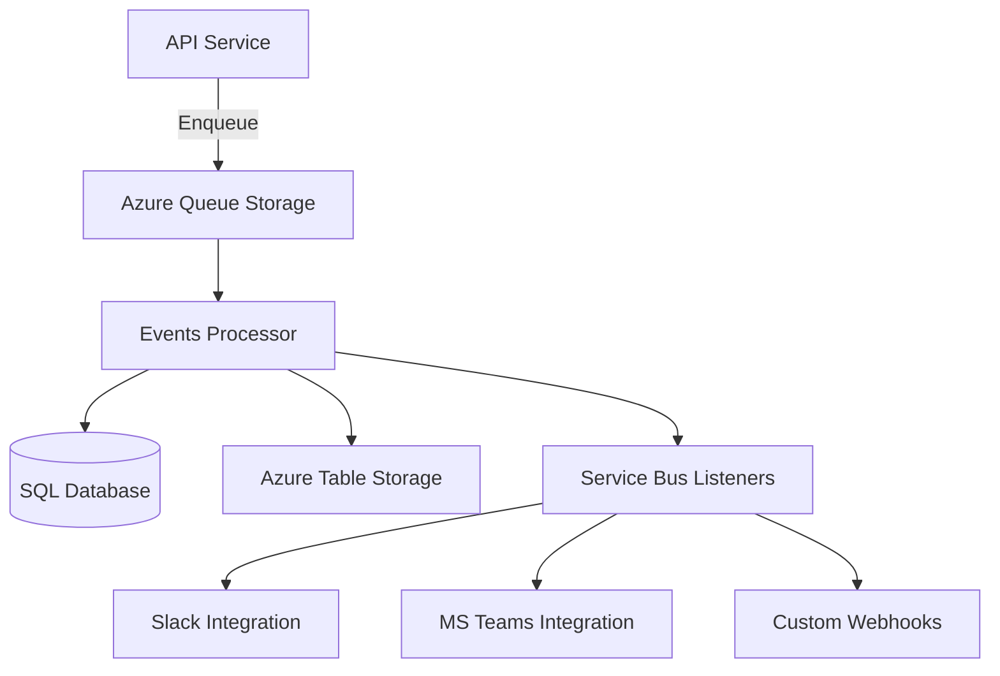

The Events Processor is a background service that processes events from Azure Queue Storage and manages event-driven integrations for audit logging and third-party services.

## Overview

<Note>
The Events Processor is primarily used in Bitwarden cloud deployments. Self-hosted instances typically handle events synchronously.
</Note>

The Events Processor provides:

- **Queue Processing**: Consume events from Azure Queue Storage
- **Azure Service Bus**: Distributed event processing
- **Event Persistence**: Store events in database and Azure Table Storage
- **Integration Triggers**: Notify external services (Slack, Teams, webhooks)
- **Scalability**: Process high-volume events asynchronously
- **Reliability**: Retry failed event processing with exponential backoff

## Architecture



## Configuration

From `src/EventsProcessor/Startup.cs:19`:

```csharp Service Configuration
public void ConfigureServices(IServiceCollection services)
{
    // Settings
    var globalSettings = services.AddGlobalSettingsServices(Configuration, Environment);
    
    // Data Protection
    services.AddCustomDataProtectionServices(Environment, globalSettings);
    
    // Repositories
    services.AddDatabaseRepositories(globalSettings);
    
    // Event Integration Services
    services.AddDistributedCache(globalSettings);
    services.AddAzureServiceBusListeners(globalSettings);
    services.AddHostedService<AzureQueueHostedService>();
}
```

## Background Processing

### Azure Queue Service

The main event processing loop:

```csharp Azure Queue Processor
public class AzureQueueHostedService : BackgroundService
{
    protected override async Task ExecuteAsync(CancellationToken stoppingToken)
    {
        while (!stoppingToken.IsCancellationRequested)
        {
            try
            {
                // Dequeue messages from Azure Queue
                var messages = await _queueClient.ReceiveMessagesAsync(
                    maxMessages: 32,
                    visibilityTimeout: TimeSpan.FromMinutes(5),
                    cancellationToken: stoppingToken);
                
                foreach (var message in messages.Value)
                {
                    await ProcessMessageAsync(message);
                    await _queueClient.DeleteMessageAsync(
                        message.MessageId, 
                        message.PopReceipt);
                }
                
                if (messages.Value.Length == 0)
                {
                    await Task.Delay(TimeSpan.FromSeconds(5), stoppingToken);
                }
            }
            catch (Exception ex)
            {
                _logger.LogError(ex, "Error processing event queue");
                await Task.Delay(TimeSpan.FromSeconds(30), stoppingToken);
            }
        }
    }
}
```

### Message Processing

Events are processed and persisted:

```csharp Event Processing
private async Task ProcessMessageAsync(QueueMessage message)
{
    var eventMessage = JsonSerializer.Deserialize<EventMessage>(message.MessageText);
    
    switch (eventMessage.Type)
    {
        case EventType.User_LoggedIn:
        case EventType.User_ChangedPassword:
        case EventType.User_Updated2fa:
            await ProcessUserEventAsync(eventMessage);
            break;
            
        case EventType.Cipher_Created:
        case EventType.Cipher_Updated:
        case EventType.Cipher_Deleted:
            await ProcessCipherEventAsync(eventMessage);
            break;
            
        case EventType.Organization_Updated:
        case EventType.OrganizationUser_Invited:
        case EventType.OrganizationUser_Confirmed:
            await ProcessOrganizationEventAsync(eventMessage);
            break;
    }
}
```

## Service Bus Integrations

From `src/EventsProcessor/Startup.cs:36`:

```csharp Service Bus Listeners
services.AddAzureServiceBusListeners(globalSettings);
```

Service Bus listeners enable:
- **Slack Notifications**: Real-time event notifications to Slack channels
- **Microsoft Teams**: Webhook notifications to Teams channels
- **Custom Webhooks**: User-defined HTTP webhook integrations

### Event Integration Flow

<Steps>
  <Step title="Event Published">
    API service publishes event to Service Bus topic
  </Step>
  <Step title="Subscription Filtering">
    Service Bus routes to appropriate subscriptions based on filters
  </Step>
  <Step title="Listener Processing">
    Events Processor listener receives and processes event
  </Step>
  <Step title="Integration Delivery">
    Event forwarded to configured integration (Slack, Teams, webhook)
  </Step>
  <Step title="Error Handling">
    Failed deliveries retried with exponential backoff
  </Step>
</Steps>

## Event Storage

### Dual Storage Strategy

Events are stored in two locations:

**SQL Database**:
- Structured event data
- Relational queries
- Compliance reporting
- Long-term retention

**Azure Table Storage**:
- High-throughput writes
- Cost-effective storage
- Time-range queries
- Scalable event log

```csharp Event Persistence
public async Task PersistEventAsync(Event eventData)
{
    // Store in SQL for queries and reporting
    await _eventRepository.CreateAsync(eventData);
    
    // Store in Table Storage for scalability
    var tableEntity = new EventTableEntity
    {
        PartitionKey = eventData.OrganizationId?.ToString() ?? eventData.UserId.ToString(),
        RowKey = $"{eventData.Date:yyyyMMddHHmmss}_{eventData.Id}",
        EventData = JsonSerializer.Serialize(eventData)
    };
    
    await _tableClient.AddEntityAsync(tableEntity);
}
```

## Middleware Pipeline

From `src/EventsProcessor/Startup.cs:40`:

```csharp Request Pipeline
public void Configure(IApplicationBuilder app)
{
    // Security headers
    app.UseMiddleware<SecurityHeadersMiddleware>();
    
    // Routing
    app.UseRouting();
    
    // Endpoints (health checks)
    app.UseEndpoints(endpoints =>
    {
        endpoints.MapGet("/alive",
            async context => await context.Response.WriteAsJsonAsync(DateTime.UtcNow));
        
        endpoints.MapGet("/now",
            async context => await context.Response.WriteAsJsonAsync(DateTime.UtcNow));
        
        endpoints.MapGet("/version",
            async context => await context.Response.WriteAsJsonAsync(AssemblyHelpers.GetVersion()));
    });
}
```

## Health Monitoring

The service exposes health check endpoints:

### Alive Check

```bash
curl http://events-processor:5000/alive
```

Response:
```json
"2024-03-10T12:00:00.000Z"
```

### Version Check

```bash
curl http://events-processor:5000/version
```

Response:
```json
"2024.3.0"
```

## Queue Configuration

### Azure Queue Storage

Configure via environment variables:

```bash
GLOBALSETTINGS__EVENTS__CONNECTIONSTRING=DefaultEndpointsProtocol=https;AccountName=...
```

Queue settings:
- **Visibility Timeout**: 5 minutes (message processing time)
- **Max Dequeue Count**: 5 attempts before moving to poison queue
- **Batch Size**: 32 messages per dequeue operation
- **Polling Interval**: 5 seconds when queue is empty

### Service Bus Topics

Service Bus configuration:

```bash
GLOBALSETTINGS__SERVICEBUS__CONNECTIONSTRING=Endpoint=sb://...
GLOBALSETTINGS__SERVICEBUS__EVENTSTOPICNAME=events
```

Topic features:
- **Subscriptions**: Multiple listeners per topic
- **Filtering**: SQL-based message filtering
- **Dead-lettering**: Failed message handling
- **Sessions**: Ordered message processing

## Event Message Format

```json Event Queue Message
{
  "type": 1000,
  "userId": "3fa85f64-5717-4562-b3fc-2c963f66afa6",
  "organizationId": "3fa85f64-5717-4562-b3fc-2c963f66afa6",
  "cipherId": "3fa85f64-5717-4562-b3fc-2c963f66afa6",
  "deviceType": 8,
  "ipAddress": "192.168.1.1",
  "date": "2024-03-10T12:00:00.000Z",
  "actingUserId": "3fa85f64-5717-4562-b3fc-2c963f66afa6"
}
```

## Integration Webhooks

### Slack Integration

Slack webhook format:

```json Slack Message
{
  "text": "Organization Event",
  "attachments": [
    {
      "color": "#175DDC",
      "fields": [
        {
          "title": "Event Type",
          "value": "User Invited",
          "short": true
        },
        {
          "title": "User",
          "value": "user@example.com",
          "short": true
        },
        {
          "title": "Timestamp",
          "value": "2024-03-10 12:00:00 UTC",
          "short": false
        }
      ]
    }
  ]
}
```

### Microsoft Teams

Teams webhook format (Adaptive Card):

```json Teams Message
{
  "type": "message",
  "attachments": [
    {
      "contentType": "application/vnd.microsoft.card.adaptive",
      "content": {
        "type": "AdaptiveCard",
        "body": [
          {
            "type": "TextBlock",
            "text": "Organization Event",
            "weight": "bolder",
            "size": "medium"
          },
          {
            "type": "FactSet",
            "facts": [
              {"title": "Event", "value": "User Invited"},
              {"title": "User", "value": "user@example.com"},
              {"title": "Time", "value": "2024-03-10 12:00 UTC"}
            ]
          }
        ]
      }
    }
  ]
}
```

## Error Handling

### Retry Strategy

```csharp Retry Logic
private async Task ProcessWithRetryAsync(Func<Task> operation, int maxRetries = 3)
{
    int retryCount = 0;
    
    while (retryCount < maxRetries)
    {
        try
        {
            await operation();
            return;
        }
        catch (Exception ex)
        {
            retryCount++;
            
            if (retryCount >= maxRetries)
            {
                _logger.LogError(ex, "Failed after {RetryCount} retries", retryCount);
                throw;
            }
            
            var delay = TimeSpan.FromSeconds(Math.Pow(2, retryCount));
            _logger.LogWarning(ex, "Retry {RetryCount} after {Delay}s", retryCount, delay.TotalSeconds);
            await Task.Delay(delay);
        }
    }
}
```

### Poison Queue

Messages that fail repeatedly are moved to poison queue:

```bash
Queue: events-poison
Retention: 7 days
Alert: Monitor poison queue depth
```

## Deployment

### Environment Variables

```bash
GLOBALSETTINGS__SELFHOSTED=false
GLOBALSETTINGS__SQLSERVER__CONNECTIONSTRING=<connection>
GLOBALSETTINGS__EVENTS__CONNECTIONSTRING=<azure_queue>
GLOBALSETTINGS__SERVICEBUS__CONNECTIONSTRING=<service_bus>
GLOBALSETTINGS__SERVICEBUS__EVENTSTOPICNAME=events
```

### Docker

```bash
docker run -d \
  --name bitwarden-events-processor \
  -e GLOBALSETTINGS__Events__ConnectionString="<azure_queue>" \
  -e GLOBALSETTINGS__ServiceBus__ConnectionString="<service_bus>" \
  bitwarden/events-processor:latest
```

### Kubernetes

```yaml Deployment
apiVersion: apps/v1
kind: Deployment
metadata:
  name: events-processor
spec:
  replicas: 3
  selector:
    matchLabels:
      app: events-processor
  template:
    metadata:
      labels:
        app: events-processor
    spec:
      containers:
      - name: events-processor
        image: bitwarden/events-processor:latest
        env:
        - name: GLOBALSETTINGS__Events__ConnectionString
          valueFrom:
            secretKeyRef:
              name: bitwarden-secrets
              key: events-connection-string
        resources:
          requests:
            memory: "256Mi"
            cpu: "100m"
          limits:
            memory: "512Mi"
            cpu: "500m"
```

## Performance Considerations

<CardGroup cols={2}>
  <Card title="Batch Processing" icon="layer-group">
    Process up to 32 messages per batch for efficiency
  </Card>
  <Card title="Parallel Processing" icon="arrows-split-up-and-left">
    Multiple instances process queue concurrently
  </Card>
  <Card title="Async Operations" icon="clock">
    Non-blocking I/O for database and storage operations
  </Card>
  <Card title="Backoff Strategy" icon="backward">
    Exponential backoff prevents queue thrashing
  </Card>
</CardGroup>

## Monitoring

### Metrics to Track

- **Queue Depth**: Number of pending messages
- **Processing Rate**: Messages processed per minute
- **Error Rate**: Failed message percentage
- **Latency**: Time from enqueue to processing
- **Poison Queue**: Messages that failed repeatedly

### Application Insights

Log custom metrics:

```csharp
_telemetryClient.TrackMetric("EventsProcessed", messagesProcessed);
_telemetryClient.TrackMetric("ProcessingLatency", latencyMs);
_telemetryClient.TrackMetric("QueueDepth", queueDepth);
```

## Troubleshooting

### Common Issues

| Issue | Solution |
|-------|----------|
| High queue depth | Scale up processor instances |
| Poison queue growth | Investigate and fix event processing errors |
| Integration failures | Check webhook URLs and credentials |
| Database deadlocks | Implement retry logic and connection pooling |

### Debug Logging

```json
{
  "Logging": {
    "LogLevel": {
      "Bit.EventsProcessor": "Debug",
      "Azure.Messaging": "Debug"
    }
  }
}
```

## Self-Hosted Considerations

<Warning>
Self-hosted deployments typically don't need the Events Processor as events are processed synchronously.
</Warning>

For self-hosted with queue processing:
1. Set up Azure Queue Storage or compatible service
2. Configure connection strings
3. Deploy Events Processor service
4. Configure API service to enqueue events

## Related Services

- [Events Service](/services/events) - Event collection endpoint
- [API Service](/services/api) - Enqueues events for processing
- [Notifications Service](/services/notifications) - Real-time event notifications