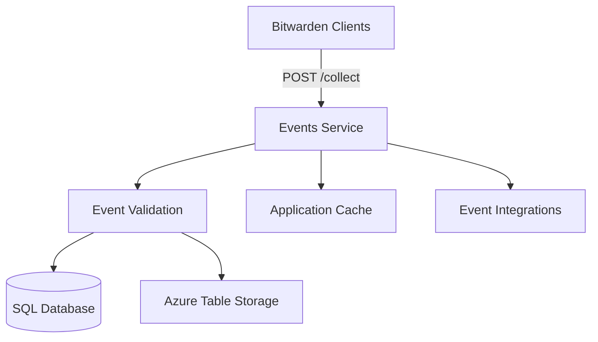

The Events service collects and persists user and organization events for audit logging, compliance reporting, and security monitoring.

## Overview

The Events service provides:

- **Event Collection**: Client-side event submission endpoint
- **Event Storage**: Persisting events to database and Azure Table Storage
- **Event Types**: User actions, cipher operations, organization activities
- **Compliance Support**: Audit trails for regulatory requirements
- **Security Monitoring**: Track suspicious activities and access patterns

## Architecture



## Configuration

From `src/Events/Startup.cs:26`:

```csharp Service Configuration
public void ConfigureServices(IServiceCollection services)
{
    // Settings
    var globalSettings = services.AddGlobalSettingsServices(Configuration, Environment);
    
    // Data Protection
    services.AddCustomDataProtectionServices(Environment, globalSettings);
    
    // Repositories
    services.AddDatabaseRepositories(globalSettings);
    
    // Context
    services.AddScoped<ICurrentContext, CurrentContext>();
    
    // Authentication
    services.AddIdentityAuthenticationServices(globalSettings, Environment, config =>
    {
        config.AddPolicy("Application", policy =>
        {
            policy.RequireAuthenticatedUser();
            policy.RequireClaim(JwtClaimTypes.AuthenticationMethod, "Application", "external");
            policy.RequireClaim(JwtClaimTypes.Scope, ApiScopes.Api);
        });
    });
    
    // Event Services
    var usingServiceBusAppCache = CoreHelpers.SettingHasValue(
        globalSettings.ServiceBus.ConnectionString) &&
        CoreHelpers.SettingHasValue(globalSettings.ServiceBus.ApplicationCacheTopicName);
    
    services.AddScoped<IApplicationCacheService, FeatureRoutedCacheService>();
    
    if (usingServiceBusAppCache)
    {
        services.AddSingleton<IVCurrentInMemoryApplicationCacheService, 
            InMemoryServiceBusApplicationCacheService>();
    }
    else
    {
        services.AddSingleton<IVCurrentInMemoryApplicationCacheService, 
            InMemoryApplicationCacheService>();
    }
    
    services.AddEventWriteServices(globalSettings);
    services.AddScoped<IEventService, EventService>();
    
    // Event integrations
    services.AddDistributedCache(globalSettings);
    services.AddRabbitMqListeners(globalSettings);
}
```

## Event Collection

### Collect Endpoint

From `src/Events/Controllers/CollectController.cs:16`:

```csharp Collect Controller
[Route("collect")]
[Authorize("Application")]
public class CollectController : Controller
{
    [HttpPost]
    public async Task<IActionResult> Post([FromBody] IEnumerable<EventModel> model)
    {
        if (model == null || !model.Any())
        {
            return new BadRequestResult();
        }
        
        foreach (var eventModel in model)
        {
            switch (eventModel.Type)
            {
                case EventType.User_ClientExportedVault:
                    await _eventService.LogUserEventAsync(
                        _currentContext.UserId.Value, 
                        eventModel.Type, 
                        eventModel.Date);
                    break;
                    
                case EventType.Cipher_ClientViewed:
                case EventType.Cipher_ClientAutofilled:
                case EventType.Cipher_ClientCopiedPassword:
                    // Validate cipher access and log event
                    var cipher = await _cipherRepository.GetByIdAsync(
                        eventModel.CipherId.Value,
                        _currentContext.UserId.Value);
                    
                    if (cipher != null)
                    {
                        cipherEvents.Add(new Tuple<Cipher, EventType, DateTime?>(
                            cipher, eventModel.Type, eventModel.Date));
                    }
                    break;
                    
                case EventType.Organization_ClientExportedVault:
                    var organization = await _organizationRepository.GetByIdAsync(
                        eventModel.OrganizationId.Value);
                    
                    if (organization != null)
                    {
                        await _eventService.LogOrganizationEventAsync(
                            organization, eventModel.Type, eventModel.Date);
                    }
                    break;
            }
        }
        
        // Batch process cipher events
        if (cipherEvents.Any())
        {
            foreach (var eventsBatch in cipherEvents.Chunk(50))
            {
                await _eventService.LogCipherEventsAsync(eventsBatch);
            }
        }
        
        return new OkResult();
    }
}
```

**Endpoint**: `POST /collect`

**Authentication**: Required (Bearer token)

**Request Body**:
```json
[
  {
    "type": 1000,
    "cipherId": "guid",
    "date": "2024-03-10T12:00:00Z"
  },
  {
    "type": 1100,
    "organizationId": "guid",
    "date": "2024-03-10T12:01:00Z"
  }
]
```

## Event Types

### User Events

<CardGroup cols={2}>
  <Card title="Login/Logout" icon="right-to-bracket">
    User authentication events
  </Card>
  <Card title="Vault Export" icon="download">
    Vault data export operations
  </Card>
  <Card title="Settings Changes" icon="gear">
    User profile and settings modifications
  </Card>
  <Card title="2FA Events" icon="shield">
    Two-factor authentication changes
  </Card>
</CardGroup>

### Cipher Events

From `src/Events/Controllers/CollectController.cs:80`:

```csharp Cipher Event Types
EventType.Cipher_ClientViewed
EventType.Cipher_ClientAutofilled
EventType.Cipher_ClientCopiedPassword
EventType.Cipher_ClientCopiedHiddenField
EventType.Cipher_ClientCopiedCardCode
EventType.Cipher_ClientToggledPasswordVisible
EventType.Cipher_ClientToggledCardCodeVisible
EventType.Cipher_ClientToggledHiddenFieldVisible
```

These events track vault item interactions:
- Viewing credentials
- Auto-filling forms
- Copying sensitive data
- Revealing hidden fields

### Organization Events

```csharp Organization Event Types
EventType.Organization_ClientExportedVault
EventType.Organization_ItemOrganization_Accepted
EventType.Organization_ItemOrganization_Declined
EventType.Organization_AutoConfirmEnabled_Admin
EventType.Organization_AutoConfirmDisabled_Admin
```

### Administrative Events

- User invitations
- Policy changes
- Collection modifications
- Group management
- Permission changes

## Event Validation

The service validates event submissions:

<Steps>
  <Step title="Authentication">
    Verify user is authenticated via Bearer token
  </Step>
  <Step title="Authorization">
    Check user has access to referenced resources (ciphers, organizations)
  </Step>
  <Step title="Batching">
    Group cipher events for efficient processing (50 per batch)
  </Step>
  <Step title="Storage">
    Persist events to database and Azure Table Storage
  </Step>
</Steps>

## Application Cache

From `src/Events/Startup.cs:56`:

The Events service uses application cache for organization abilities:

```csharp Cache Configuration
services.AddScoped<IApplicationCacheService, FeatureRoutedCacheService>();

if (usingServiceBusAppCache)
{
    services.AddSingleton<IVCurrentInMemoryApplicationCacheService, 
        InMemoryServiceBusApplicationCacheService>();
}
else
{
    services.AddSingleton<IVCurrentInMemoryApplicationCacheService, 
        InMemoryApplicationCacheService>();
}
```

Cache synchronization via:
- **Azure Service Bus**: Multi-instance deployments
- **In-Memory**: Single instance deployments

From `src/Events/Startup.cs:80`:

```csharp Cache Hosted Service
if (usingServiceBusAppCache)
{
    services.AddHostedService<Core.HostedServices.ApplicationCacheHostedService>();
}
```

## Event Integrations

The service supports event-driven integrations via RabbitMQ:

From `src/Events/Startup.cs:86`:

```csharp Event Integrations
services.AddDistributedCache(globalSettings);
services.AddRabbitMqListeners(globalSettings);
```

Integrations include:
- **Slack**: Organization event notifications
- **Microsoft Teams**: Webhook notifications
- **Custom Webhooks**: User-defined integrations

## Middleware Pipeline

From `src/Events/Startup.cs:90`:

```csharp Request Pipeline
public void Configure(IApplicationBuilder app)
{
    // Security headers
    app.UseMiddleware<SecurityHeadersMiddleware>();
    
    // Forwarded headers (self-hosted)
    if (globalSettings.SelfHosted)
    {
        app.UseForwardedHeaders(globalSettings);
    }
    
    // Default middleware
    app.UseDefaultMiddleware(env, globalSettings);
    
    // Routing
    app.UseRouting();
    
    // CORS
    app.UseCors(policy => policy
        .SetIsOriginAllowed(o => CoreHelpers.IsCorsOriginAllowed(o, globalSettings))
        .AllowAnyMethod()
        .AllowAnyHeader()
        .AllowCredentials());
    
    // Authentication & Authorization
    app.UseAuthentication();
    app.UseAuthorization();
    
    // Current context
    app.UseMiddleware<CurrentContextMiddleware>();
    
    // Controllers
    app.UseEndpoints(endpoints => endpoints.MapDefaultControllerRoute());
}
```

## Event Storage

Events are stored in two locations:

### SQL Database

Primary event storage with relational queries:

```sql Event Table
CREATE TABLE [dbo].[Event] (
    [Id] UNIQUEIDENTIFIER NOT NULL,
    [Type] INT NOT NULL,
    [UserId] UNIQUEIDENTIFIER,
    [OrganizationId] UNIQUEIDENTIFIER,
    [CipherId] UNIQUEIDENTIFIER,
    [CollectionId] UNIQUEIDENTIFIER,
    [PolicyId] UNIQUEIDENTIFIER,
    [GroupId] UNIQUEIDENTIFIER,
    [OrganizationUserId] UNIQUEIDENTIFIER,
    [ActingUserId] UNIQUEIDENTIFIER,
    [DeviceType] SMALLINT,
    [IpAddress] VARCHAR(50),
    [Date] DATETIME2(7) NOT NULL,
    CONSTRAINT [PK_Event] PRIMARY KEY CLUSTERED ([Id] ASC)
);
```

### Azure Table Storage

Scalable event storage for high-volume events:

```csharp Table Storage
PartitionKey: OrganizationId or UserId
RowKey: {Date:yyyyMMddHHmmss}_{EventId}
```

Benefits:
- High throughput
- Cost-effective storage
- Efficient time-range queries

## Client Integration

### JavaScript Example

```javascript
const events = [
  {
    type: 1000, // Cipher_ClientViewed
    cipherId: '3fa85f64-5717-4562-b3fc-2c963f66afa6',
    date: new Date().toISOString()
  },
  {
    type: 1003, // Cipher_ClientAutofilled
    cipherId: '3fa85f64-5717-4562-b3fc-2c963f66afa6',
    date: new Date().toISOString()
  }
];

await fetch('https://events.bitwarden.com/collect', {
  method: 'POST',
  headers: {
    'Authorization': `Bearer ${accessToken}`,
    'Content-Type': 'application/json'
  },
  body: JSON.stringify(events)
});
```

### Mobile Example (C#)

```csharp
var events = new List<EventModel>
{
    new EventModel
    {
        Type = EventType.Cipher_ClientViewed,
        CipherId = cipherId,
        Date = DateTime.UtcNow
    }
};

await _apiService.PostEventsCollectAsync(events);
```

## Deployment

### Environment Variables

```bash
GLOBALSETTINGS__SELFHOSTED=true
GLOBALSETTINGS__SQLSERVER__CONNECTIONSTRING=<connection>
GLOBALSETTINGS__EVENTS__CONNECTIONSTRING=<azure_table>
GLOBALSETTINGS__SERVICEBUS__CONNECTIONSTRING=<service_bus>
GLOBALSETTINGS__SERVICEBUS__APPLICATIONCACHETOPICNAME=<topic>
```

### Docker

```bash
docker run -d \
  --name bitwarden-events \
  -p 5005:5000 \
  -e GLOBALSETTINGS__SelfHosted=true \
  -e GLOBALSETTINGS__SqlServer__ConnectionString="<connection>" \
  bitwarden/events:latest
```

## Performance Considerations

<CardGroup cols={2}>
  <Card title="Batch Processing" icon="layer-group">
    Cipher events processed in batches of 50 for efficiency
  </Card>
  <Card title="Async Operations" icon="clock">
    Non-blocking event persistence
  </Card>
  <Card title="Table Storage" icon="table">
    Azure Table for high-volume event storage
  </Card>
  <Card title="Cache Sync" icon="rotate">
    Service Bus for distributed cache invalidation
  </Card>
</CardGroup>

## Security Considerations

<Warning>
Event data contains sensitive information. Ensure proper access controls and encryption.
</Warning>

- **Authentication**: All requests require valid Bearer tokens
- **Authorization**: Users can only log events for resources they access
- **Validation**: Cipher and organization access validated before logging
- **IP Tracking**: Client IP addresses captured for security analysis
- **Audit Trail**: Events are immutable once stored

## Compliance Support

The Events service supports compliance requirements:

- **GDPR**: User activity tracking and data access logs
- **SOC 2**: Audit trails for security controls
- **HIPAA**: Access logging for protected health information
- **ISO 27001**: Information security event management

## Querying Events

Organization administrators can query events via the API service:

```bash
curl -X GET "https://api.bitwarden.com/organizations/{orgId}/events" \
  -H "Authorization: Bearer {token}" \
  -H "Content-Type: application/json"
```

Query parameters:
- `start`: Start date (ISO 8601)
- `end`: End date (ISO 8601)
- `actingUserId`: Filter by user
- `itemId`: Filter by resource (cipher, collection, etc.)

## Related Services

- [API Service](/services/api) - Triggers server-side events
- [Events Processor](/services/events-processor) - Background event processing
- [Notifications Service](/services/notifications) - Real-time event notifications