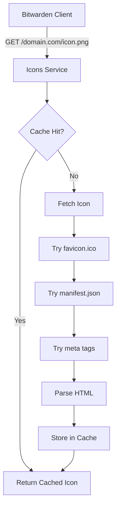

The Icons service fetches and caches website favicons for vault login items, providing visual identification in the Bitwarden interface.

## Overview

The Icons service provides:

- **Favicon Fetching**: Retrieve website favicons and icons
- **Multiple Strategies**: Try multiple icon sources (favicon.ico, manifest, meta tags)
- **Caching**: In-memory cache for frequently requested icons
- **Domain Mapping**: Handle special cases and CDN redirects
- **Fallback Icon**: Default icon for failed requests
- **Performance**: Fast icon delivery with minimal overhead

## Architecture



## Configuration

From `src/Icons/Startup.cs:23`:

```csharp Service Configuration
public void ConfigureServices(IServiceCollection services)
{
    // Settings
    var globalSettings = services.AddGlobalSettingsServices(Configuration, Environment);
    var iconsSettings = new IconsSettings();
    var changePasswordUriSettings = new ChangePasswordUriSettings();
    ConfigurationBinder.Bind(Configuration.GetSection("IconsSettings"), iconsSettings);
    ConfigurationBinder.Bind(Configuration.GetSection("ChangePasswordUriSettings"), 
        changePasswordUriSettings);
    services.AddSingleton(s => iconsSettings);
    services.AddSingleton(s => changePasswordUriSettings);
    
    // HTTP Client
    services.ConfigureHttpClients();
    
    // HTML Parser
    services.AddHtmlParsing();
    
    // Memory Cache
    services.AddMemoryCache(options =>
    {
        options.SizeLimit = iconsSettings.CacheSizeLimit;
    });
    
    services.AddMemoryCache(options =>
    {
        options.SizeLimit = changePasswordUriSettings.CacheSizeLimit;
    });
    
    // Services
    services.AddServices();
}
```

## Icon Endpoint

From `src/Icons/Controllers/IconsController.cs:55`:

```csharp Icon Retrieval
[HttpGet("{hostname}/icon.png")]
public async Task<IActionResult> Get(string hostname)
{
    // Validate hostname
    if (string.IsNullOrWhiteSpace(hostname) || !hostname.Contains("."))
    {
        return new BadRequestResult();
    }
    
    // Construct and validate URL
    var url = $"http://{hostname}";
    if (!Uri.TryCreate(url, UriKind.Absolute, out var uri))
    {
        return new BadRequestResult();
    }
    
    var domain = uri.Host;
    var mappedDomain = _domainMappingService.MapDomain(domain);
    
    // Check cache
    if (!_iconsSettings.CacheEnabled || 
        !_memoryCache.TryGetValue(mappedDomain, out Icon icon))
    {
        // Fetch icon
        var result = await _iconFetchingService.GetIconAsync(domain);
        icon = result ?? null;
        
        // Cache result (including null/not found)
        if (_iconsSettings.CacheEnabled && 
            (icon == null || icon.Image.Length <= 50012))
        {
            _memoryCache.Set(mappedDomain, icon, new MemoryCacheEntryOptions
            {
                AbsoluteExpirationRelativeToNow = 
                    new TimeSpan(_iconsSettings.CacheHours, 0, 0),
                Size = icon?.Image.Length ?? 0,
                Priority = icon == null ? 
                    CacheItemPriority.High : CacheItemPriority.Normal
            });
        }
    }
    
    // Return icon or fallback
    if (icon == null)
    {
        return new FileContentResult(_notFoundImage, "image/png");
    }
    
    return new FileContentResult(icon.Image, icon.Format);
}
```

**Endpoint**: `GET /{hostname}/icon.png`

**Example**: `GET /github.com/icon.png`

**Response**: Image file (PNG, ICO, SVG, etc.)

## Icon Fetching Strategies

The service tries multiple strategies to find icons:

<Steps>
  <Step title="Favicon.ico">
    Try standard `/favicon.ico` location
  </Step>
  <Step title="Web Manifest">
    Parse `/manifest.json` for icon URLs
  </Step>
  <Step title="HTML Meta Tags">
    Parse HTML for icon meta tags (`<link rel="icon">`)
  </Step>
  <Step title="Apple Touch Icon">
    Try Apple-specific touch icons
  </Step>
  <Step title="Fallback">
    Return default Bitwarden globe icon
  </Step>
</Steps>

### HTML Parsing

```csharp HTML Icon Extraction
public async Task<Icon> ExtractIconFromHtmlAsync(string html, string domain)
{
    var document = await _htmlParser.ParseDocumentAsync(html);
    
    // Try various icon selectors
    var iconSelectors = new[]
    {
        "link[rel='icon']",
        "link[rel='shortcut icon']",
        "link[rel='apple-touch-icon']",
        "link[rel='apple-touch-icon-precomposed']",
        "meta[property='og:image']"
    };
    
    foreach (var selector in iconSelectors)
    {
        var element = document.QuerySelector(selector);
        if (element != null)
        {
            var href = element.GetAttribute("href") ?? 
                      element.GetAttribute("content");
            
            if (!string.IsNullOrWhiteSpace(href))
            {
                var iconUrl = new Uri(new Uri($"https://{domain}"), href);
                return await FetchIconFromUrlAsync(iconUrl);
            }
        }
    }
    
    return null;
}
```

## Caching Strategy

### Memory Cache

Icons are cached in memory with size limits:

```csharp Cache Configuration
services.AddMemoryCache(options =>
{
    options.SizeLimit = iconsSettings.CacheSizeLimit; // Default: 100MB
});
```

### Cache Rules

From `src/Icons/Controllers/IconsController.cs:91`:

```csharp Cache Logic
// Only cache not found and smaller images (<= 50kb)
if (_iconsSettings.CacheEnabled && 
    (icon == null || icon.Image.Length <= 50012))
{
    _memoryCache.Set(mappedDomain, icon, new MemoryCacheEntryOptions
    {
        AbsoluteExpirationRelativeToNow = new TimeSpan(_iconsSettings.CacheHours, 0, 0),
        Size = icon?.Image.Length ?? 0,
        Priority = icon == null ? CacheItemPriority.High : CacheItemPriority.Normal
    });
}
```

**Cache Settings**:
- **Duration**: Configurable hours (default: 24 hours)
- **Size Limit**: Total cache size limit
- **Entry Size**: Large icons (>50KB) not cached
- **Priority**: Not found results cached with high priority

## Domain Mapping

Special domain handling for popular services:

```csharp Domain Mapping
public string MapDomain(string domain)
{
    // Handle subdomains of known services
    var mappings = new Dictionary<string, string>
    {
        { "accounts.google.com", "google.com" },
        { "login.microsoftonline.com", "microsoft.com" },
        { "signin.aws.amazon.com", "aws.amazon.com" },
        { "github.com", "github.com" },
        { "gitlab.com", "gitlab.com" }
    };
    
    // Check exact match
    if (mappings.TryGetValue(domain.ToLower(), out var mapped))
    {
        return mapped;
    }
    
    // Check if subdomain of known service
    foreach (var mapping in mappings)
    {
        if (domain.EndsWith($".{mapping.Key}", StringComparison.OrdinalIgnoreCase))
        {
            return mapping.Value;
        }
    }
    
    return domain;
}
```

## Fallback Icon

From `src/Icons/Controllers/IconsController.cs:14`:

```csharp Default Icon
private static readonly byte[] _notFoundImage = Convert.FromBase64String(
    "iVBORw0KGgoAAAANSUhEUgAAABMAAAATCAQAAADYWf5HAAAB...");
```

The fallback is a base64-encoded Bitwarden globe icon (bwi-globe) displayed when:
- Domain not found
- Icon fetch failed
- Invalid URL

## Middleware Pipeline

From `src/Icons/Startup.cs:60`:

```csharp Request Pipeline
public void Configure(IApplicationBuilder app)
{
    // Security headers
    app.UseMiddleware<SecurityHeadersMiddleware>();
    
    // Forwarded headers (self-hosted)
    if (globalSettings.SelfHosted)
    {
        app.UseForwardedHeaders(globalSettings);
    }
    
    // Cache control headers
    app.Use(async (context, next) =>
    {
        context.Response.GetTypedHeaders().CacheControl = new CacheControlHeaderValue
        {
            Public = true,
            MaxAge = TimeSpan.FromDays(7)
        };
        
        context.Response.Headers.Append("Content-Security-Policy", 
            "default-src 'self'; script-src 'none'");
        
        await next();
    });
    
    // CORS
    app.UseCors(policy => policy
        .SetIsOriginAllowed(o => CoreHelpers.IsCorsOriginAllowed(o, globalSettings))
        .AllowAnyMethod()
        .AllowAnyHeader()
        .AllowCredentials());
    
    // Routing
    app.UseRouting();
    app.UseEndpoints(endpoints => endpoints.MapDefaultControllerRoute());
}
```

### Response Headers

```http
Cache-Control: public, max-age=604800
Content-Security-Policy: default-src 'self'; script-src 'none'
Content-Type: image/png
```

## Configuration Endpoint

```http
GET /config
```

Returns cache configuration:

```json
{
  "cacheEnabled": true,
  "cacheHours": 24,
  "cacheSizeLimit": 104857600
}
```

## HTTP Client Configuration

The service uses custom HTTP client configuration:

```csharp HTTP Client Setup
services.AddHttpClient("IconFetcher")
    .ConfigurePrimaryHttpMessageHandler(() => new HttpClientHandler
    {
        AllowAutoRedirect = true,
        MaxAutomaticRedirections = 5,
        AutomaticDecompression = DecompressionMethods.GZip | DecompressionMethods.Deflate
    })
    .SetHandlerLifetime(TimeSpan.FromMinutes(10))
    .AddPolicyHandler(GetRetryPolicy());

private static IAsyncPolicy<HttpResponseMessage> GetRetryPolicy()
{
    return HttpPolicyExtensions
        .HandleTransientHttpError()
        .OrResult(msg => msg.StatusCode == System.Net.HttpStatusCode.NotFound)
        .WaitAndRetryAsync(2, retryAttempt => 
            TimeSpan.FromSeconds(Math.Pow(2, retryAttempt)));
}
```

## Security Features

<CardGroup cols={2}>
  <Card title="URL Validation" icon="shield-check">
    Validate and sanitize all input URLs
  </Card>
  <Card title="CSP Headers" icon="lock">
    Content-Security-Policy prevents script execution
  </Card>
  <Card title="CORS Policy" icon="globe">
    Allow only configured origins
  </Card>
  <Card title="Size Limits" icon="ruler">
    Limit cached icon size to prevent abuse
  </Card>
</CardGroup>

## Performance Optimization

### Caching Benefits

- Reduces external HTTP requests
- Faster icon loading for users
- Lower bandwidth usage
- Improved vault performance

### Cache Eviction

Least Recently Used (LRU) eviction when cache is full:

```csharp
Options.SizeLimit = 104857600; // 100MB
Options.Priority = CacheItemPriority.Normal;
```

## Deployment

### Environment Variables

```bash
GLOBALSETTINGS__SELFHOSTED=true
ICONSSETTINGS__CACHEENABLED=true
ICONSSETTINGS__CACHEHOURS=24
ICONSSETTINGS__CACHESIZELIMIT=104857600
```

### Docker

```bash
docker run -d \
  --name bitwarden-icons \
  -p 5008:5000 \
  -e GLOBALSETTINGS__SelfHosted=true \
  -e ICONSSETTINGS__CacheEnabled=true \
  bitwarden/icons:latest
```

### Kubernetes

```yaml Deployment
apiVersion: apps/v1
kind: Deployment
metadata:
  name: icons
spec:
  replicas: 2
  selector:
    matchLabels:
      app: icons
  template:
    spec:
      containers:
      - name: icons
        image: bitwarden/icons:latest
        resources:
          requests:
            memory: "256Mi"
            cpu: "100m"
          limits:
            memory: "512Mi"
            cpu: "200m"
```

## Monitoring

### Metrics to Track

- Cache hit rate
- Icon fetch latency
- Failed fetches
- Cache size utilization
- Request rate

### Health Check

```bash
curl http://icons:5000/alive
```

## Troubleshooting

### Common Issues

| Issue | Solution |
|-------|----------|
| Icon not found | Check if website has favicon |
| Slow loading | Verify cache is enabled |
| Memory issues | Reduce cache size limit |
| Wrong icon | Clear cache or wait for expiration |

### Debug Logging

```json
{
  "Logging": {
    "LogLevel": {
      "Bit.Icons": "Debug"
    }
  }
}
```

## Self-Hosted Considerations

<Note>
For air-gapped environments, consider pre-populating cache or disabling icon fetching.
</Note>

### Firewall Requirements

The Icons service needs outbound HTTPS access to:
- Any website domain users have vault items for
- Port 443 (HTTPS)
- Port 80 (HTTP, redirects to HTTPS)

## Related Services

- [API Service](/services/api) - References icons for vault items
- [Web Vault](/clients/web-vault) - Displays icons in UI