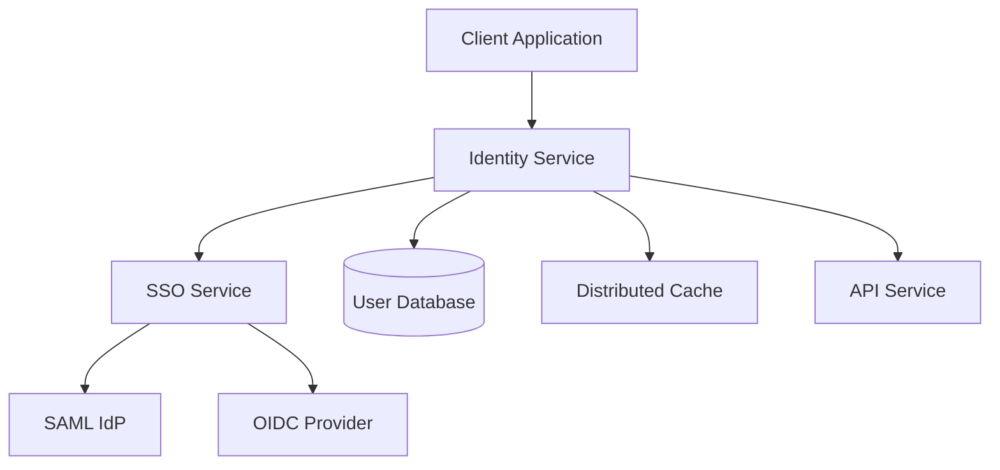

The Identity service provides authentication and authorization for Bitwarden Server using OAuth 2.0 and OpenID Connect protocols, built on Duende IdentityServer.

## Overview

The Identity service handles:

- **User Authentication**: Password-based login, SSO integration
- **OAuth 2.0 Flows**: Authorization code, client credentials, resource owner password
- **OpenID Connect**: Identity token issuance and validation
- **Token Management**: Access tokens, refresh tokens, identity tokens
- **SSO Integration**: External authentication via SSO service
- **Device Authorization**: Device-specific authentication flows

## Architecture



## OAuth 2.0 Flows

### Authorization Code Flow

Used by web and mobile clients for user authentication:

<Steps>
  <Step title="Authorization Request">
    Client redirects to `/connect/authorize` with client_id and redirect_uri
  </Step>
  <Step title="User Authentication">
    User authenticates with username/password or SSO
  </Step>
  <Step title="Authorization Code">
    Identity service redirects back with authorization code
  </Step>
  <Step title="Token Exchange">
    Client exchanges code for access token at `/connect/token`
  </Step>
</Steps>

### Client Credentials Flow

Used for server-to-server authentication (Public API, SCIM):

```bash
curl -X POST "https://identity.bitwarden.com/connect/token" \
  -H "Content-Type: application/x-www-form-urlencoded" \
  -d "grant_type=client_credentials" \
  -d "client_id=organization.{guid}" \
  -d "client_secret={secret}" \
  -d "scope=api.organization"
```

### Resource Owner Password Flow

Used by CLI and desktop clients:

```bash
curl -X POST "https://identity.bitwarden.com/connect/token" \
  -H "Content-Type: application/x-www-form-urlencoded" \
  -d "grant_type=password" \
  -d "username={email}" \
  -d "password={password}" \
  -d "scope=api offline_access" \
  -d "client_id=cli" \
  -d "deviceType=8" \
  -d "deviceIdentifier={device_id}" \
  -d "deviceName={device_name}"
```

## Configuration

### Application Settings

From `src/Identity/Startup.cs:33`:

```csharp Service Configuration
public void ConfigureServices(IServiceCollection services)
{
    // Settings
    var globalSettings = services.AddGlobalSettingsServices(Configuration, Environment);
    
    // Data Protection
    services.AddCustomDataProtectionServices(Environment, globalSettings);
    
    // Repositories
    services.AddDatabaseRepositories(globalSettings);
    
    // Caching
    services.AddMemoryCache();
    services.AddDistributedCache(globalSettings);
    
    // Disable claim mapping
    JwtSecurityTokenHandler.DefaultMapInboundClaims = false;
    
    // Authentication
    services.AddDistributedIdentityServices()
        .AddAuthentication()
        .AddCookie(AuthenticationSchemes.BitwardenExternalCookieAuthenticationScheme)
        .AddOpenIdConnect("sso", "Single Sign On", options =>
        {
            options.Authority = globalSettings.BaseServiceUri.InternalSso;
            options.ClientId = "oidc-identity";
            options.ClientSecret = globalSettings.OidcIdentityClientKey;
            options.ResponseType = "code";
            options.SaveTokens = false;
            options.GetClaimsFromUserInfoEndpoint = true;
        });
    
    // IdentityServer
    services.AddCustomIdentityServerServices(Environment, globalSettings);
    
    // Identity
    services.AddCustomIdentityServices(globalSettings);
}
```

### IdentityServer Configuration

The service uses Duende IdentityServer for OAuth/OIDC implementation:

<Note>
IdentityServer is configured with signing certificates for token validation.
</Note>

```json Certificate Configuration
{
  "globalSettings": {
    "identityServer": {
      "certificateThumbprint": "ABC123..."
    }
  }
}
```

## Supported Scopes

The Identity service issues tokens with the following scopes:

| Scope | Description | Used By |
|-------|-------------|----------|
| `api` | Full API access | Web, Mobile, Desktop |
| `offline_access` | Refresh token | All clients |
| `api.organization` | Public organization API | Integrations |
| `api.push` | Push notification registration | Mobile |
| `api.licensing` | License validation | Self-hosted |
| `api.scim` | SCIM provisioning | Enterprise SSO |
| `api.secrets` | Secrets Manager | SM clients |
| `internal` | Internal service access | Notifications, Events |

## Client Types

Bitwarden defines several OAuth clients:

```csharp Client Definitions
// User-facing clients
web - Web vault
browser - Browser extension
desktop - Desktop application
mobile - Mobile apps
cli - Command-line interface

// Service clients
organization.{guid} - Organization API access
installation.{guid} - Installation access
connector - Directory Connector
```

## Authentication Schemes

From `src/Identity/Startup.cs:98`:

### SSO Integration

The Identity service integrates with the SSO service for enterprise authentication:

```csharp SSO Configuration
.AddOpenIdConnect("sso", "Single Sign On", options =>
{
    options.Authority = globalSettings.BaseServiceUri.InternalSso;
    options.ClientId = "oidc-identity";
    options.ClientSecret = globalSettings.OidcIdentityClientKey;
    options.SignInScheme = AuthenticationSchemes.BitwardenExternalCookieAuthenticationScheme;
    options.ResponseType = "code";
    
    options.Events = new OpenIdConnectEvents
    {
        OnRedirectToIdentityProvider = context =>
        {
            // Pass domain_hint and organizationId to SSO service
            context.ProtocolMessage.DomainHint = context.Properties.Items["domain_hint"];
            context.ProtocolMessage.Parameters.Add("organizationId", 
                context.Properties.Items["organizationId"]);
            return Task.FromResult(0);
        }
    };
});
```

## Controllers

The Identity service exposes several endpoints:

### SSO Controller

Handles SSO login flows:

```csharp
/sso/authorize - Initiate SSO login
/sso/login - Process SSO callback
/sso/prevalidate - Validate SSO configuration
```

### Accounts Controller

User account operations:

```csharp
/accounts/prelogin - Get KDF iteration count
/accounts/register - User registration endpoint
```

### IdentityServer Endpoints

Standard OAuth/OIDC endpoints:

```
/connect/authorize - Authorization endpoint
/connect/token - Token endpoint
/connect/userinfo - UserInfo endpoint
/connect/introspect - Token introspection
/connect/revoke - Token revocation
/.well-known/openid-configuration - Discovery document
```

## Token Structure

### Access Token Claims

Access tokens include the following claims:

```json
{
  "nbf": 1234567890,
  "exp": 1234571490,
  "iss": "https://identity.bitwarden.com",
  "client_id": "web",
  "sub": "{user_id}",
  "auth_time": 1234567890,
  "idp": "bitwarden",
  "premium": "false",
  "email": "user@example.com",
  "email_verified": "true",
  "name": "User Name",
  "orgowner": "{org_id}",
  "device": "{device_id}",
  "scope": ["api", "offline_access"],
  "amr": ["Application"]
}
```

### Refresh Tokens

<Warning>
Refresh tokens are long-lived and must be stored securely by clients.
</Warning>

Refresh tokens enable clients to obtain new access tokens without re-authentication:

```bash Refresh Token Flow
curl -X POST "https://identity.bitwarden.com/connect/token" \
  -H "Content-Type: application/x-www-form-urlencoded" \
  -d "grant_type=refresh_token" \
  -d "client_id=web" \
  -d "refresh_token={refresh_token}"
```

## Two-Factor Authentication

The Identity service integrates 2FA into the authentication flow:

<Steps>
  <Step title="Primary Authentication">
    User provides username and password
  </Step>
  <Step title="2FA Challenge">
    Identity service responds with `TwoFactorRequired` error and available providers
  </Step>
  <Step title="2FA Verification">
    Client resubmits with 2FA code and provider
  </Step>
  <Step title="Token Issuance">
    Identity service issues tokens upon successful 2FA verification
  </Step>
</Steps>

Supported 2FA providers:
- Authenticator apps (TOTP)
- Email
- Duo Security
- YubiKey
- FIDO2 WebAuthn

## Rate Limiting

The Identity service implements rate limiting to prevent brute force attacks:

```json Rate Limits
{
  "IpRateLimitOptions": {
    "GeneralRules": [
      {
        "Endpoint": "post:/connect/token",
        "Period": "1m",
        "Limit": 10
      },
      {
        "Endpoint": "post:/accounts/prelogin",
        "Period": "1m",
        "Limit": 10
      }
    ]
  }
}
```

## Middleware Pipeline

From `src/Identity/Startup.cs:170`:

```csharp Request Pipeline
public void Configure(IApplicationBuilder app)
{
    // Security headers
    app.UseMiddleware<SecurityHeadersMiddleware>();
    
    // Path base for self-hosted
    if (globalSettings.SelfHosted)
    {
        app.UsePathBase("/identity");
        app.UseForwardedHeaders(globalSettings);
    }
    
    // Rate limiting (cloud only)
    if (!globalSettings.SelfHosted)
    {
        app.UseMiddleware<CustomIpRateLimitMiddleware>();
    }
    
    // Localization
    app.UseCoreLocalization();
    
    // Static files (login pages, CSS, JS)
    app.UseStaticFiles();
    
    // Routing
    app.UseRouting();
    
    // CORS
    app.UseCors(policy => policy
        .SetIsOriginAllowed(o => CoreHelpers.IsCorsOriginAllowed(o, globalSettings))
        .AllowAnyMethod()
        .AllowAnyHeader()
        .AllowCredentials());
    
    // Current context
    app.UseMiddleware<CurrentContextMiddleware>();
    
    // IdentityServer
    app.UseIdentityServer();
    
    // Controllers
    app.UseEndpoints(endpoints => endpoints.MapDefaultControllerRoute());
}
```

## Deployment

### Environment Variables

```bash
GLOBALSETTINGS__SELFHOSTED=true
GLOBALSETTINGS__SQLSERVER__CONNECTIONSTRING=<connection>
GLOBALSETTINGS__IDENTITYSERVER__CERTIFICATETHUMBPRINT=<thumbprint>
GLOBALSETTINGS__OIDCIDENTITYCLIENTKEY=<secret>
GLOBALSETTINGS__BASESERVICEURI__INTERNALSSO=<sso_url>
```

### Docker

```bash
docker run -d \
  --name bitwarden-identity \
  -p 5001:5000 \
  -e GLOBALSETTINGS__SelfHosted=true \
  -e GLOBALSETTINGS__SqlServer__ConnectionString="<connection>" \
  bitwarden/identity:latest
```

### Self-Hosted Configuration

<Note>
In self-hosted deployments, the Identity service runs at `/identity` path.
</Note>

```nginx Nginx Configuration
location /identity {
    proxy_pass http://identity:5000/identity;
    proxy_set_header Host $host;
    proxy_set_header X-Real-IP $remote_addr;
    proxy_set_header X-Forwarded-For $proxy_add_x_forwarded_for;
    proxy_set_header X-Forwarded-Proto $scheme;
}
```

## Discovery Document

The Identity service exposes an OpenID Connect discovery document:

```bash
curl https://identity.bitwarden.com/.well-known/openid-configuration
```

Response includes:
- Authorization endpoint
- Token endpoint
- Supported grant types
- Supported scopes
- Signing keys (JWKS)

## Background Services

From `src/Identity/Startup.cs:157`:

```csharp Hosted Services
if (CoreHelpers.SettingHasValue(globalSettings.ServiceBus.ConnectionString))
{
    services.AddHostedService<Core.HostedServices.ApplicationCacheHostedService>();
}
```

The cache service synchronizes user permissions and organization data across instances.

## Related Services

- [SSO Service](/services/sso) - Enterprise SSO authentication
- [API Service](/services/api) - Resource server for OAuth tokens
- [Admin Service](/services/admin) - Administrative functions