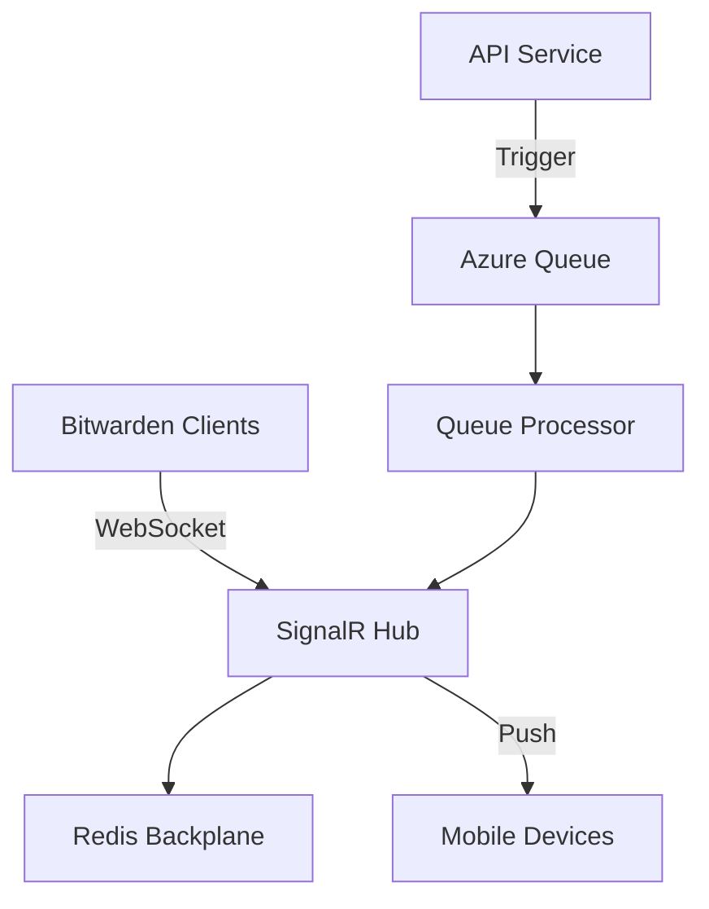
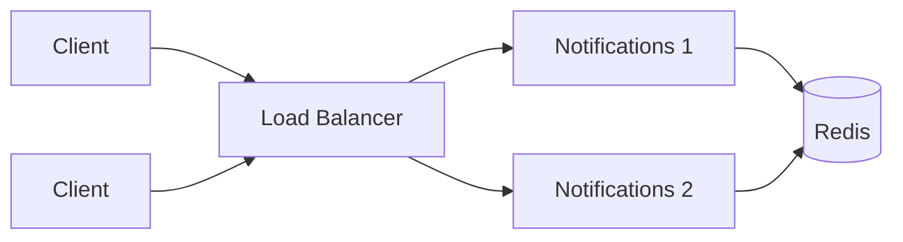

The Notifications service provides real-time push notifications to Bitwarden clients using SignalR over WebSockets, enabling instant vault synchronization across devices.

## Overview

The Notifications service handles:

- **Real-Time Updates**: WebSocket connections for instant notifications
- **SignalR Hubs**: Authenticated and anonymous notification hubs
- **Message Broadcasting**: User, organization, and installation-wide notifications
- **Connection Management**: Active connection tracking and health monitoring
- **Queue Processing**: Azure Queue integration for notification delivery (cloud)

## Architecture



## SignalR Hubs

The service exposes two SignalR hubs:

### Authenticated Hub

From `src/Notifications/NotificationsHub.cs:12`:

```csharp NotificationsHub
[Authorize("Application")]
public class NotificationsHub : Microsoft.AspNetCore.SignalR.Hub
{
    public override async Task OnConnectedAsync()
    {
        var currentContext = new CurrentContext(null, null);
        await currentContext.BuildAsync(Context.User, _globalSettings);
        
        var clientType = DeviceTypes.ToClientType(currentContext.DeviceType);
        
        // Add to user group
        if (clientType != ClientType.All && currentContext.UserId.HasValue)
        {
            await Groups.AddToGroupAsync(Context.ConnectionId, 
                GetUserGroup(currentContext.UserId.Value, clientType));
        }
        
        // Add to installation group
        if (_globalSettings.Installation.Id != Guid.Empty)
        {
            await Groups.AddToGroupAsync(Context.ConnectionId, 
                GetInstallationGroup(_globalSettings.Installation.Id));
        }
        
        // Add to organization groups
        if (currentContext.Organizations != null)
        {
            foreach (var org in currentContext.Organizations)
            {
                await Groups.AddToGroupAsync(Context.ConnectionId, 
                    GetOrganizationGroup(org.Id));
            }
        }
        
        _connectionCounter.Increment();
    }
}
```

**Endpoint**: `/hub`

**Authentication**: Required (Bearer token)

**Groups**:
- User groups (per client type)
- Organization groups
- Installation groups

### Anonymous Hub

From `src/Notifications/AnonymousNotificationsHub.cs:9`:

```csharp AnonymousNotificationsHub
[AllowAnonymous]
public class AnonymousNotificationsHub : Hub, INotificationHub
{
    public override async Task OnConnectedAsync()
    {
        var httpContext = Context.GetHttpContext();
        var token = httpContext.Request.Query["Token"].FirstOrDefault();
        
        if (!string.IsNullOrWhiteSpace(token))
        {
            await Groups.AddToGroupAsync(Context.ConnectionId, token);
        }
        
        await base.OnConnectedAsync();
    }
}
```

**Endpoint**: `/anonymous-hub`

**Authentication**: Anonymous with token-based groups

**Use Case**: Send file sharing notifications

## Configuration

### Application Settings

From `src/Notifications/Startup.cs:23`:

```csharp Service Configuration
public void ConfigureServices(IServiceCollection services)
{
    // Settings
    var globalSettings = services.AddGlobalSettingsServices(Configuration, Environment);
    
    // Identity authentication
    services.AddIdentityAuthenticationServices(globalSettings, Environment, config =>
    {
        config.AddPolicy("Application", policy =>
        {
            policy.RequireAuthenticatedUser();
            policy.RequireClaim(JwtClaimTypes.AuthenticationMethod, "Application", "external");
            policy.RequireClaim(JwtClaimTypes.Scope, ApiScopes.Api);
        });
        config.AddPolicy("Internal", policy =>
        {
            policy.RequireAuthenticatedUser();
            policy.RequireClaim(JwtClaimTypes.Scope, ApiScopes.Internal);
        });
    });
    
    // SignalR with Redis backplane
    var signalRServerBuilder = services.AddSignalR()
        .AddMessagePackProtocol(options =>
        {
            options.SerializerOptions = MessagePack.MessagePackSerializerOptions.Standard
                .WithResolver(MessagePack.Resolvers.ContractlessStandardResolver.Instance);
        });
    
    if (CoreHelpers.SettingHasValue(globalSettings.Notifications?.RedisConnectionString))
    {
        signalRServerBuilder.AddStackExchangeRedis(
            globalSettings.Notifications.RedisConnectionString,
            options =>
            {
                options.Configuration.ChannelPrefix = "Notifications";
            });
    }
    
    services.AddSingleton<IUserIdProvider, SubjectUserIdProvider>();
    services.AddSingleton<ConnectionCounter>();
    services.AddSingleton<HubHelpers>();
}
```

### Redis Backplane

<Note>
Redis is required for scaling the Notifications service across multiple instances.
</Note>

```json Redis Configuration
{
  "globalSettings": {
    "notifications": {
      "redisConnectionString": "redis:6379,ssl=false",
      "connectionString": "<azure_queue_connection>"
    }
  }
}
```

The Redis backplane ensures messages are delivered across all SignalR instances:

```csharp Redis Setup
signalRServerBuilder.AddStackExchangeRedis(
    globalSettings.Notifications.RedisConnectionString,
    options =>
    {
        options.Configuration.ChannelPrefix = "Notifications";
    });
```

## Hub Configuration

From `src/Notifications/Startup.cs:112`:

```csharp Hub Endpoints
app.UseEndpoints(endpoints =>
{
    endpoints.MapHub<NotificationsHub>("/hub", options =>
    {
        options.ApplicationMaxBufferSize = 2048;
        options.TransportMaxBufferSize = 4096;
    });
    
    endpoints.MapHub<AnonymousNotificationsHub>("/anonymous-hub", options =>
    {
        options.ApplicationMaxBufferSize = 2048;
        options.TransportMaxBufferSize = 4096;
    });
    
    endpoints.MapDefaultControllerRoute();
});
```

## Notification Groups

The service uses SignalR groups for targeted message delivery:

### User Groups

From `src/Notifications/NotificationsHub.cs:107`:

```csharp User Group Format
public static string GetUserGroup(Guid userId, ClientType clientType)
{
    return $"UserClientType_{userId}_{clientType}";
}
```

Examples:
- `UserClientType_{guid}_Browser`
- `UserClientType_{guid}_Mobile`
- `UserClientType_{guid}_Desktop`

### Organization Groups

From `src/Notifications/NotificationsHub.cs:112`:

```csharp Organization Group Format
public static string GetOrganizationGroup(Guid organizationId, ClientType? clientType = null)
{
    return clientType is null or ClientType.All
        ? $"Organization_{organizationId}"
        : $"OrganizationClientType_{organizationId}_{clientType}";
}
```

### Installation Groups

From `src/Notifications/NotificationsHub.cs:100`:

```csharp Installation Group Format
public static string GetInstallationGroup(Guid installationId, ClientType? clientType = null)
{
    return clientType is null or ClientType.All
        ? $"Installation_{installationId}"
        : $"Installation_ClientType_{installationId}_{clientType}";
}
```

## Message Types

Clients receive different types of notifications:

<CardGroup cols={2}>
  <Card title="Sync Required" icon="rotate">
    Notifies clients to sync vault data
  </Card>
  <Card title="Cipher Update" icon="key">
    Specific cipher was modified
  </Card>
  <Card title="Folder Update" icon="folder">
    Folder structure changed
  </Card>
  <Card title="User Updated" icon="user">
    User settings or profile changed
  </Card>
  <Card title="Logout" icon="right-from-bracket">
    Force client logout
  </Card>
  <Card title="Auth Request" icon="shield">
    Passwordless auth request
  </Card>
</CardGroup>

## Client Connection

### JavaScript Example

```javascript
const connection = new signalR.HubConnectionBuilder()
    .withUrl("https://notifications.bitwarden.com/hub", {
        accessTokenFactory: () => accessToken
    })
    .withAutomaticReconnect()
    .build();

connection.on("SyncCipherUpdate", (cipherId) => {
    console.log("Cipher updated:", cipherId);
    // Sync the specific cipher
});

connection.on("SyncVault", () => {
    console.log("Full sync required");
    // Perform full vault sync
});

connection.on("LogOut", () => {
    console.log("Force logout");
    // Log user out
});

await connection.start();
```

### C# Example (Mobile/Desktop)

```csharp
var hubConnection = new HubConnectionBuilder()
    .WithUrl($"{apiUrl}/hub", options =>
    {
        options.AccessTokenProvider = () => Task.FromResult(accessToken);
    })
    .WithAutomaticReconnect()
    .Build();

hubConnection.On<string>("SyncCipherUpdate", async (cipherId) =>
{
    await SyncCipherAsync(cipherId);
});

hubConnection.On("SyncVault", async () =>
{
    await FullSyncAsync();
});

await hubConnection.StartAsync();
```

## Controllers

The service includes controllers for triggering notifications:

### Send Controller

From `src/Notifications/Controllers/SendController.cs`:

```csharp
[Authorize("Internal")]
public class SendController : Controller
{
    [HttpPost("send")]
    public async Task<IActionResult> PostSend([FromBody] SendNotificationModel model)
    {
        // Trigger notification to specific groups
    }
}
```

**Authorization**: Internal services only (API, Events)

## Background Services

From `src/Notifications/Startup.cs:68`:

### Heartbeat Service

```csharp Heartbeat
services.AddHostedService<HeartbeatHostedService>();
```

Monitors connection health and tracks active connections.

### Queue Processor (Cloud Only)

```csharp Queue Processing
if (!globalSettings.SelfHosted)
{
    if (CoreHelpers.SettingHasValue(globalSettings.Notifications?.ConnectionString))
    {
        services.AddHostedService<AzureQueueHostedService>();
    }
}
```

Processes notification messages from Azure Queue Storage.

## Connection Tracking

The service tracks active connections:

```csharp Connection Counter
public class ConnectionCounter
{
    private long _count = 0;
    
    public void Increment() => Interlocked.Increment(ref _count);
    public void Decrement() => Interlocked.Decrement(ref _count);
    public long GetCount() => Interlocked.Read(ref _count);
}
```

Used for monitoring and health checks.

## Middleware Pipeline

From `src/Notifications/Startup.cs:81`:

```csharp Request Pipeline
public void Configure(IApplicationBuilder app)
{
    // Security headers
    app.UseMiddleware<SecurityHeadersMiddleware>();
    
    // Forwarded headers (self-hosted)
    if (globalSettings.SelfHosted)
    {
        app.UseForwardedHeaders(globalSettings);
    }
    
    // Routing
    app.UseRouting();
    
    // CORS
    app.UseCors(policy => policy
        .SetIsOriginAllowed(o => CoreHelpers.IsCorsOriginAllowed(o, globalSettings))
        .AllowAnyMethod()
        .AllowAnyHeader()
        .AllowCredentials());
    
    // Authentication & Authorization
    app.UseAuthentication();
    app.UseAuthorization();
    
    // Endpoints (SignalR hubs)
    app.UseEndpoints(endpoints =>
    {
        endpoints.MapHub<NotificationsHub>("/hub");
        endpoints.MapHub<AnonymousNotificationsHub>("/anonymous-hub");
        endpoints.MapDefaultControllerRoute();
    });
}
```

## Deployment

### Environment Variables

```bash
GLOBALSETTINGS__SELFHOSTED=true
GLOBALSETTINGS__NOTIFICATIONS__REDISCONNECTIONSTRING=<redis_connection>
GLOBALSETTINGS__NOTIFICATIONS__CONNECTIONSTRING=<azure_queue>
```

### Docker

```bash
docker run -d \
  --name bitwarden-notifications \
  -p 5003:5000 \
  -e GLOBALSETTINGS__SelfHosted=true \
  -e GLOBALSETTINGS__Notifications__RedisConnectionString="<redis>" \
  bitwarden/notifications:latest
```

### Scaling Considerations

<Note>
When running multiple instances, Redis backplane is required for message distribution.
</Note>



## Performance Optimization

### Message Pack Protocol

The service uses MessagePack for efficient binary serialization:

```csharp MessagePack Configuration
.AddMessagePackProtocol(options =>
{
    options.SerializerOptions = MessagePack.MessagePackSerializerOptions.Standard
        .WithResolver(MessagePack.Resolvers.ContractlessStandardResolver.Instance);
});
```

Benefits:
- Smaller message size
- Faster serialization
- Reduced bandwidth

### Buffer Configuration

```csharp Buffer Sizes
options.ApplicationMaxBufferSize = 2048;
options.TransportMaxBufferSize = 4096;
```

Optimized for typical notification message sizes.

## Monitoring

### Health Checks

Monitor active connections:

```bash
curl http://notifications:5000/info
```

### Connection Metrics

Track:
- Total active connections
- Connections per hub
- Group membership counts
- Message throughput

## Troubleshooting

<Warning>
Clients must maintain active WebSocket connections. Check firewall and proxy settings.
</Warning>

### Common Issues

| Issue | Solution |
|-------|----------|
| Connection drops | Enable automatic reconnect in client |
| No notifications | Verify Redis backplane configuration |
| High latency | Check Redis and network performance |
| Authentication failures | Verify token validity and scopes |

### Debug Logging

```json
{
  "Logging": {
    "LogLevel": {
      "Microsoft.AspNetCore.SignalR": "Debug",
      "Microsoft.AspNetCore.Http.Connections": "Debug"
    }
  }
}
```

## Related Services

- [API Service](/services/api) - Triggers notifications
- [Events Service](/services/events) - Event-driven notifications
- [Identity Service](/services/identity) - Authentication tokens