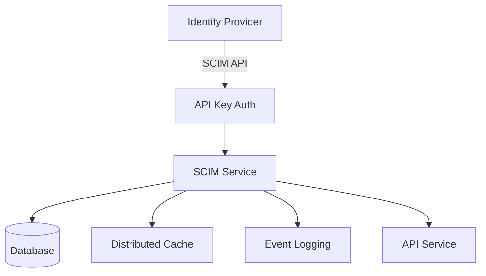

The SCIM (System for Cross-domain Identity Management) service enables automated user and group provisioning for enterprise organizations using identity providers like Azure AD, Okta, and OneLogin.

## Overview

<Note>
SCIM is an enterprise feature available in the commercial version of Bitwarden Server.
</Note>

The SCIM service provides:

- **SCIM 2.0 Protocol**: Standards-compliant user and group provisioning
- **User Provisioning**: Automatic user creation, updates, and deactivation
- **Group Management**: Synchronize organizational groups and memberships
- **API Key Authentication**: Secure authentication for identity providers
- **Real-time Sync**: Instant propagation of identity changes

## Architecture



## SCIM 2.0 Specification

The service implements SCIM 2.0 core schema (RFC 7643) and protocol (RFC 7644):

- **Users**: `/v2/{orgId}/users`
- **Groups**: `/v2/{orgId}/groups`
- **Service Provider Config**: `/v2/ServiceProviderConfig`
- **Resource Types**: `/v2/ResourceTypes`
- **Schemas**: `/v2/Schemas`

## Configuration

From `bitwarden_license/src/Scim/Startup.cs:29`:

```csharp Service Configuration
public void ConfigureServices(IServiceCollection services)
{
    // Settings
    var globalSettings = services.AddGlobalSettingsServices(Configuration, Environment);
    services.Configure<ScimSettings>(Configuration.GetSection("ScimSettings"));
    
    // Data Protection
    services.AddCustomDataProtectionServices(Environment, globalSettings);
    
    // Stripe Billing
    StripeConfiguration.ApiKey = globalSettings.Stripe.ApiKey;
    
    // Repositories
    services.AddDatabaseRepositories(globalSettings);
    
    // Context
    services.AddScoped<ICurrentContext, CurrentContext>();
    services.AddScoped<IScimContext, ScimContext>();
    
    // API Key Authentication
    services.AddAuthentication(ApiKeyAuthenticationOptions.DefaultScheme)
        .AddScheme<ApiKeyAuthenticationOptions, ApiKeyAuthenticationHandler>(
            ApiKeyAuthenticationOptions.DefaultScheme, null);
    
    services.AddAuthorization(config =>
    {
        config.AddPolicy("Scim", policy =>
        {
            policy.RequireAuthenticatedUser();
            policy.RequireClaim(JwtClaimTypes.Scope, "api.scim");
        });
    });
    
    // SCIM Commands and Queries
    services.AddScimGroupCommands();
    services.AddScimGroupQueries();
    services.AddScimUserQueries();
    services.AddScimUserCommands();
}
```

## Authentication

### API Key Authentication

The SCIM service uses API key authentication instead of OAuth:

```bash
curl -X GET "https://scim.bitwarden.com/v2/{orgId}/users" \
  -H "Authorization: Bearer {scim_api_key}"
```

**API Key Format**: Organization-specific key generated in web vault

**Location**: Organization Settings → SCIM Provisioning

### SCIM Context

From `bitwarden_license/src/Scim/Startup.cs:50`:

```csharp SCIM Context
services.AddScoped<IScimContext, ScimContext>();
```

The SCIM context middleware validates:
- API key authenticity
- Organization ID matches authenticated organization
- Organization has SCIM enabled
- API key has not been revoked

## Users Endpoint

### List Users

```http
GET /v2/{orgId}/users
GET /v2/{orgId}/users?filter=userName eq "user@example.com"
GET /v2/{orgId}/users?startIndex=1&count=100
```

Response:
```json
{
  "schemas": ["urn:ietf:params:scim:api:messages:2.0:ListResponse"],
  "totalResults": 150,
  "itemsPerPage": 100,
  "startIndex": 1,
  "Resources": [
    {
      "schemas": ["urn:ietf:params:scim:schemas:core:2.0:User"],
      "id": "guid",
      "externalId": "external_id",
      "userName": "user@example.com",
      "name": {
        "givenName": "First",
        "familyName": "Last"
      },
      "emails": [
        {
          "primary": true,
          "value": "user@example.com",
          "type": "work"
        }
      ],
      "active": true
    }
  ]
}
```

### Create User

```http
POST /v2/{orgId}/users
Content-Type: application/scim+json
```

```json Request Body
{
  "schemas": ["urn:ietf:params:scim:schemas:core:2.0:User"],
  "userName": "user@example.com",
  "externalId": "external_id",
  "name": {
    "givenName": "First",
    "familyName": "Last"
  },
  "emails": [
    {
      "primary": true,
      "value": "user@example.com",
      "type": "work"
    }
  ],
  "active": true
}
```

### Update User

```http
PUT /v2/{orgId}/users/{id}
Content-Type: application/scim+json
```

### Patch User

```http
PATCH /v2/{orgId}/users/{id}
Content-Type: application/scim+json
```

```json Patch Operations
{
  "schemas": ["urn:ietf:params:scim:api:messages:2.0:PatchOp"],
  "Operations": [
    {
      "op": "replace",
      "path": "active",
      "value": false
    }
  ]
}
```

### Delete User

```http
DELETE /v2/{orgId}/users/{id}
```

<Warning>
Deleting a user via SCIM removes them from the organization but does not delete their Bitwarden account.
</Warning>

## Groups Endpoint

From `bitwarden_license/src/Scim/Controllers/v2/GroupsController.cs:17`:

```csharp Groups Controller
[Authorize("Scim")]
[Route("v2/{organizationId}/groups")]
[Produces("application/scim+json")]
public class GroupsController : Controller
{
    [HttpGet("{id}")]
    public async Task<IActionResult> Get(Guid organizationId, Guid id)
    {
        var group = await _groupRepository.GetByIdAsync(id);
        if (group == null || group.OrganizationId != organizationId)
        {
            throw new NotFoundException("Group not found.");
        }
        return Ok(new ScimGroupResponseModel(group));
    }
    
    [HttpPost("")]
    public async Task<IActionResult> Post(Guid organizationId, 
        [FromBody] ScimGroupRequestModel model)
    {
        var organization = await _organizationRepository.GetByIdAsync(organizationId);
        var group = await _postGroupCommand.PostGroupAsync(organization, model);
        return new CreatedResult(Url.Action(nameof(Get), 
            new { group.OrganizationId, group.Id }), 
            new ScimGroupResponseModel(group));
    }
    
    [HttpPatch("{id}")]
    public async Task<IActionResult> Patch(Guid organizationId, Guid id, 
        [FromBody] ScimPatchModel model)
    {
        var group = await _groupRepository.GetByIdAsync(id);
        if (group == null || group.OrganizationId != organizationId)
        {
            throw new NotFoundException("Group not found.");
        }
        
        await _patchGroupCommand.PatchGroupAsync(group, model);
        return new NoContentResult();
    }
}
```

### List Groups

```http
GET /v2/{orgId}/groups
GET /v2/{orgId}/groups?filter=displayName eq "Developers"
```

Response:
```json
{
  "schemas": ["urn:ietf:params:scim:api:messages:2.0:ListResponse"],
  "totalResults": 10,
  "itemsPerPage": 10,
  "startIndex": 1,
  "Resources": [
    {
      "schemas": ["urn:ietf:params:scim:schemas:core:2.0:Group"],
      "id": "guid",
      "externalId": "external_id",
      "displayName": "Developers",
      "members": [
        {
          "value": "user_guid",
          "display": "user@example.com"
        }
      ]
    }
  ]
}
```

### Create Group

```http
POST /v2/{orgId}/groups
Content-Type: application/scim+json
```

```json
{
  "schemas": ["urn:ietf:params:scim:schemas:core:2.0:Group"],
  "displayName": "Developers",
  "externalId": "external_group_id",
  "members": [
    {
      "value": "user_guid"
    }
  ]
}
```

### Update Group Membership

```http
PATCH /v2/{orgId}/groups/{id}
Content-Type: application/scim+json
```

```json Add Members
{
  "schemas": ["urn:ietf:params:scim:api:messages:2.0:PatchOp"],
  "Operations": [
    {
      "op": "add",
      "path": "members",
      "value": [
        {"value": "user_guid_1"},
        {"value": "user_guid_2"}
      ]
    }
  ]
}
```

```json Remove Members
{
  "schemas": ["urn:ietf:params:scim:api:messages:2.0:PatchOp"],
  "Operations": [
    {
      "op": "remove",
      "path": "members",
      "value": [
        {"value": "user_guid"}
      ]
    }
  ]
}
```

## SCIM Commands and Queries

From `bitwarden_license/src/Scim/Startup.cs:89`:

```csharp SCIM Services
// Group operations
services.AddScimGroupCommands();
services.AddScimGroupQueries();

// User operations
services.AddScimUserQueries();
services.AddScimUserCommands();
```

These services implement:
- **Commands**: Create, update, patch, delete operations
- **Queries**: List, filter, search operations
- **Validation**: SCIM schema compliance
- **Business Logic**: Bitwarden-specific rules and constraints

## Event Logging

All SCIM operations are logged with `EventSystemUser.SCIM`:

From `bitwarden_license/src/Scim/Controllers/v2/GroupsController.cs:112`:

```csharp Event Logging
[HttpDelete("{id}")]
public async Task<IActionResult> Delete(Guid organizationId, Guid id)
{
    await _deleteGroupCommand.DeleteGroupAsync(organizationId, id, EventSystemUser.SCIM);
    return new NoContentResult();
}
```

Logged events:
- User invited/confirmed/removed
- Group created/updated/deleted
- Group membership changes
- Failed authentication attempts

## Middleware Pipeline

From `bitwarden_license/src/Scim/Startup.cs:95`:

```csharp Request Pipeline
public void Configure(IApplicationBuilder app)
{
    // Security headers
    app.UseMiddleware<SecurityHeadersMiddleware>();
    
    // Forwarded headers (self-hosted)
    if (globalSettings.SelfHosted)
    {
        app.UseForwardedHeaders(globalSettings);
    }
    
    // Default middleware
    app.UseDefaultMiddleware(env, globalSettings);
    
    // Routing
    app.UseRouting();
    
    // SCIM context (validates organization)
    app.UseMiddleware<ScimContextMiddleware>();
    
    // Authentication & Authorization
    app.UseAuthentication();
    app.UseAuthorization();
    
    // Current context
    app.UseMiddleware<CurrentContextMiddleware>();
    
    // Controllers
    app.UseEndpoints(endpoints => endpoints.MapDefaultControllerRoute());
}
```

## Supported Identity Providers

<CardGroup cols={2}>
  <Card title="Azure AD" icon="microsoft">
    Microsoft Entra ID (Azure Active Directory) provisioning
  </Card>
  <Card title="Okta" icon="okta">
    Okta Identity Cloud integration
  </Card>
  <Card title="OneLogin" icon="key">
    OneLogin directory synchronization
  </Card>
  <Card title="JumpCloud" icon="cloud">
    JumpCloud directory integration
  </Card>
</CardGroup>

## Setup Guide

<Steps>
  <Step title="Enable SCIM">
    Navigate to Organization Settings → SCIM Provisioning
  </Step>
  <Step title="Generate API Key">
    Click "Enable SCIM" to generate organization-specific API key
  </Step>
  <Step title="Configure IdP">
    In your identity provider, add Bitwarden SCIM application:
    - **Base URL**: `https://scim.bitwarden.com/v2/{organizationId}`
    - **API Key**: Use generated key as bearer token
  </Step>
  <Step title="Test Connection">
    Use IdP's test connection feature to verify configuration
  </Step>
  <Step title="Assign Users**">
    Assign users and groups in IdP to begin provisioning
  </Step>
</Steps>

## Filtering and Pagination

The SCIM service supports standard SCIM query parameters:

### Filtering

```http
GET /v2/{orgId}/users?filter=userName eq "user@example.com"
GET /v2/{orgId}/groups?filter=displayName sw "Dev"
```

Supported operators:
- `eq` - equals
- `ne` - not equals
- `sw` - starts with
- `ew` - ends with
- `co` - contains

### Pagination

```http
GET /v2/{orgId}/users?startIndex=1&count=100
```

Parameters:
- `startIndex`: 1-based index (default: 1)
- `count`: Number of results per page (default: 100)

## Error Handling

SCIM errors follow RFC 7644 error response format:

```json Error Response
{
  "schemas": ["urn:ietf:params:scim:api:messages:2.0:Error"],
  "status": "404",
  "detail": "User not found."
}
```

Common status codes:
- `400` - Bad Request (invalid SCIM request)
- `401` - Unauthorized (invalid API key)
- `404` - Not Found (resource doesn't exist)
- `409` - Conflict (duplicate external ID)
- `500` - Internal Server Error

## Deployment

### Environment Variables

```bash
GLOBALSETTINGS__SELFHOSTED=true
GLOBALSETTINGS__SQLSERVER__CONNECTIONSTRING=<connection>
SCIMSETTINGS__ENABLED=true
```

### Docker

```bash
docker run -d \
  --name bitwarden-scim \
  -p 5002:5000 \
  -e GLOBALSETTINGS__SelfHosted=true \
  -e GLOBALSETTINGS__SqlServer__ConnectionString="<connection>" \
  bitwarden/scim:latest
```

## Rate Limiting

<Note>
SCIM endpoints may be rate-limited to prevent abuse. Implement exponential backoff in IdP sync jobs.
</Note>

Recommended sync intervals:
- **Full sync**: Every 24 hours
- **Incremental sync**: Every 30-60 minutes
- **Real-time updates**: As changes occur (with backoff)

## Troubleshooting

### Common Issues

| Issue | Solution |
|-------|----------|
| 401 Unauthorized | Verify API key is correct and SCIM is enabled |
| 404 Not Found | Check organization ID in URL matches API key |
| 409 Conflict | External ID already exists, use unique identifiers |
| User not receiving invitation | Check email settings and spam filters |

### Debug Logging

```json
{
  "Logging": {
    "LogLevel": {
      "Bit.Scim": "Debug"
    }
  }
}
```

## Limitations

<Warning>
SCIM provisioning has the following limitations:
</Warning>

- Users cannot be created without an email address
- Only organization users are managed (not entire Bitwarden accounts)
- Custom attributes are not supported
- Password management is not supported via SCIM
- Collections are not managed via SCIM

## Best Practices

1. **External IDs**: Always set unique `externalId` for users and groups
2. **Incremental Sync**: Use incremental sync to reduce API calls
3. **Error Handling**: Implement proper error handling and retry logic
4. **Monitoring**: Monitor SCIM sync logs in IdP admin console
5. **Testing**: Test with small group before full deployment

## Related Services

- [SSO Service](/services/sso) - SAML/OIDC authentication for provisioned users
- [API Service](/services/api) - Organization management
- [Identity Service](/services/identity) - User authentication