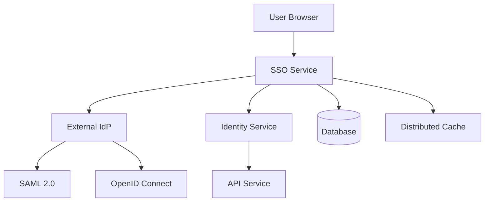
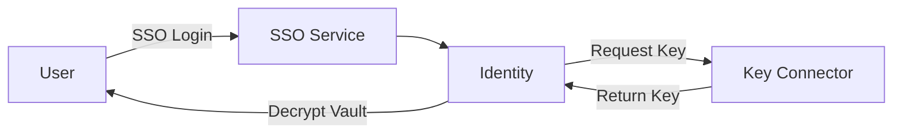
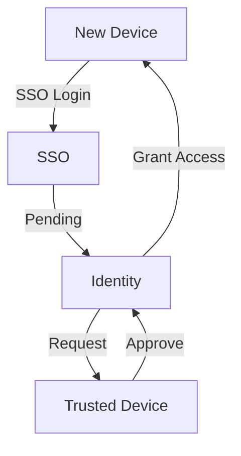

The SSO service provides enterprise Single Sign-On authentication using SAML 2.0 and OpenID Connect protocols, enabling organizations to integrate with their existing identity providers.

## Overview

<Note>
SSO is an enterprise feature available in the commercial version of Bitwarden Server.
</Note>

The SSO service provides:

- **SAML 2.0**: Service Provider implementation for SAML-based SSO
- **OpenID Connect**: Relying Party for OIDC authentication
- **Multi-Tenancy**: Organization-specific SSO configurations
- **Just-In-Time Provisioning**: Automatic user account creation
- **Domain Verification**: Trusted domain-based login routing
- **Member Decryption Options**: Support for Key Connector and Account Recovery

## Architecture



## Authentication Flows

### SAML 2.0 Flow

<Steps>
  <Step title="SSO Initiation">
    User enters email or clicks SSO login button
  </Step>
  <Step title="Organization Lookup">
    SSO service identifies organization by domain or identifier
  </Step>
  <Step title="SAML Request">
    SSO service generates SAML AuthnRequest and redirects to IdP
  </Step>
  <Step title="IdP Authentication">
    User authenticates with organization's identity provider
  </Step>
  <Step title="SAML Response">
    IdP sends SAML assertion back to SSO service
  </Step>
  <Step title="Validation">
    SSO service validates SAML signature and assertions
  </Step>
  <Step title="Token Exchange">
    SSO service redirects to Identity service with authorization code
  </Step>
  <Step title="Access Token">
    Identity service issues OAuth tokens for client application
  </Step>
</Steps>

### OpenID Connect Flow

<Steps>
  <Step title="SSO Initiation">
    User initiates login via organization SSO
  </Step>
  <Step title="OIDC Authorization">
    SSO service redirects to OIDC provider with authorization request
  </Step>
  <Step title="User Authentication">
    User authenticates with OIDC provider
  </Step>
  <Step title="Authorization Code">
    OIDC provider returns authorization code
  </Step>
  <Step title="Token Exchange">
    SSO service exchanges code for ID token and access token
  </Step>
  <Step title="User Info">
    SSO service retrieves user information from OIDC UserInfo endpoint
  </Step>
  <Step title="Bitwarden Login">
    SSO service creates/updates user and redirects to Identity service
  </Step>
</Steps>

## Configuration

From `bitwarden_license/src/Sso/Startup.cs:26`:

```csharp Service Configuration
public void ConfigureServices(IServiceCollection services)
{
    // Settings
    var globalSettings = services.AddGlobalSettingsServices(Configuration, Environment);
    
    // Stripe Billing
    StripeConfiguration.ApiKey = globalSettings.Stripe.ApiKey;
    
    // Data Protection
    services.AddCustomDataProtectionServices(Environment, globalSettings);
    
    // Repositories
    services.AddDatabaseRepositories(globalSettings);
    
    // Caching
    services.AddMemoryCache();
    services.AddDistributedCache(globalSettings);
    
    // MVC with views
    services.AddControllersWithViews();
    
    // Authentication
    services.AddDistributedIdentityServices();
    services.AddAuthentication()
        .AddCookie(AuthenticationSchemes.BitwardenExternalCookieAuthenticationScheme);
    
    // SSO Services
    services.AddSsoServices(globalSettings);
    
    // IdentityServer
    services.AddSsoIdentityServerServices(Environment, globalSettings);
    
    // Identity
    services.AddCustomIdentityServices(globalSettings);
    
    // Business Services
    services.AddBaseServices(globalSettings);
    services.AddDefaultServices(globalSettings);
    services.AddCoreLocalizationServices();
    services.AddBillingOperations();
}
```

## SAML 2.0 Implementation

### Service Provider Metadata

The SSO service exposes SAML metadata for IdP configuration:

```http
GET /saml2/{organizationId}/metadata
```

Metadata includes:
- Entity ID
- Assertion Consumer Service URL
- Single Logout Service URL
- Signing certificates
- Supported bindings (HTTP-POST, HTTP-Redirect)

### Assertion Consumer Service

Receives and validates SAML assertions:

```http
POST /saml2/{organizationId}/Acs
```

Validation steps:
1. Signature verification
2. Timestamp validation (NotBefore/NotOnOrAfter)
3. Audience restriction
4. Attribute extraction
5. User provisioning/update

### Required SAML Attributes

| Attribute | Description | Required |
|-----------|-------------|----------|
| `email` or `emailaddress` | User email address | Yes |
| `name` or `displayname` | Full name | No |
| `firstname` or `givenname` | First name | No |
| `lastname` or `surname` | Last name | No |

## OpenID Connect Implementation

### Configuration Discovery

The SSO service discovers OIDC provider configuration via:

```
{authority}/.well-known/openid-configuration
```

### Required OIDC Claims

| Claim | Description | Required |
|-------|-------------|----------|
| `email` | User email address | Yes |
| `name` | Full name | No |
| `given_name` | First name | No |
| `family_name` | Last name | No |
| `sub` | Subject identifier | Yes |

### Token Validation

ID tokens are validated for:
- Signature (using IdP's public keys)
- Issuer matches configuration
- Audience matches client ID
- Expiration timestamp
- Nonce validation

## SSO Configuration Models

Organizations configure SSO via the web vault:

### SAML 2.0 Settings

```json
{
  "configType": 1,
  "data": {
    "spEntityId": "https://sso.bitwarden.com/saml2/{orgId}",
    "spMetadataUrl": "https://sso.bitwarden.com/saml2/{orgId}/metadata",
    "spAcsUrl": "https://sso.bitwarden.com/saml2/{orgId}/Acs",
    "idpEntityId": "https://idp.example.com",
    "idpBindingType": "HttpPost",
    "idpSingleSignOnServiceUrl": "https://idp.example.com/sso",
    "idpSingleLogOutServiceUrl": "https://idp.example.com/slo",
    "idpX509PublicCert": "-----BEGIN CERTIFICATE-----...",
    "idpAllowUnsolicitedAuthnResponse": false,
    "idpWantAuthnRequestsSigned": false,
    "outboundSigningAlgorithm": "http://www.w3.org/2001/04/xmldsig-more#rsa-sha256"
  }
}
```

### OIDC Settings

```json
{
  "configType": 2,
  "data": {
    "authority": "https://login.microsoftonline.com/{tenant}/v2.0",
    "clientId": "client_id",
    "clientSecret": "client_secret",
    "metadataAddress": "https://login.microsoftonline.com/{tenant}/v2.0/.well-known/openid-configuration",
    "redirectUri": "https://sso.bitwarden.com/oidc-signin",
    "postLogoutRedirectUri": "https://sso.bitwarden.com/logged-out",
    "scopes": "openid profile email",
    "acrValues": "",
    "expectedReturnAcrValue": ""
  }
}
```

## Middleware Pipeline

From `bitwarden_license/src/Sso/Startup.cs:91`:

```csharp Request Pipeline
public void Configure(IApplicationBuilder app)
{
    // Security headers
    app.UseMiddleware<SecurityHeadersMiddleware>();
    
    // Set server origin
    if (!environment.IsDevelopment())
    {
        var uri = new Uri(globalSettings.BaseServiceUri.Sso);
        app.Use(async (ctx, next) =>
        {
            ctx.RequestServices.GetRequiredService<IServerUrls>().Origin = 
                $"{uri.Scheme}://{uri.Host}";
            await next();
        });
    }
    
    // Self-hosted path base
    if (globalSettings.SelfHosted)
    {
        app.UsePathBase("/sso");
        app.UseForwardedHeaders(globalSettings);
    }
    
    // Localization
    app.UseCoreLocalization();
    
    // Static files (login pages)
    app.UseStaticFiles();
    
    // Routing
    app.UseRouting();
    
    // CORS
    app.UseCors(policy => policy
        .SetIsOriginAllowed(o => CoreHelpers.IsCorsOriginAllowed(o, globalSettings))
        .AllowAnyMethod()
        .AllowAnyHeader()
        .AllowCredentials());
    
    // Current context
    app.UseMiddleware<CurrentContextMiddleware>();
    
    // IdentityServer with custom authentication
    app.UseIdentityServer(new IdentityServerMiddlewareOptions
    {
        AuthenticationMiddleware = app => app.UseMiddleware<SsoAuthenticationMiddleware>()
    });
    
    // Authorization and Controllers
    app.UseAuthorization();
    app.UseEndpoints(endpoints => endpoints.MapDefaultControllerRoute());
}
```

## Controllers

The SSO service includes several controllers:

### Account Controller

Handles SSO login flows:

```csharp
/Account/Login - Initiate SSO login
/Account/ExternalChallenge - Challenge external IdP
/Account/Callback - Handle IdP callback
/Account/Logout - SSO logout
```

### Metadata Controller

SAML metadata endpoints:

```csharp
/saml2/{orgId}/metadata - SAML SP metadata
/saml2/{orgId}/Acs - Assertion Consumer Service
```

### Home Controller

Error pages and information:

```csharp
/Error - Error display
/Alive - Health check
```

## Domain Verification

Organizations can verify domains to enable automatic SSO routing:

<Steps>
  <Step title="Add Domain">
    Navigate to Organization Settings → Verified Domains
  </Step>
  <Step title="Generate DNS Record">
    System generates TXT record for verification
  </Step>
  <Step title="Add DNS Record">
    Add TXT record to domain's DNS configuration
  </Step>
  <Step title="Verify Domain">
    Click "Verify" to validate DNS record
  </Step>
  <Step title="Enable SSO">
    Users with verified domain email can use SSO automatically
  </Step>
</Steps>

## Member Decryption Options

SSO supports different vault decryption methods:

### Master Password

Traditional approach - users decrypt vault with master password after SSO login.

### Key Connector

Stores encryption keys on customer's infrastructure:



### Trusted Devices

Device-based encryption key approval:



## Just-In-Time Provisioning

When enabled, SSO automatically creates user accounts:

<Note>
JIT provisioning creates organization members but does not grant collection access automatically.
</Note>

JIT workflow:
1. User authenticates via SSO
2. SSO service checks if user exists
3. If new user, create invitation
4. Auto-confirm invitation
5. Add to default group (if configured)
6. Redirect to vault

## Deployment

### Environment Variables

```bash
GLOBALSETTINGS__SELFHOSTED=true
GLOBALSETTINGS__SQLSERVER__CONNECTIONSTRING=<connection>
GLOBALSETTINGS__BASESERVICEURI__SSO=https://sso.example.com
GLOBALSETTINGS__STRIPE__APIKEY=<stripe_key>
```

### Docker

```bash
docker run -d \
  --name bitwarden-sso \
  -p 5006:5000 \
  -e GLOBALSETTINGS__SelfHosted=true \
  -e GLOBALSETTINGS__SqlServer__ConnectionString="<connection>" \
  bitwarden/sso:latest
```

### Self-Hosted Configuration

<Note>
In self-hosted deployments, the SSO service runs at `/sso` path.
</Note>

```nginx Nginx Configuration
location /sso {
    proxy_pass http://sso:5000/sso;
    proxy_set_header Host $host;
    proxy_set_header X-Real-IP $remote_addr;
    proxy_set_header X-Forwarded-For $proxy_add_x_forwarded_for;
    proxy_set_header X-Forwarded-Proto $scheme;
}
```

## Supported Identity Providers

<CardGroup cols={2}>
  <Card title="Azure AD" icon="microsoft">
    Microsoft Entra ID via OIDC or SAML
  </Card>
  <Card title="Okta" icon="okta">
    Okta Identity Cloud (OIDC/SAML)
  </Card>
  <Card title="OneLogin" icon="key">
    OneLogin SAML integration
  </Card>
  <Card title="ADFS" icon="windows">
    Active Directory Federation Services
  </Card>
  <Card title="Google Workspace" icon="google">
    Google SAML integration
  </Card>
  <Card title="Duo" icon="shield">
    Duo SSO with SAML
  </Card>
  <Card title="PingFederate" icon="network-wired">
    Ping Identity solutions
  </Card>
  <Card title="Auth0" icon="lock">
    Auth0 OIDC integration
  </Card>
</CardGroup>

## Troubleshooting

### SAML Common Issues

| Issue | Solution |
|-------|----------|
| Invalid signature | Verify IdP certificate in configuration |
| Timestamp validation failed | Check server time synchronization (NTP) |
| Missing email attribute | Configure email claim in IdP |
| Audience restriction | Verify Entity ID matches configuration |

### OIDC Common Issues

| Issue | Solution |
|-------|----------|
| Invalid client | Verify client ID in configuration |
| Redirect URI mismatch | Check redirect URI matches registration |
| Invalid scope | Ensure `openid email` scopes are granted |
| Token validation failed | Verify authority URL and client secret |

### Debug Logging

```json
{
  "Logging": {
    "LogLevel": {
      "Bit.Sso": "Debug",
      "Duende.IdentityServer": "Debug"
    }
  }
}
```

## Security Considerations

<Warning>
SSO implementations must follow security best practices:
</Warning>

- **Certificate Validation**: Always validate IdP certificates
- **Timestamp Checks**: Enforce NotBefore/NotOnOrAfter
- **Signature Verification**: Require signed assertions
- **HTTPS Only**: Never use SSO over HTTP
- **Domain Verification**: Verify email domains before JIT provisioning
- **Audit Logging**: Monitor SSO authentication events

## Related Services

- [Identity Service](/services/identity) - OAuth token issuance
- [SCIM Service](/services/scim) - User provisioning
- [API Service](/services/api) - Organization management